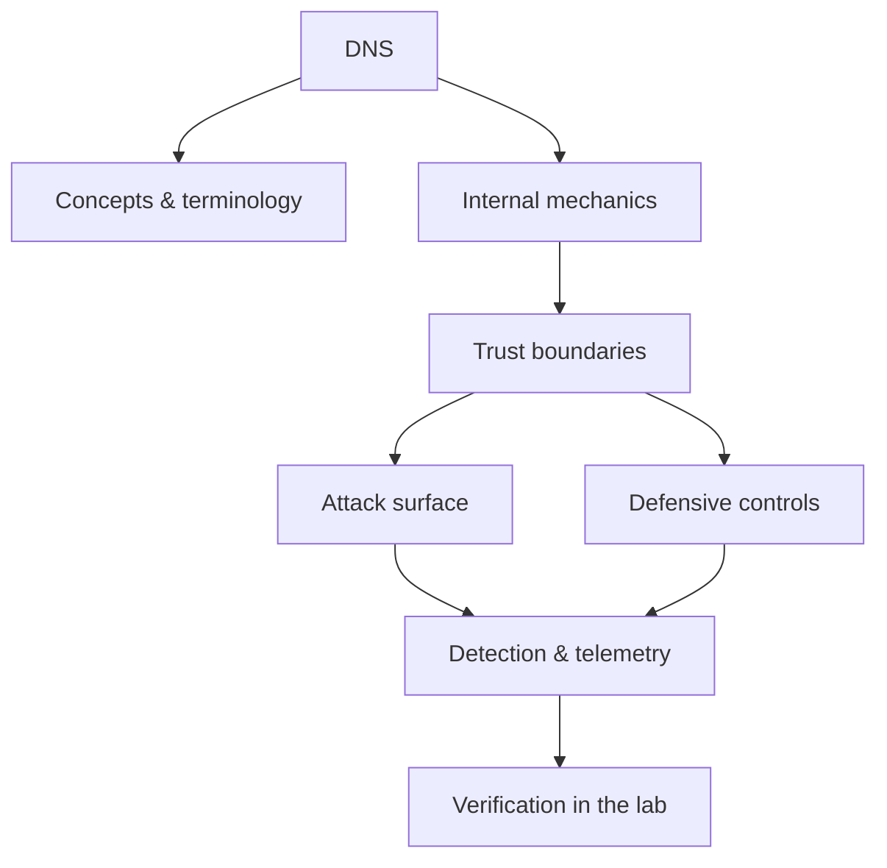

<!-- SPDX-License-Identifier: GPL-3.0-or-later | Copyright (C) 2026 Nithees Narendra S -->
[Home](../../README.md) › [Networking](README.md) › **DNS**

# DNS

Resolution flow, record types, zone transfers, DNSSEC, DoH/DoT, tunnelling and cache poisoning.

<div class="meta-row"><span class="badge b-intermediate">Intermediate</span><span class="badge">⌨ ~60 min hands-on</span><span class="badge">📖 ~20 min read</span><button id="lesson-complete" class="lesson-check"><span class="lbl">Mark complete</span></button></div>

**▶ Here to build, not read? Jump to the [Hands-On Practice](#hands-on-practice).**

**Prerequisites:** [The OSI Model](osi-model.md) · [TCP/IP](tcp-ip.md)

## Overview

DNS is the internet's distributed naming system: it translates human-friendly names like
`example.com` into the IP addresses machines route to, plus a wealth of other records (mail servers, text
records, service locations). It is a hierarchical, cached, globally-distributed database queried billions of
times a second, and almost every other protocol depends on it working correctly. That ubiquity and trust make
DNS both a rich attack surface and a powerful source of security telemetry.

For security, DNS matters three ways. As a **target**, it can be poisoned (feeding victims false answers) or
hijacked (redirecting a domain). As a **channel**, its ever-allowed outbound traffic is abused for C2 and data
exfiltration (DNS tunnelling). As a **sensor**, DNS logs reveal malware beaconing, newly-registered domains and
exfiltration patterns better than almost any other single data source. Understanding resolution is the
prerequisite for all three.

### How it works

Resolving `www.example.com` from a stub resolver typically walks the hierarchy via a
recursive resolver:

1. Ask a **root** server → it refers you to the `.com` **TLD** servers.
2. Ask the `.com` servers → they refer you to `example.com`'s **authoritative** servers.
3. Ask the authoritative servers → they return the `A`/`AAAA` record.

Answers are **cached** at each level for their TTL, which is what makes DNS scale — and what makes cache
poisoning valuable, since one bad cached answer serves many victims. Key record types: `A`/`AAAA` (addresses),
`CNAME` (alias), `MX` (mail), `NS` (delegation), `TXT` (SPF/DKIM/verification), `SOA` (zone authority),
`PTR` (reverse). Each is a place data crosses a trust boundary — and each is something an attacker can forge if
DNSSEC is absent.



<div class="card"><div class="card-title">🔑 Key terms</div>

- **Recursive resolver** — The server that does the full lookup on a client's behalf and caches results.
- **Authoritative server** — The server holding the real records for a zone.
- **TTL** — Time-to-live — how long an answer may be cached; central to poisoning and failover.
- **Cache poisoning** — Injecting a forged answer into a resolver's cache so victims are misdirected.
- **DNSSEC** — Cryptographic signatures over records that let resolvers verify authenticity.
- **DNS tunnelling** — Encoding non-DNS data in DNS queries/responses for covert C2 or exfiltration.

</div>

> [!EXAMPLE] **In the wild.** **The 2008 Kaminsky vulnerability.** By combining predictable transaction IDs with the ability
to trigger many queries, an attacker could forge authoritative answers and poison a resolver's cache for an
entire domain. The coordinated response — source-port randomisation across every major DNS implementation —
was one of the largest synchronised patch efforts in internet history and is why DNSSEC deployment accelerated.

## Hands-On Practice

> [!TIP] This is the main event. Bring up the lab, then work the walkthrough — every command has a **▸ Run** button (needs the lab runner) and a **📋 Copy** button. ~60 min, Kali attacker, fully local.

```cf-lab
{"title": "Networking", "section": "01-networking", "targets": [["metasploitable", "Many open services (FTP/SSH/Telnet/SMB/HTTP/MySQL) — the scan & enumerate target"], ["Kali (you)", "Attacker + capture host (tcpdump/wireshark/tshark/nmap)"]], "compose": "# net-lab/docker-compose.yml  —  Networking part environment\nservices:\n  metasploitable:\n    image: tleemcjr/metasploitable2\n    container_name: net-target\n    networks: [labnet]\n    # intentionally vulnerable services; keep it OFF any routed network\n    command: /bin/sh -c \"/etc/rc.local; tail -f /dev/null\"\n\nnetworks:\n  labnet:\n    driver: bridge\n    internal: true          # no route to host/internet — fail closed"}
```

Uses the [Networking lab environment](README.md#lab-environment).

### Guided walkthrough

<div class="stepper">

```cf-step
{"n": 1, "goal": "Provision & baseline", "cmd": "# bring up the part environment, then confirm you can reach `metasploitable` from Kali", "output": "Target reachable; you have a clean starting point.", "why": "Always capture 'normal' before you change anything — it's your reference.", "runnable": false}
```
```cf-step
{"n": 2, "goal": "Reproduce the technique", "cmd": "# perform the core dns technique step by step against metasploitable", "output": "You observe the expected effect and can repeat it reliably.", "why": "Owning the mechanism by hand beats running a tool you don't understand.", "runnable": false}
```
```cf-step
{"n": 3, "goal": "Observe what happened", "cmd": "# inspect logs / responses / process or network activity", "output": "You can point to exactly where and why it worked.", "why": "The evidence here is what a defender would alert on.", "runnable": false}
```
```cf-step
{"n": 4, "goal": "Apply the primary control", "cmd": "# implement the single most important fix for this technique", "output": "Repeating the technique now fails.", "why": "Fix the class, not the one payload — then prove it's closed.", "runnable": false}
```

</div>

### Live terminal

```cf-terminal
{"title": "kali@dns — start the lab runner for a live shell"}
```

### Try it yourself

> [!NOTE] Try each for real. Open the hint only when stuck, the solution only to check.

**Challenge 1.** Extend the walkthrough with one variation of the dns technique and predict the result before running it.

<details><summary>Hint</summary>

Change one variable (payload, target, or control) at a time.

</details>
<details><summary>Solution</summary>

Answers vary — the goal is a correct prediction confirmed by observation.

</details>

**Challenge 2.** Find and apply a second defensive control for dns and show it also blocks the technique.

<details><summary>Hint</summary>

Think in layers: prevention, detection, and least privilege.

</details>
<details><summary>Solution</summary>

Any independent control that breaks the chain counts — name why it works.

</details>

**Challenge 3.** Write a one-paragraph report of your dns test mapped to CWE/ATT&CK and the fix.

<details><summary>Hint</summary>

Structure: finding → impact → evidence → remediation.

</details>
<details><summary>Solution</summary>

A defender should be able to act on your report without asking you anything.

</details>

### Detect & defend (blue-team view)

- Re-run the technique while watching your telemetry — attack and detection are two views of one event.
- Turn what you observed into a detection rule (Sigma/YARA) and confirm it fires without flooding.

### Skills check

You can move on when you can, without notes:

- [ ] Reproduce the core dns technique on demand against the lab.
- [ ] Explain the root cause and the single most effective control.
- [ ] Describe the telemetry a defender would use to catch it.

### Going deeper — DNS as attack channel and as sensor

Because outbound DNS is almost always permitted, attackers
abuse it, and defenders watch it.

**Exfiltration / C2 (offensive, lab only):** data is encoded into subdomain labels of a domain the attacker
controls; the authoritative server logs (and reconstructs) it:
```
<base32-chunk-of-stolen-data>.exfil.attacker.example  ->  attacker's authoritative NS
```
Signatures a defender hunts: abnormally long or high-entropy subdomains, high query volume to one domain, and
lots of unique subdomains (many TXT/NULL queries).

**Detection (defensive):** DNS logs are gold — beaconing to newly-registered or algorithmically-generated
domains (DGA), spikes of NXDOMAIN, and long/entropic labels. Zeek and Suricata produce per-query logs ideal
for this; a Sigma rule on subdomain length/entropy catches much tunnelling.


## Check Yourself

_Quick self-test — answers hidden. If you can't answer without notes, redo the relevant walkthrough step._

**Q1. In one sentence, what security problem does DNS address or create?**

<details><summary>Show answer</summary>

DNS matters because its behaviour determines where trust is placed; misplacing that trust is the root of the associated bug class.

</details>

**Q2. Name one trust boundary involved in DNS and what crosses it.**

<details><summary>Show answer</summary>

Any point where attacker-influenced data meets privileged processing — e.g. user input reaching an interpreter, or a token reaching a verifier.

</details>

**Q3. Give one attack against DNS and the single control that most reduces its impact.**

<details><summary>Show answer</summary>

State the attack precisely, then the *primary* control (validation, encoding, isolation, authentication, or least privilege) — not a laundry list.

</details>

**Interview angles**

- Walk me through how DNS works, then tell me where you would attack it.
- How would you detect DNS being abused in an environment you defend?
- What is the difference between mitigating and eliminating the risk associated with DNS?

## Pitfalls & Best Practice

**Common mistakes**

- Assuming DNS is 'just infrastructure' and not logging or monitoring it.
- Allowing unrestricted outbound DNS to arbitrary resolvers, enabling tunnelling and exfiltration.
- Deploying DoH/DoT without accounting for the loss of DNS visibility it can cause.
- Neglecting DNSSEC where integrity matters, leaving cache poisoning and hijacking easier.
- Ignoring zone-transfer (AXFR) exposure that leaks an organisation's entire internal namespace.

**Do this instead**

- Log and monitor DNS centrally; it is one of the highest-value telemetry sources you have.
- Force clients through controlled resolvers and restrict/inspect outbound DNS to catch tunnelling.
- Deploy DNSSEC for zones where answer integrity matters; validate on resolvers.
- Restrict zone transfers to authorised secondaries only.
- Hunt for DGA/tunnelling signals: entropy, label length, NXDOMAIN spikes and newly-registered domains.

## Reference

### MITRE ATT&CK Mapping

| Technique | ID |
| --- | --- |
| ATT&CK technique | [T1071.004](https://attack.mitre.org/techniques/T1071/004/) |
| ATT&CK technique | [T1568.002](https://attack.mitre.org/techniques/T1568/002/) |
| ATT&CK technique | [T1590.002](https://attack.mitre.org/techniques/T1590/002/) |
| ATT&CK technique | [T1048.003](https://attack.mitre.org/techniques/T1048/003/) |

### OWASP Mapping

- See [OWASP Top 10](../03-web-security/owasp-top-10.md) for the relevant category when this applies to web systems.

### CWE Mapping

| CWE | Weakness |
| --- | --- |
| [CWE-350](https://cwe.mitre.org/data/definitions/350.html) | Reliance on Reverse DNS Resolution |

### CAPEC Mapping

| CAPEC | Attack pattern |
| --- | --- |
| [CAPEC-142](https://capec.mitre.org/data/definitions/142.html) | DNS Cache Poisoning |
| [CAPEC-261](https://capec.mitre.org/data/definitions/261.html) | Fuzzing for garnering other adjacent info |

### CVE References

- [CVE-2008-1447](https://nvd.nist.gov/vuln/detail/CVE-2008-1447)

### NIST References

- [NIST CSRC Publications](https://csrc.nist.gov/publications) — search for the control family or guide relevant to this topic.

### RFC References

- [RFC 1034](https://www.rfc-editor.org/rfc/rfc1034) — Domain Names — Concepts
- [RFC 1035](https://www.rfc-editor.org/rfc/rfc1035) — Domain Names — Implementation
- [RFC 4033](https://www.rfc-editor.org/rfc/rfc4033) — DNSSEC Introduction
- [RFC 8484](https://www.rfc-editor.org/rfc/rfc8484) — DNS over HTTPS
- [RFC 7858](https://www.rfc-editor.org/rfc/rfc7858) — DNS over TLS

### Research Papers

- *Reflections on Trusting Trust* — Ken Thompson, 1984
- *Smashing the Stack for Fun and Profit* — Aleph One, Phrack 49, 1996
- *The Protection of Information in Computer Systems* — Saltzer & Schroeder, 1975

### Books

- *TCP/IP Illustrated, Vol. 1* — W. Richard Stevens
- *Computer Networking: A Top-Down Approach* — Kurose & Ross
- *Practical Packet Analysis, 3rd ed.* — Chris Sanders

### Official Documentation

- [MITRE ATT&CK](https://attack.mitre.org/)
- [OWASP](https://owasp.org/)
- [NIST CSRC Publications](https://csrc.nist.gov/publications)

### Related Chapters

- [The OSI Model](osi-model.md)
- [TCP/IP](tcp-ip.md)
- [Routing](routing.md)
- [Switching](switching.md)
- [ARP](arp.md)
- [DHCP](dhcp.md)

---

_Part of the **Networking** section of [Cybersecurity-Mastery](../../README.md). 🟡 Intermediate · ~60 min hands-on · Last updated 2026-08-13._
