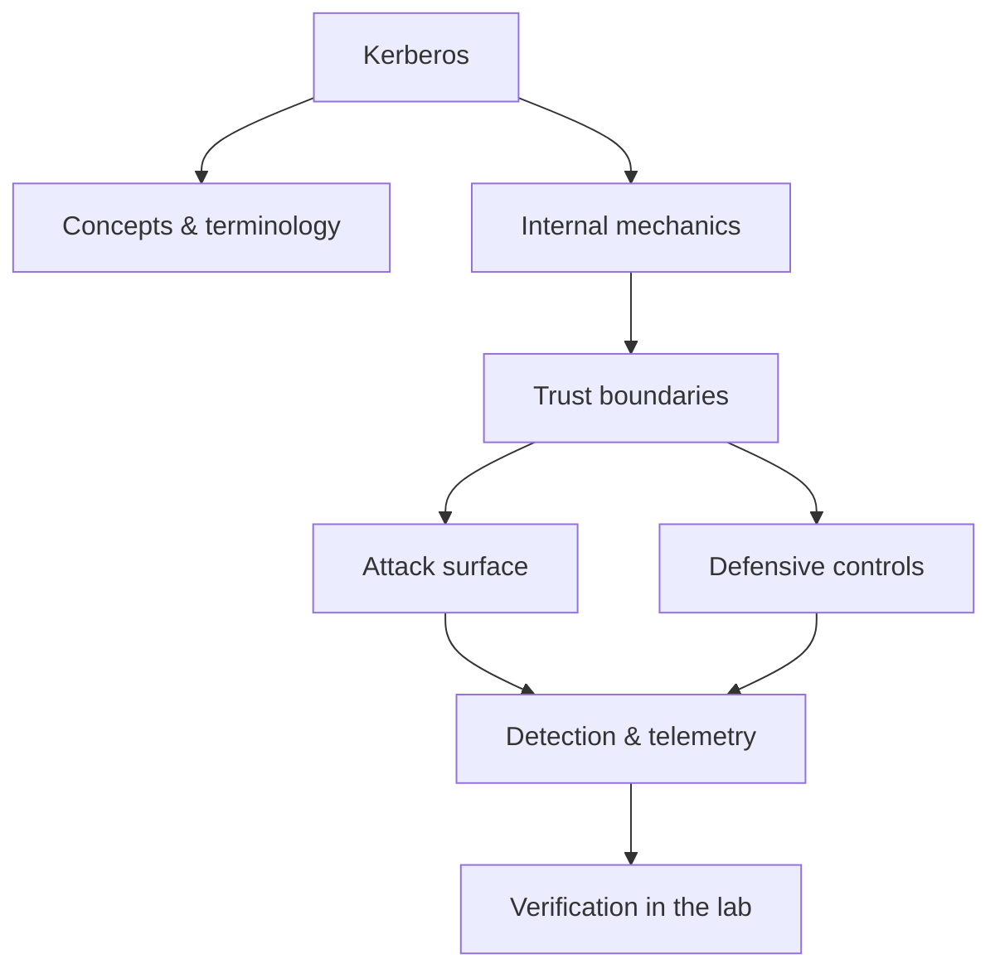

<!-- SPDX-License-Identifier: GPL-3.0-or-later | Copyright (C) 2026 Nithees Narendra S -->
[Home](../../README.md) › [Networking](README.md) › **Kerberos**

# Kerberos

AS-REQ through TGS-REP, tickets, PACs, delegation and the full family of ticket attacks.

<div class="meta-row"><span class="badge b-advanced">Advanced</span><span class="badge">⌨ ~84 min hands-on</span><span class="badge">📖 ~28 min read</span><button id="lesson-complete" class="lesson-check"><span class="lbl">Mark complete</span></button></div>

**▶ Here to build, not read? Jump to the [Hands-On Practice](#hands-on-practice).**

**Prerequisites:** [Active Directory](../12-identity/active-directory.md) · [Symmetric Cryptography](../02-cryptography/symmetric.md) · [TCP/IP](tcp-ip.md)

## Overview

Kerberos is a ticket-based authentication protocol that lets a client prove its identity to
services across a network without ever sending a password over the wire, using a trusted third party — the Key
Distribution Center (KDC) — and symmetric cryptography. In Windows Active Directory it is the primary
authentication protocol, which makes it central to both defending and attacking enterprise networks. Its
elegance is that a user authenticates once and receives a Ticket-Granting Ticket (TGT), then trades that TGT
for per-service tickets without re-entering credentials.

That same design creates a rich attack surface. Because tickets are encrypted with keys derived from account
passwords, an attacker who obtains a ticket can crack it offline (Kerberoasting); because the KDC trusts what
is inside a validly-encrypted ticket, an attacker who compromises the right key can forge tickets (Golden/
Silver); and because delegation lets services act on a user's behalf, misconfigured delegation becomes a
privilege-escalation path. Understanding Kerberos is the difference between memorising AD attacks and
reasoning about them.

### How it works

Kerberos runs in three exchanges:

1. **AS (Authentication Service).** The client sends an `AS-REQ` timestamp encrypted with a key derived from
   its password. The KDC verifies it and returns an `AS-REP` containing a **TGT** (encrypted with the KDC's
   `krbtgt` key) and a session key.
2. **TGS (Ticket-Granting Service).** To use a service, the client presents its TGT and asks for a service
   ticket (`TGS-REQ`). The KDC returns a **service ticket** encrypted with the *target service account's* key.
3. **AP (Application).** The client presents the service ticket to the service, which decrypts it with its own
   key and reads the identity and authorisation (PAC) inside.

The trust boundaries that attackers target: the service ticket is encrypted with the service account's
password-derived key (crackable offline — Kerberoasting); the TGT is encrypted with `krbtgt` (compromise it and
forge any TGT — Golden Ticket); a service ticket forged with a service key grants access to that one service
(Silver Ticket).



<div class="card"><div class="card-title">🔑 Key terms</div>

- **KDC** — Key Distribution Center — the trusted third party issuing tickets; in AD, every domain controller.
- **TGT** — Ticket-Granting Ticket — proof of authentication, encrypted with the krbtgt key.
- **Service ticket (TGS)** — A ticket for one service, encrypted with that service account's key.
- **krbtgt** — The account whose key encrypts all TGTs; its hash is the master key of the domain.
- **PAC** — Privilege Attribute Certificate — authorisation data (groups/SIDs) carried inside a ticket.
- **SPN** — Service Principal Name — the identifier a service ticket is requested for; the hook for Kerberoasting.

</div>

> [!EXAMPLE] **In the wild.** **Kerberoasting in ransomware intrusions.** Incident reports from major DFIR vendors repeatedly
show operators Kerberoasting a SQL or backup service account with a weak password, cracking it offline in
minutes, and using it to move toward Domain Admin. The control that would have broken it — a 25+ character
managed password and AES-only encryption — costs nothing and is the single highest-value AD hardening step.

## Hands-On Practice

> [!TIP] This is the main event. Bring up the lab, then work the walkthrough — every command has a **▸ Run** button (needs the lab runner) and a **📋 Copy** button. ~84 min, Kali attacker, fully local.

```cf-lab
{"title": "Networking", "section": "01-networking", "targets": [["metasploitable", "Many open services (FTP/SSH/Telnet/SMB/HTTP/MySQL) — the scan & enumerate target"], ["Kali (you)", "Attacker + capture host (tcpdump/wireshark/tshark/nmap)"]], "compose": "# net-lab/docker-compose.yml  —  Networking part environment\nservices:\n  metasploitable:\n    image: tleemcjr/metasploitable2\n    container_name: net-target\n    networks: [labnet]\n    # intentionally vulnerable services; keep it OFF any routed network\n    command: /bin/sh -c \"/etc/rc.local; tail -f /dev/null\"\n\nnetworks:\n  labnet:\n    driver: bridge\n    internal: true          # no route to host/internet — fail closed"}
```

Uses the [Networking lab environment](README.md#lab-environment).

### Guided walkthrough

<div class="stepper">

```cf-step
{"n": 1, "goal": "Provision & baseline", "cmd": "# bring up the part environment, then confirm you can reach `metasploitable` from Kali", "output": "Target reachable; you have a clean starting point.", "why": "Always capture 'normal' before you change anything — it's your reference.", "runnable": false}
```
```cf-step
{"n": 2, "goal": "Reproduce the technique", "cmd": "# perform the core kerberos technique step by step against metasploitable", "output": "You observe the expected effect and can repeat it reliably.", "why": "Owning the mechanism by hand beats running a tool you don't understand.", "runnable": false}
```
```cf-step
{"n": 3, "goal": "Observe what happened", "cmd": "# inspect logs / responses / process or network activity", "output": "You can point to exactly where and why it worked.", "why": "The evidence here is what a defender would alert on.", "runnable": false}
```
```cf-step
{"n": 4, "goal": "Apply the primary control", "cmd": "# implement the single most important fix for this technique", "output": "Repeating the technique now fails.", "why": "Fix the class, not the one payload — then prove it's closed.", "runnable": false}
```

</div>

### Live terminal

```cf-terminal
{"title": "kali@kerberos — start the lab runner for a live shell"}
```

### Try it yourself

> [!NOTE] Try each for real. Open the hint only when stuck, the solution only to check.

**Challenge 1.** Extend the walkthrough with one variation of the kerberos technique and predict the result before running it.

<details><summary>Hint</summary>

Change one variable (payload, target, or control) at a time.

</details>
<details><summary>Solution</summary>

Answers vary — the goal is a correct prediction confirmed by observation.

</details>

**Challenge 2.** Find and apply a second defensive control for kerberos and show it also blocks the technique.

<details><summary>Hint</summary>

Think in layers: prevention, detection, and least privilege.

</details>
<details><summary>Solution</summary>

Any independent control that breaks the chain counts — name why it works.

</details>

**Challenge 3.** Write a one-paragraph report of your kerberos test mapped to CWE/ATT&CK and the fix.

<details><summary>Hint</summary>

Structure: finding → impact → evidence → remediation.

</details>
<details><summary>Solution</summary>

A defender should be able to act on your report without asking you anything.

</details>

### Detect & defend (blue-team view)

- Re-run the technique while watching your telemetry — attack and detection are two views of one event.
- Turn what you observed into a detection rule (Sigma/YARA) and confirm it fires without flooding.

### Skills check

You can move on when you can, without notes:

- [ ] Reproduce the core kerberos technique on demand against the lab.
- [ ] Explain the root cause and the single most effective control.
- [ ] Describe the telemetry a defender would use to catch it.

### Going deeper — The ticket-attack family

Each attack maps directly to a boundary above:

- **Kerberoasting (T1558.003).** Request service tickets for accounts with SPNs; the ticket is encrypted with
  the service account's password key, so crack it offline. Service accounts often have weak, non-expiring
  passwords.
  ```bash
  impacket-GetUserSPNs -request -dc-ip DC_IP domain/user
  hashcat -m 13100 spns.hash rockyou.txt
  ```
- **AS-REP Roasting (T1558.004).** For accounts with pre-authentication disabled, request an AS-REP and crack
  it offline — no credentials needed.
- **Golden Ticket (T1558.001).** With the `krbtgt` hash, forge an arbitrary TGT — full domain persistence.
- **Silver Ticket (T1558.002).** With a service account's key, forge a service ticket for that one service,
  bypassing the KDC entirely.
- **Delegation abuse (T1550/T1484).** Unconstrained delegation captures TGTs; constrained and resource-based
  constrained delegation (RBCD) can be abused to impersonate privileged users.


### Going deeper — Detecting Kerberos abuse

Attack and detection are two views of one event:

- **Kerberoasting** — Event ID **4769** (service ticket requested), especially with RC4 (`0x17`) encryption
  and a spike of SPN requests from one principal.
- **Golden/Silver tickets** — anomalies in ticket lifetimes, tickets for non-existent accounts, or a mismatch
  between the ticket's claims and the account.
- **AS-REP roasting** — Event ID **4768** with pre-auth not required.
Harden by: strong, rotated service-account passwords (or gMSAs), AES-only encryption, `krbtgt` rotation
(twice), removing unnecessary SPNs, and eliminating unconstrained delegation.


## Check Yourself

_Quick self-test — answers hidden. If you can't answer without notes, redo the relevant walkthrough step._

**Q1. In one sentence, what security problem does Kerberos address or create?**

<details><summary>Show answer</summary>

Kerberos matters because its behaviour determines where trust is placed; misplacing that trust is the root of the associated bug class.

</details>

**Q2. Name one trust boundary involved in Kerberos and what crosses it.**

<details><summary>Show answer</summary>

Any point where attacker-influenced data meets privileged processing — e.g. user input reaching an interpreter, or a token reaching a verifier.

</details>

**Q3. Give one attack against Kerberos and the single control that most reduces its impact.**

<details><summary>Show answer</summary>

State the attack precisely, then the *primary* control (validation, encoding, isolation, authentication, or least privilege) — not a laundry list.

</details>

**Interview angles**

- Walk me through how Kerberos works, then tell me where you would attack it.
- How would you detect Kerberos being abused in an environment you defend?
- What is the difference between mitigating and eliminating the risk associated with Kerberos?

## Pitfalls & Best Practice

**Common mistakes**

- Leaving service accounts with weak, non-expiring passwords and unnecessary SPNs.
- Permitting RC4 encryption, which makes Kerberoast hashes far cheaper to crack.
- Never rotating the krbtgt key, so a single past compromise grants indefinite Golden Ticket forgery.
- Configuring unconstrained delegation on servers that do not require it.
- Alerting only on failed logons and missing ticket-request (4769) anomalies entirely.

**Do this instead**

- Use group Managed Service Accounts (gMSAs) with long, auto-rotated passwords.
- Enforce AES encryption and disable RC4 for Kerberos where compatibility allows.
- Rotate the krbtgt password twice, periodically and after any suspected DC compromise.
- Replace unconstrained delegation with constrained/RBCD scoped to specific services.
- Monitor 4768/4769 for roasting and forged-ticket anomalies; hunt with BloodHound proactively.

## Reference

### MITRE ATT&CK Mapping

| Technique | ID |
| --- | --- |
| ATT&CK technique | [T1558.003](https://attack.mitre.org/techniques/T1558/003/) |
| ATT&CK technique | [T1558.001](https://attack.mitre.org/techniques/T1558/001/) |
| ATT&CK technique | [T1558.002](https://attack.mitre.org/techniques/T1558/002/) |
| ATT&CK technique | [T1550.003](https://attack.mitre.org/techniques/T1550/003/) |
| ATT&CK technique | [T1208](https://attack.mitre.org/techniques/T1208/) |

### OWASP Mapping

- See [OWASP Top 10](../03-web-security/owasp-top-10.md) for the relevant category when this applies to web systems.

### CWE Mapping

- No direct weakness ID; when this concept fails in code it usually surfaces as one of the [CWE Top 25](../04-vulnerabilities/cwe-top-25.md) entries.

### CAPEC Mapping

| CAPEC | Attack pattern |
| --- | --- |
| [CAPEC-645](https://capec.mitre.org/data/definitions/645.html) | Use of Captured Tickets (Pass The Ticket) |

### CVE References

- No canonical CVE for a concept page. Search the [NVD](https://nvd.nist.gov/) for concrete instances when studying real cases.

### NIST References

- [NIST CSRC Publications](https://csrc.nist.gov/publications) — search for the control family or guide relevant to this topic.

### RFC References

- [RFC 4120](https://www.rfc-editor.org/rfc/rfc4120) — The Kerberos Network Authentication Service (V5)
- [RFC 6113](https://www.rfc-editor.org/rfc/rfc6113) — Kerberos FAST

### Research Papers

- *Reflections on Trusting Trust* — Ken Thompson, 1984
- *Smashing the Stack for Fun and Profit* — Aleph One, Phrack 49, 1996
- *The Protection of Information in Computer Systems* — Saltzer & Schroeder, 1975

### Books

- *Active Directory, 5th ed.* — Desmond, Richards, Allen & Lowe-Norris
- *Pentesting Active Directory & Windows-based Infrastructure* — Isakov

### Official Documentation

- [MITRE ATT&CK](https://attack.mitre.org/)
- [OWASP](https://owasp.org/)
- [NIST CSRC Publications](https://csrc.nist.gov/publications)

### Related Chapters

- [The OSI Model](osi-model.md)
- [TCP/IP](tcp-ip.md)
- [Routing](routing.md)
- [Switching](switching.md)
- [ARP](arp.md)
- [DHCP](dhcp.md)

---

_Part of the **Networking** section of [Cybersecurity-Mastery](../../README.md). 🟠 Advanced · ~84 min hands-on · Last updated 2026-08-13._
