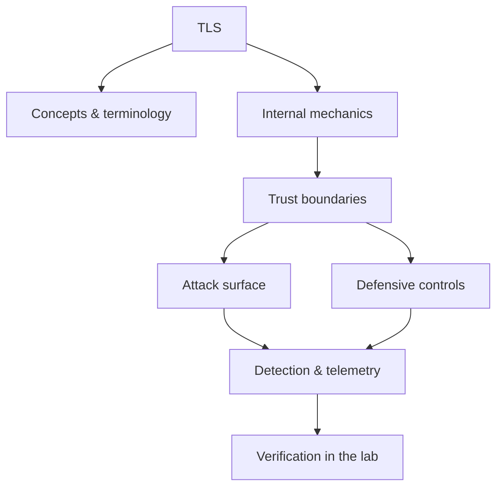

<!-- SPDX-License-Identifier: GPL-3.0-or-later | Copyright (C) 2026 Nithees Narendra S -->
[Home](../../README.md) › [Networking](README.md) › **TLS**

# TLS

Handshake internals for TLS 1.2 and 1.3, cipher suites, session resumption and downgrade attacks.

<div class="meta-row"><span class="badge b-advanced">Advanced</span><span class="badge">⌨ ~72 min hands-on</span><span class="badge">📖 ~24 min read</span><button id="lesson-complete" class="lesson-check"><span class="lbl">Mark complete</span></button></div>

**▶ Here to build, not read? Jump to the [Hands-On Practice](#hands-on-practice).**

**Prerequisites:** [Asymmetric Cryptography](../02-cryptography/asymmetric.md) · [Symmetric Cryptography](../02-cryptography/symmetric.md) · [X.509 Certificates](../02-cryptography/certificates.md) · [TCP/IP](tcp-ip.md)

## Overview

TLS (Transport Layer Security) provides a secure channel over an insecure network with three
guarantees: **confidentiality** (eavesdroppers learn nothing), **integrity** (tampering is detected), and
**authentication** (you are talking to who you think, via certificates). It is the protocol behind the "s" in
HTTPS and secures email, VPNs, APIs and databases besides. Crucially, TLS composes primitives you study
elsewhere — key exchange, symmetric encryption, MACs, signatures, certificates — into one handshake, so it is
where cryptographic theory meets operational reality.

The security of TLS rests on the handshake correctly negotiating strong parameters and validating the server's
certificate chain. Historically, most TLS failures were not breaks of the underlying maths but failures at the
edges: downgrade to weak options, certificate-validation bugs, padding oracles, and implementation flaws like
Heartbleed. TLS 1.3 (2018) was a deliberate simplification that removed the dangerous options and made the
protocol faster and safer by construction.

### How it works

A TLS 1.3 handshake is lean. The client sends `ClientHello` with its supported cipher
suites and, optimistically, a Diffie-Hellman key share. The server replies `ServerHello` with its chosen suite
and key share, and — now encrypted — its certificate, a signature over the handshake transcript (proving it
holds the certificate's private key), and a `Finished` MAC. Both sides derive the same session keys from the
DH shared secret via the HKDF key schedule. From that point, application data is protected with an AEAD cipher
(AES-GCM or ChaCha20-Poly1305) that provides confidentiality and integrity together.

The trust hinges on the certificate: the client must build a chain from the server's certificate to a trusted
root CA, check the name matches, verify validity dates, and check revocation. Every historic "TLS bug" is
either a weakness in the negotiated parameters or a failure somewhere in that validation.



<div class="card"><div class="card-title">🔑 Key terms</div>

- **Handshake** — The negotiation that authenticates the peer and establishes session keys.
- **Cipher suite** — The named bundle of algorithms (key exchange, authentication, AEAD) TLS agrees on.
- **Forward secrecy (PFS)** — Ephemeral keys ensure past traffic stays safe even if the long-term key later leaks.
- **AEAD** — Authenticated Encryption with Associated Data — encryption and integrity in one primitive (GCM, ChaCha20-Poly1305).
- **Certificate chain** — The path from the server's cert to a trusted root CA that establishes authenticity.
- **SNI** — Server Name Indication — the hostname the client requests, historically sent in the clear.

</div>

> [!EXAMPLE] **In the wild.** **Heartbleed (2014).** A one-line missing length check in OpenSSL's `dtls1_process_heartbeat`
allowed remote memory disclosure. Its impact — silent theft of private keys from ~500,000 trusted certificates
— forced mass certificate reissuance and reshaped how the industry funds critical infrastructure code.
Reproduce the concept (not against public systems) with a vulnerable OpenSSL build in an isolated lab to see
exactly what leaks.

## Hands-On Practice

> [!TIP] This is the main event. Bring up the lab, then work the walkthrough — every command has a **▸ Run** button (needs the lab runner) and a **📋 Copy** button. ~72 min, Kali attacker, fully local.

```cf-lab
{"title": "Networking", "section": "01-networking", "targets": [["metasploitable", "Many open services (FTP/SSH/Telnet/SMB/HTTP/MySQL) — the scan & enumerate target"], ["Kali (you)", "Attacker + capture host (tcpdump/wireshark/tshark/nmap)"]], "compose": "# net-lab/docker-compose.yml  —  Networking part environment\nservices:\n  metasploitable:\n    image: tleemcjr/metasploitable2\n    container_name: net-target\n    networks: [labnet]\n    # intentionally vulnerable services; keep it OFF any routed network\n    command: /bin/sh -c \"/etc/rc.local; tail -f /dev/null\"\n\nnetworks:\n  labnet:\n    driver: bridge\n    internal: true          # no route to host/internet — fail closed"}
```

Uses the [Networking lab environment](README.md#lab-environment).

### Guided walkthrough

<div class="stepper">

```cf-step
{"n": 1, "goal": "Provision & baseline", "cmd": "# bring up the part environment, then confirm you can reach `metasploitable` from Kali", "output": "Target reachable; you have a clean starting point.", "why": "Always capture 'normal' before you change anything — it's your reference.", "runnable": false}
```
```cf-step
{"n": 2, "goal": "Reproduce the technique", "cmd": "# perform the core tls technique step by step against metasploitable", "output": "You observe the expected effect and can repeat it reliably.", "why": "Owning the mechanism by hand beats running a tool you don't understand.", "runnable": false}
```
```cf-step
{"n": 3, "goal": "Observe what happened", "cmd": "# inspect logs / responses / process or network activity", "output": "You can point to exactly where and why it worked.", "why": "The evidence here is what a defender would alert on.", "runnable": false}
```
```cf-step
{"n": 4, "goal": "Apply the primary control", "cmd": "# implement the single most important fix for this technique", "output": "Repeating the technique now fails.", "why": "Fix the class, not the one payload — then prove it's closed.", "runnable": false}
```

</div>

### Live terminal

```cf-terminal
{"title": "kali@tls — start the lab runner for a live shell"}
```

### Try it yourself

> [!NOTE] Try each for real. Open the hint only when stuck, the solution only to check.

**Challenge 1.** Extend the walkthrough with one variation of the tls technique and predict the result before running it.

<details><summary>Hint</summary>

Change one variable (payload, target, or control) at a time.

</details>
<details><summary>Solution</summary>

Answers vary — the goal is a correct prediction confirmed by observation.

</details>

**Challenge 2.** Find and apply a second defensive control for tls and show it also blocks the technique.

<details><summary>Hint</summary>

Think in layers: prevention, detection, and least privilege.

</details>
<details><summary>Solution</summary>

Any independent control that breaks the chain counts — name why it works.

</details>

**Challenge 3.** Write a one-paragraph report of your tls test mapped to CWE/ATT&CK and the fix.

<details><summary>Hint</summary>

Structure: finding → impact → evidence → remediation.

</details>
<details><summary>Solution</summary>

A defender should be able to act on your report without asking you anything.

</details>

### Detect & defend (blue-team view)

- Re-run the technique while watching your telemetry — attack and detection are two views of one event.
- Turn what you observed into a detection rule (Sigma/YARA) and confirm it fires without flooding.

### Skills check

You can move on when you can, without notes:

- [ ] Reproduce the core tls technique on demand against the lab.
- [ ] Explain the root cause and the single most effective control.
- [ ] Describe the telemetry a defender would use to catch it.

### Going deeper — Inspecting and hardening TLS

Read a real handshake and grade a deployment:

```bash
# See the negotiated version, suite, and certificate chain
openssl s_client -connect example.com:443 -servername example.com </dev/null 2>/dev/null \
  | openssl x509 -noout -subject -issuer -dates

# Enumerate what a server supports (lab/owned hosts only)
nmap --script ssl-enum-ciphers -p 443 TARGET
```

Hardening checklist: TLS 1.2+ only (prefer 1.3), forward-secret suites only (ECDHE), AEAD ciphers only,
OCSP stapling, HSTS, a correctly ordered chain, and modern key sizes (RSA ≥ 2048 or ECDSA P-256). Test with
`testssl.sh` or SSL Labs' methodology.


## Check Yourself

_Quick self-test — answers hidden. If you can't answer without notes, redo the relevant walkthrough step._

**Q1. In one sentence, what security problem does TLS address or create?**

<details><summary>Show answer</summary>

TLS matters because its behaviour determines where trust is placed; misplacing that trust is the root of the associated bug class.

</details>

**Q2. Name one trust boundary involved in TLS and what crosses it.**

<details><summary>Show answer</summary>

Any point where attacker-influenced data meets privileged processing — e.g. user input reaching an interpreter, or a token reaching a verifier.

</details>

**Q3. Give one attack against TLS and the single control that most reduces its impact.**

<details><summary>Show answer</summary>

State the attack precisely, then the *primary* control (validation, encoding, isolation, authentication, or least privilege) — not a laundry list.

</details>

**Interview angles**

- Walk me through how TLS works, then tell me where you would attack it.
- How would you detect TLS being abused in an environment you defend?
- What is the difference between mitigating and eliminating the risk associated with TLS?

## Pitfalls & Best Practice

**Common mistakes**

- Allowing legacy protocol versions (SSL 3.0, TLS 1.0/1.1) or non-forward-secret cipher suites.
- Disabling or mishandling certificate validation in clients 'to make it work'.
- Trusting SNI/hostname checks to something other than the TLS stack's validated identity.
- Enabling 0-RTT for non-idempotent requests without replay protection.
- Forgetting revocation/expiry monitoring, leading to outages or trust in revoked certs.

**Do this instead**

- Prefer TLS 1.3; where 1.2 is required, restrict to ECDHE + AEAD suites.
- Automate certificate issuance and renewal (ACME) and monitor expiry and CT logs.
- Enable HSTS and OCSP stapling; keep the chain correctly ordered and complete.
- Never disable certificate validation; pin or constrain trust where the threat model warrants.
- Keep TLS libraries patched — most real TLS incidents are implementation bugs.

## Reference

### MITRE ATT&CK Mapping

| Technique | ID |
| --- | --- |
| ATT&CK technique | [T1557](https://attack.mitre.org/techniques/T1557/) |
| ATT&CK technique | [T1040](https://attack.mitre.org/techniques/T1040/) |

### OWASP Mapping

- See [OWASP Top 10](../03-web-security/owasp-top-10.md) for the relevant category when this applies to web systems.

### CWE Mapping

| CWE | Weakness |
| --- | --- |
| [CWE-326](https://cwe.mitre.org/data/definitions/326.html) | Inadequate Encryption Strength |
| [CWE-327](https://cwe.mitre.org/data/definitions/327.html) | Use of a Broken or Risky Cryptographic Algorithm |

### CAPEC Mapping

- No single attack pattern; see the [CAPEC](../14-threat-intelligence/capec.md) chapter to map behaviour to patterns.

### CVE References

- [CVE-2014-0160](https://nvd.nist.gov/vuln/detail/CVE-2014-0160)
- [CVE-2014-3566](https://nvd.nist.gov/vuln/detail/CVE-2014-3566)

### NIST References

- [NIST CSRC Publications](https://csrc.nist.gov/publications) — search for the control family or guide relevant to this topic.

### RFC References

- [RFC 8446](https://www.rfc-editor.org/rfc/rfc8446) — TLS 1.3
- [RFC 5246](https://www.rfc-editor.org/rfc/rfc5246) — TLS 1.2
- [RFC 6066](https://www.rfc-editor.org/rfc/rfc6066) — TLS Extensions
- [RFC 7457](https://www.rfc-editor.org/rfc/rfc7457) — Summarizing Known Attacks on TLS/DTLS

### Research Papers

- *Reflections on Trusting Trust* — Ken Thompson, 1984
- *Smashing the Stack for Fun and Profit* — Aleph One, Phrack 49, 1996
- *The Protection of Information in Computer Systems* — Saltzer & Schroeder, 1975

### Books

- *Serious Cryptography, 2nd ed.* — Jean-Philippe Aumasson
- *Cryptography Engineering* — Ferguson, Schneier & Kohno
- *Real-World Cryptography* — David Wong

### Official Documentation

- [SSL Labs Best Practices](https://github.com/ssllabs/research/wiki/SSL-and-TLS-Deployment-Best-Practices)

### Related Chapters

- [X.509 Certificates](../02-cryptography/certificates.md)
- [Public Key Infrastructure](../02-cryptography/pki.md)
- [HTTPS](https.md)
- [Applied Cryptanalysis](../02-cryptography/cryptanalysis.md)
- [The OSI Model](osi-model.md)
- [TCP/IP](tcp-ip.md)

---

_Part of the **Networking** section of [Cybersecurity-Mastery](../../README.md). 🟠 Advanced · ~72 min hands-on · Last updated 2026-08-13._
