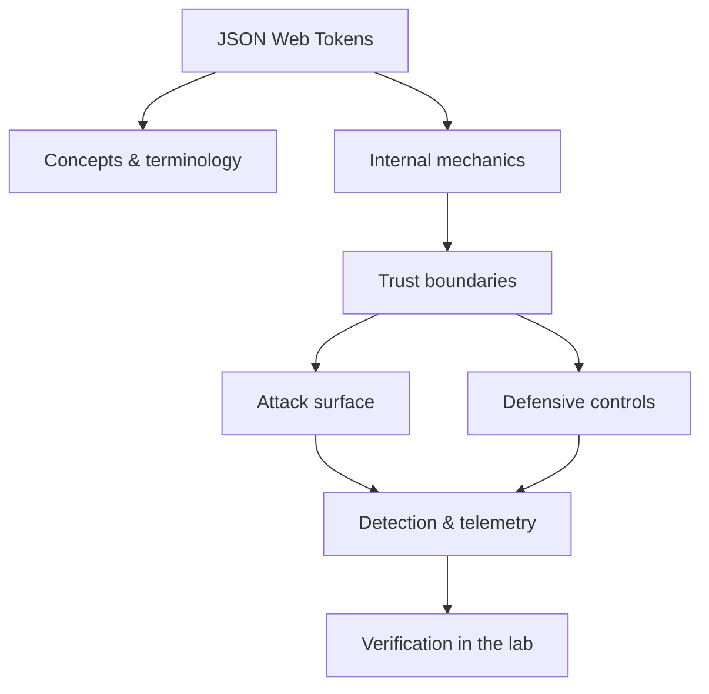

<!-- SPDX-License-Identifier: GPL-3.0-or-later | Copyright (C) 2026 Nithees Narendra S -->
[Home](../../README.md) › [Web Security](README.md) › **JSON Web Tokens**

# JSON Web Tokens

JWS/JWE structure, alg confusion, kid injection, claims validation and revocation strategy.

<div class="meta-row"><span class="badge b-intermediate">Intermediate</span><span class="badge">⌨ ~48 min hands-on</span><span class="badge">📖 ~16 min read</span><button id="lesson-complete" class="lesson-check"><span class="lbl">Mark complete</span></button></div>

**▶ Here to build, not read? Jump to the [Hands-On Practice](#hands-on-practice).**

**Prerequisites:** [Web Authentication](authentication.md) · [HMAC](../02-cryptography/hmac.md) · [Asymmetric Cryptography](../02-cryptography/asymmetric.md)

## Overview

JWS/JWE structure, alg confusion, kid injection, claims validation and revocation strategy. In one line: JSON web tokens decides where trust is placed, and misplaced trust is where the security problem lives. That's the theory you need — the understanding comes from doing it, so the walkthrough below is the heart of this chapter.

### How it works

Mechanically, JSON web tokens comes down to three things: what data is trusted, where it crosses a boundary, and what happens on the other side. The diagram traces that path; you'll walk it for real, step by step, in the practice below.



<div class="card"><div class="card-title">🔑 Key terms</div>

- **Trust boundary** — where data or control passes between components of different privilege or trust.
- **Attack surface** — the set of points an attacker can interact with.
- **Primary control** — the single measure that most reduces this technique's impact.
- **Telemetry** — the log or signal a defender uses to detect the technique.

</div>

## Hands-On Practice

> [!TIP] This is the main event. Bring up the lab, then work the walkthrough — every command has a **▸ Run** button (needs the lab runner) and a **📋 Copy** button. ~48 min, Kali attacker, fully local.

**Mission.** Break weak JWT verification (alg confusion, weak secret) then harden it.

```cf-lab
{"title": "Web Security", "section": "03-web-security", "targets": [["bWAPP", "http://localhost:8081  — 100+ web bugs, best for targeted practice"], ["DVWA", "http://localhost:8082  — adjustable security levels"], ["Juice Shop", "http://localhost:8083 — modern SPA, full OWASP Top 10"], ["WebGoat", "http://localhost:8084 — guided lessons"]], "compose": "# web-lab/docker-compose.yml  —  Web Security part environment\nservices:\n  bwapp:\n    image: raesene/bwapp\n    ports: [\"8081:80\"]\n    networks: [labnet]\n  dvwa:\n    image: vulnerables/web-dvwa\n    ports: [\"8082:80\"]\n    networks: [labnet]\n  juice-shop:\n    image: bkimminich/juice-shop\n    ports: [\"8083:3000\"]\n    networks: [labnet]\n  webgoat:\n    image: webgoat/webgoat\n    ports: [\"8084:8080\"]\n    networks: [labnet]\n\nnetworks:\n  labnet:\n    driver: bridge\n    # routed here so your browser/Burp on the host can reach the apps;\n    # for a jeopardy-style setup put the attacker box on labnet and set internal: true"}
```

**Target for this lesson:** A lab JWT app (or Juice Shop token). Tooling: jwt_tool, hashcat.. Full setup: [Web Security lab environment](README.md#lab-environment).

### Guided walkthrough

<div class="stepper">

```cf-step
{"n": 1, "goal": "Decode the token", "cmd": "jwt_tool eyJhbGciOiJIUzI1NiIsInR5cCI6IkpXVCJ9...", "output": "Header {alg: HS256}, claims {user: bob, role: user}", "why": "JWTs are signed, not encrypted — you can read (not yet forge) the claims.", "runnable": true}
```
```cf-step
{"n": 2, "goal": "Test alg:none", "cmd": "jwt_tool <token> -X a", "output": "If accepted, the server trusts an unsigned token.", "why": "Broken libraries treat alg:none as valid — instant forgery.", "runnable": true}
```
```cf-step
{"n": 3, "goal": "Crack a weak HMAC secret", "cmd": "hashcat -m 16500 token.txt rockyou.txt", "output": "Recovered secret: 'secret'", "why": "A guessable HS256 key lets you sign arbitrary tokens.", "runnable": true}
```
```cf-step
{"n": 4, "goal": "Forge an admin token", "cmd": "jwt_tool <token> -S hs256 -p 'secret' -pc role -pv admin", "output": "A valid token with role=admin.", "why": "Present it and the app grants admin — authentication bypass.", "runnable": true}
```
```cf-step
{"n": 5, "goal": "Fix", "cmd": "# pin alg server-side; reject none; use a 256-bit random key; validate exp/aud/iss", "output": "Forged/none/weak-key tokens are all rejected.", "why": "Verification must be strict about algorithm and key, not just 'signature present'.", "runnable": false}
```

</div>

### Live terminal

```cf-terminal
{"title": "kali@jwt — start the lab runner for a live shell"}
```

### Try it yourself

> [!NOTE] Try each for real. Open the hint only when stuck, the solution only to check.

**Challenge 1.** Perform an RS256→HS256 algorithm-confusion forgery.

<details><summary>Hint</summary>

Sign with HS256 using the server's *public* key as the HMAC secret.

</details>
<details><summary>Solution</summary>

`jwt_tool <token> -X k -pk public.pem` — if the server uses one 'verify' call, it treats the public key as the HMAC secret.

</details>

**Challenge 2.** Forge a token via kid header injection.

<details><summary>Hint</summary>

kid may be used to select a key from a path or DB.

</details>
<details><summary>Solution</summary>

Point kid at a file with known contents (`/dev/null` → empty key) or inject SQL into a kid lookup.

</details>

**Challenge 3.** Explain why short expiries don't fix a weak signing key.

<details><summary>Hint</summary>

Forgery mints fresh tokens at will.

</details>
<details><summary>Solution</summary>

If you hold the key you set exp yourself; key strength, not lifetime, is the control.

</details>

### Quick quiz

```cf-quiz
{"q": "A JWT verifier accepts `alg: none`. What does that allow?", "options": ["Nothing, none is safe", "Forging tokens with no valid signature", "Only reading claims", "Faster verification"], "answer": 1, "explain": "alg:none means the token is unsigned; if accepted, an attacker forges any claims (e.g. role=admin) with no key."}
```

### Detect & defend (blue-team view)

- Log and alert on tokens with alg=none or unexpected alg values reaching verification.
- Sudden role escalations without a corresponding privileged action are a forged-token signal.

### Skills check

You can move on when you can, without notes:

- [ ] Read a JWT and test alg:none, weak-secret and alg-confusion flaws.
- [ ] Forge a privileged token against a weak implementation.
- [ ] Harden verification (pin alg, strong key, validate claims).

## Check Yourself

_Quick self-test — answers hidden. If you can't answer without notes, redo the relevant walkthrough step._

**Q1. In one sentence, what security problem does JSON Web Tokens address or create?**

<details><summary>Show answer</summary>

JSON Web Tokens matters because its behaviour determines where trust is placed; misplacing that trust is the root of the associated bug class.

</details>

**Q2. Name one trust boundary involved in JSON Web Tokens and what crosses it.**

<details><summary>Show answer</summary>

Any point where attacker-influenced data meets privileged processing — e.g. user input reaching an interpreter, or a token reaching a verifier.

</details>

**Q3. Give one attack against JSON Web Tokens and the single control that most reduces its impact.**

<details><summary>Show answer</summary>

State the attack precisely, then the *primary* control (validation, encoding, isolation, authentication, or least privilege) — not a laundry list.

</details>

**Interview angles**

- Walk me through how JSON Web Tokens works, then tell me where you would attack it.
- How would you detect JSON Web Tokens being abused in an environment you defend?
- What is the difference between mitigating and eliminating the risk associated with JSON Web Tokens?

## Pitfalls & Best Practice

**Common mistakes**

- Treating JSON web tokens as a checkbox instead of understanding the mechanism — defences copied without comprehension fail silently.
- Trusting client-side or default controls to enforce a server-side security property.
- Testing only the happy path and never the abuse cases or malformed input.
- Fixing the symptom (one payload) instead of the class (the missing control).

**Do this instead**

- Push security decisions to a single, well-tested enforcement point rather than scattering checks.
- Fail closed: when in doubt, deny and log, so misconfiguration reduces access rather than expanding it.
- Instrument the trust boundaries so the same event is visible to offence (as a target) and defence (as a signal).
- Validate your understanding of JSON web tokens empirically in the lab before trusting it in production.
- Prefer safe, high-level APIs and secure defaults over hand-rolled primitives.

## Reference

### MITRE ATT&CK Mapping

_No single ATT&CK technique maps cleanly to this concept. Once you apply it offensively or defensively, map the specific behaviour using the [ATT&CK](../14-threat-intelligence/mitre-attack.md) chapter._

### OWASP Mapping

- [OWASP JWT Cheat Sheet](https://cheatsheetseries.owasp.org/cheatsheets/JSON_Web_Token_for_Java_Cheat_Sheet.html)

### CWE Mapping

| CWE | Weakness |
| --- | --- |
| [CWE-347](https://cwe.mitre.org/data/definitions/347.html) | Improper Verification of Cryptographic Signature |
| [CWE-321](https://cwe.mitre.org/data/definitions/321.html) | Use of Hard-coded Cryptographic Key |

### CAPEC Mapping

- No single attack pattern; see the [CAPEC](../14-threat-intelligence/capec.md) chapter to map behaviour to patterns.

### CVE References

- No canonical CVE for a concept page. Search the [NVD](https://nvd.nist.gov/) for concrete instances when studying real cases.

### NIST References

- [NIST CSRC Publications](https://csrc.nist.gov/publications) — search for the control family or guide relevant to this topic.

### RFC References

- [RFC 7519](https://www.rfc-editor.org/rfc/rfc7519) — JSON Web Token (JWT)
- [RFC 7515](https://www.rfc-editor.org/rfc/rfc7515) — JSON Web Signature
- [RFC 8725](https://www.rfc-editor.org/rfc/rfc8725) — JWT Best Current Practices

### Research Papers

- *Reflections on Trusting Trust* — Ken Thompson, 1984
- *Smashing the Stack for Fun and Profit* — Aleph One, Phrack 49, 1996
- *The Protection of Information in Computer Systems* — Saltzer & Schroeder, 1975

### Books

- *The Web Application Hacker's Handbook, 2nd ed.* — Stuttard & Pinto
- *Real-World Bug Hunting* — Peter Yaworski
- *The Tangled Web* — Michal Zalewski
- *Web Security for Developers* — Malcolm McDonald

### Official Documentation

- [MITRE ATT&CK](https://attack.mitre.org/)
- [OWASP](https://owasp.org/)
- [NIST CSRC Publications](https://csrc.nist.gov/publications)

### Related Chapters

- [OAuth 2.0 and 2.1](oauth.md)
- [OpenID Connect](openid-connect.md)
- [Web Authentication](authentication.md)
- [Session Management](sessions.md)
- [Web Application Architecture](web-architecture.md)
- [HTTP for Security Testing](http-protocol.md)

---

_Part of the **Web Security** section of [Cybersecurity-Mastery](../../README.md). 🟡 Intermediate · ~48 min hands-on · Last updated 2026-08-13._
