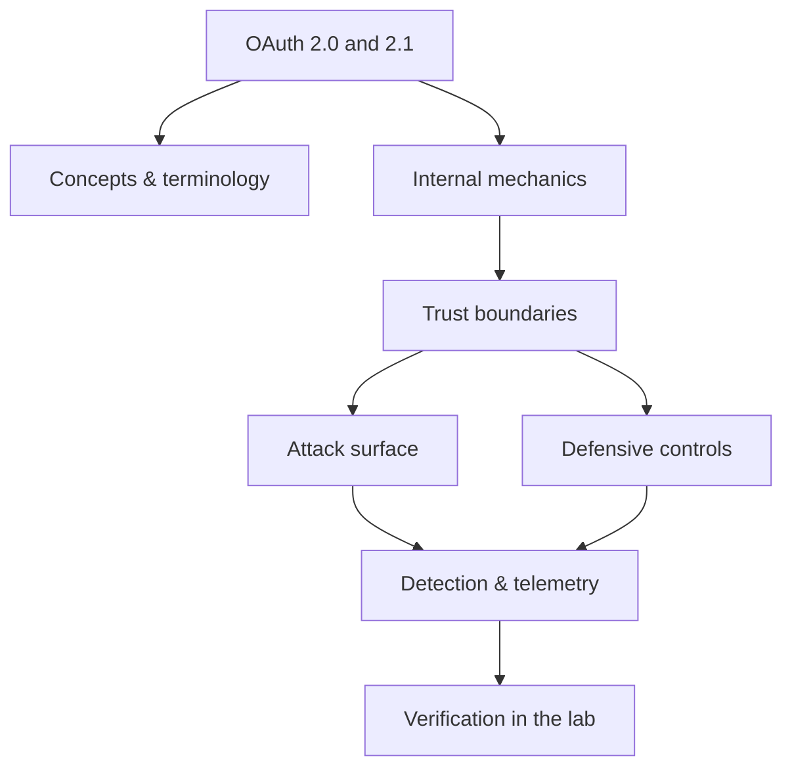

<!-- SPDX-License-Identifier: GPL-3.0-or-later | Copyright (C) 2026 Nithees Narendra S -->
[Home](../../README.md) › [Web Security](README.md) › **OAuth 2.0 and 2.1**

# OAuth 2.0 and 2.1

Grant types, PKCE, redirect URI validation, token leakage and confused-deputy attacks.

<div class="meta-row"><span class="badge b-advanced">Advanced</span><span class="badge">⌨ ~72 min hands-on</span><span class="badge">📖 ~24 min read</span><button id="lesson-complete" class="lesson-check"><span class="lbl">Mark complete</span></button></div>

**▶ Here to build, not read? Jump to the [Hands-On Practice](#hands-on-practice).**

**Prerequisites:** [Web Authentication](authentication.md) · [Authorization](authorization.md) · [JSON Web Tokens](jwt.md)

## Overview

OAuth 2.0 is an **authorization** framework: it lets a user grant a third-party application
limited access to their resources on another service without sharing their password, by issuing scoped access
tokens. It is the machinery behind "Sign in with Google" and countless API integrations. Crucially, OAuth is
about *delegated authorization* (what an app may do), not *authentication* (who the user is) — conflating the
two is the source of a whole class of vulnerabilities, which is exactly why OpenID Connect was layered on top
to do authentication properly.

OAuth's security rests on a small number of parameters being validated strictly: the `redirect_uri` (where the
authorization response is sent), the `state` (CSRF protection), and — in modern flows — PKCE (which binds the
authorization request to the client that started it). Most OAuth breaks are not cryptographic; they are
validation failures at these seams that let an attacker steal an authorization code or token, or trick a client
into accepting one it should not.

### How it works

The recommended **authorization-code flow with PKCE**:

1. The client redirects the user to the authorization server with `client_id`, `redirect_uri`, `scope`,
   `state`, and a PKCE `code_challenge`.
2. The user authenticates and consents; the server redirects back to the *registered* `redirect_uri` with an
   authorization `code` and the `state`.
3. The client verifies `state`, then exchanges the `code` (plus the PKCE `code_verifier`) at the token endpoint
   for an access token (and optionally a refresh token).
4. The client calls the resource API with the bearer access token.

The trust hinges on: exact `redirect_uri` matching (so codes cannot be sent to an attacker), `state`
verification (so responses cannot be forged/CSRF'd), and PKCE (so a stolen code cannot be redeemed by anyone
but the original client). Weaken any one and specific attacks open up.



<div class="card"><div class="card-title">🔑 Key terms</div>

- **Authorization code** — A short-lived code exchanged for tokens at the token endpoint — the safest grant.
- **Access token / Refresh token** — The bearer credential for API calls / a longer-lived credential to get new access tokens.
- **redirect_uri** — Where the authorization response is delivered; must be matched exactly to prevent code theft.
- **state** — An opaque value echoed back to bind request and response — CSRF protection.
- **PKCE** — Proof Key for Code Exchange — binds the code to the client that requested it (RFC 7636).
- **Scope** — The specific, limited permissions a token grants.

</div>

> [!EXAMPLE] **In the wild.** **Account takeover via redirect_uri + open redirect (recurring bug-bounty pattern).** Researchers
repeatedly chain a client's open redirect with permissive redirect_uri validation to exfiltrate authorization
codes and take over accounts. It is the clearest demonstration that OAuth's safety is only as strong as its
redirect and state validation — the crypto is rarely the problem.

## Hands-On Practice

> [!TIP] This is the main event. Bring up the lab, then work the walkthrough — every command has a **▸ Run** button (needs the lab runner) and a **📋 Copy** button. ~72 min, Kali attacker, fully local.

```cf-lab
{"title": "Web Security", "section": "03-web-security", "targets": [["bWAPP", "http://localhost:8081  — 100+ web bugs, best for targeted practice"], ["DVWA", "http://localhost:8082  — adjustable security levels"], ["Juice Shop", "http://localhost:8083 — modern SPA, full OWASP Top 10"], ["WebGoat", "http://localhost:8084 — guided lessons"]], "compose": "# web-lab/docker-compose.yml  —  Web Security part environment\nservices:\n  bwapp:\n    image: raesene/bwapp\n    ports: [\"8081:80\"]\n    networks: [labnet]\n  dvwa:\n    image: vulnerables/web-dvwa\n    ports: [\"8082:80\"]\n    networks: [labnet]\n  juice-shop:\n    image: bkimminich/juice-shop\n    ports: [\"8083:3000\"]\n    networks: [labnet]\n  webgoat:\n    image: webgoat/webgoat\n    ports: [\"8084:8080\"]\n    networks: [labnet]\n\nnetworks:\n  labnet:\n    driver: bridge\n    # routed here so your browser/Burp on the host can reach the apps;\n    # for a jeopardy-style setup put the attacker box on labnet and set internal: true"}
```

Uses the [Web Security lab environment](README.md#lab-environment).

### Guided walkthrough

<div class="stepper">

```cf-step
{"n": 1, "goal": "Provision & baseline", "cmd": "# bring up the part environment, then confirm you can reach `bWAPP` from Kali", "output": "Target reachable; you have a clean starting point.", "why": "Always capture 'normal' before you change anything — it's your reference.", "runnable": false}
```
```cf-step
{"n": 2, "goal": "Reproduce the technique", "cmd": "# perform the core oauth 2.0 and 2.1 technique step by step against bWAPP", "output": "You observe the expected effect and can repeat it reliably.", "why": "Owning the mechanism by hand beats running a tool you don't understand.", "runnable": false}
```
```cf-step
{"n": 3, "goal": "Observe what happened", "cmd": "# inspect logs / responses / process or network activity", "output": "You can point to exactly where and why it worked.", "why": "The evidence here is what a defender would alert on.", "runnable": false}
```
```cf-step
{"n": 4, "goal": "Apply the primary control", "cmd": "# implement the single most important fix for this technique", "output": "Repeating the technique now fails.", "why": "Fix the class, not the one payload — then prove it's closed.", "runnable": false}
```

</div>

### Live terminal

```cf-terminal
{"title": "kali@oauth — start the lab runner for a live shell"}
```

### Try it yourself

> [!NOTE] Try each for real. Open the hint only when stuck, the solution only to check.

**Challenge 1.** Extend the walkthrough with one variation of the oauth 2.0 and 2.1 technique and predict the result before running it.

<details><summary>Hint</summary>

Change one variable (payload, target, or control) at a time.

</details>
<details><summary>Solution</summary>

Answers vary — the goal is a correct prediction confirmed by observation.

</details>

**Challenge 2.** Find and apply a second defensive control for oauth 2.0 and 2.1 and show it also blocks the technique.

<details><summary>Hint</summary>

Think in layers: prevention, detection, and least privilege.

</details>
<details><summary>Solution</summary>

Any independent control that breaks the chain counts — name why it works.

</details>

**Challenge 3.** Write a one-paragraph report of your oauth 2.0 and 2.1 test mapped to CWE/ATT&CK and the fix.

<details><summary>Hint</summary>

Structure: finding → impact → evidence → remediation.

</details>
<details><summary>Solution</summary>

A defender should be able to act on your report without asking you anything.

</details>

### Detect & defend (blue-team view)

- Re-run the technique while watching your telemetry — attack and detection are two views of one event.
- Turn what you observed into a detection rule (Sigma/YARA) and confirm it fires without flooding.

### Skills check

You can move on when you can, without notes:

- [ ] Reproduce the core oauth 2.0 and 2.1 technique on demand against the lab.
- [ ] Explain the root cause and the single most effective control.
- [ ] Describe the telemetry a defender would use to catch it.

### Going deeper — The classic OAuth attacks — all validation failures

Each maps to a weakened parameter:

- **redirect_uri manipulation** — loose matching (prefix/substring/open redirect on the client) lets the code
  be delivered to the attacker. Fix: exact, pre-registered matching.
- **Missing/unchecked `state`** — enables CSRF (login CSRF, forced account linking). Fix: generate, bind and
  verify `state`.
- **Authorization code interception** — a public client's code stolen in transit is replayed. Fix: PKCE.
- **Implicit grant token leakage** — tokens in the URL fragment leak via history/referrer. Fix: don't use
  implicit; use code+PKCE (RFC 9700).
- **Token/audience confusion** — using OAuth for authentication and trusting an access token as proof of
  identity; or accepting a token minted for another client. Fix: use OpenID Connect ID tokens and validate
  `aud`/`iss`.
- **Mix-up attacks** — a client confused about which authorization server responded. Fix: the iss parameter
  and strict metadata handling.


## Check Yourself

_Quick self-test — answers hidden. If you can't answer without notes, redo the relevant walkthrough step._

**Q1. In one sentence, what security problem does OAuth 2.0 and 2.1 address or create?**

<details><summary>Show answer</summary>

OAuth 2.0 and 2.1 matters because its behaviour determines where trust is placed; misplacing that trust is the root of the associated bug class.

</details>

**Q2. Name one trust boundary involved in OAuth 2.0 and 2.1 and what crosses it.**

<details><summary>Show answer</summary>

Any point where attacker-influenced data meets privileged processing — e.g. user input reaching an interpreter, or a token reaching a verifier.

</details>

**Q3. Give one attack against OAuth 2.0 and 2.1 and the single control that most reduces its impact.**

<details><summary>Show answer</summary>

State the attack precisely, then the *primary* control (validation, encoding, isolation, authentication, or least privilege) — not a laundry list.

</details>

**Interview angles**

- Walk me through how OAuth 2.0 and 2.1 works, then tell me where you would attack it.
- How would you detect OAuth 2.0 and 2.1 being abused in an environment you defend?
- What is the difference between mitigating and eliminating the risk associated with OAuth 2.0 and 2.1?

## Pitfalls & Best Practice

**Common mistakes**

- Loose redirect_uri matching (prefix/wildcard) instead of exact, pre-registered URIs.
- Omitting or not verifying the state parameter, opening CSRF and forced account-linking.
- Using the deprecated implicit grant and exposing tokens in URL fragments.
- Treating an OAuth access token as proof of identity instead of using OpenID Connect.
- Not validating token aud/iss, allowing token/audience confusion across clients.

**Do this instead**

- Use the authorization-code flow with PKCE for all client types; avoid the implicit grant.
- Require exact redirect_uri matching against a pre-registered allow-list.
- Generate, bind and verify state on every authorization request.
- For authentication, use OpenID Connect and validate the ID token's signature, aud and iss.
- Scope tokens minimally, keep lifetimes short, and store refresh tokens securely.

## Reference

### MITRE ATT&CK Mapping

| Technique | ID |
| --- | --- |
| ATT&CK technique | [T1528](https://attack.mitre.org/techniques/T1528/) |

### OWASP Mapping

- See [OWASP Top 10](owasp-top-10.md) for the relevant category when this applies to web systems.

### CWE Mapping

| CWE | Weakness |
| --- | --- |
| [CWE-601](https://cwe.mitre.org/data/definitions/601.html) | Open Redirect |
| [CWE-352](https://cwe.mitre.org/data/definitions/352.html) | CSRF |

### CAPEC Mapping

- No single attack pattern; see the [CAPEC](../14-threat-intelligence/capec.md) chapter to map behaviour to patterns.

### CVE References

- No canonical CVE for a concept page. Search the [NVD](https://nvd.nist.gov/) for concrete instances when studying real cases.

### NIST References

- [NIST CSRC Publications](https://csrc.nist.gov/publications) — search for the control family or guide relevant to this topic.

### RFC References

- [RFC 6749](https://www.rfc-editor.org/rfc/rfc6749) — OAuth 2.0 Framework
- [RFC 6819](https://www.rfc-editor.org/rfc/rfc6819) — OAuth 2.0 Threat Model
- [RFC 7636](https://www.rfc-editor.org/rfc/rfc7636) — PKCE
- [RFC 9700](https://www.rfc-editor.org/rfc/rfc9700) — OAuth 2.0 Security BCP

### Research Papers

- *Reflections on Trusting Trust* — Ken Thompson, 1984
- *Smashing the Stack for Fun and Profit* — Aleph One, Phrack 49, 1996
- *The Protection of Information in Computer Systems* — Saltzer & Schroeder, 1975

### Books

- *The Web Application Hacker's Handbook, 2nd ed.* — Stuttard & Pinto
- *Real-World Bug Hunting* — Peter Yaworski
- *The Tangled Web* — Michal Zalewski
- *Web Security for Developers* — Malcolm McDonald

### Official Documentation

- [MITRE ATT&CK](https://attack.mitre.org/)
- [OWASP](https://owasp.org/)
- [NIST CSRC Publications](https://csrc.nist.gov/publications)

### Related Chapters

- [Web Application Architecture](web-architecture.md)
- [HTTP for Security Testing](http-protocol.md)
- [Cookies](cookies.md)
- [Session Management](sessions.md)
- [Web Authentication](authentication.md)
- [Authorization](authorization.md)

---

_Part of the **Web Security** section of [Cybersecurity-Mastery](../../README.md). 🟠 Advanced · ~72 min hands-on · Last updated 2026-08-13._
