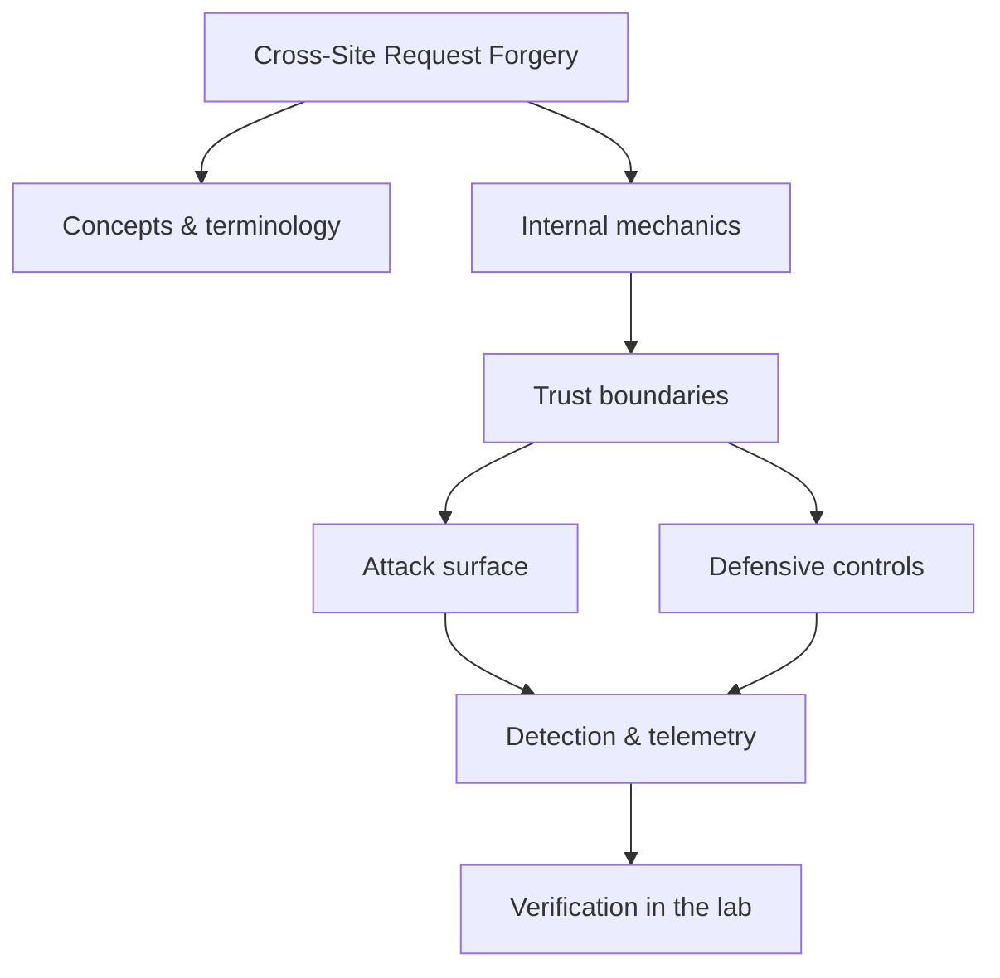

<!-- SPDX-License-Identifier: GPL-3.0-or-later | Copyright (C) 2026 Nithees Narendra S -->
[Home](../../README.md) › [Vulnerabilities](README.md) › **Cross-Site Request Forgery**

# Cross-Site Request Forgery

State-changing requests, token patterns, SameSite behaviour and CSRF-in-JSON edge cases.

<div class="meta-row"><span class="badge b-intermediate">Intermediate</span><span class="badge">⌨ ~48 min hands-on</span><span class="badge">📖 ~16 min read</span><button id="lesson-complete" class="lesson-check"><span class="lbl">Mark complete</span></button></div>

**▶ Here to build, not read? Jump to the [Hands-On Practice](#hands-on-practice).**

**Prerequisites:** [Cookies](../03-web-security/cookies.md) · [Session Management](../03-web-security/sessions.md) · [HTTP for Security Testing](../03-web-security/http-protocol.md)

## Overview

Cross-Site Request Forgery abuses the browser's habit of automatically attaching a user's
credentials (cookies, HTTP auth) to *every* request to a site, regardless of who initiated it. If an
application decides "this request carries a valid session cookie, therefore the user intended it", an attacker
can forge a state-changing request from a page the victim visits elsewhere, and the browser will send it fully
authenticated. The user is the confused deputy: their browser acts on the attacker's behalf.

CSRF only affects actions that rely on ambient credentials and change state (transfer money, change email,
add an admin). The defence is to require proof that the request came from your own application — a value the
attacker cannot know or send cross-site — via anti-CSRF tokens, and to lean on the browser's `SameSite` cookie
attribute, which stops cookies riding along on cross-site requests in the first place.

### How it works

A vulnerable flow: the bank's "change email" endpoint accepts a POST with the new address
and trusts the session cookie. The attacker hosts a page with an auto-submitting form:

```html
<form action="https://bank.example/account/email" method="POST">
  <input type="hidden" name="email" value="attacker@evil.com">
</form>
<script>document.forms[0].submit()</script>
```

When the logged-in victim opens it, the browser attaches their bank cookie and the change succeeds. The
attacker never sees the response (the same-origin policy hides it) — they do not need to; the *side effect*
already happened. The fix breaks the one assumption the attack relies on: that a valid cookie implies user
intent. A per-session, unpredictable token echoed in the form and verified server-side supplies the missing
proof of intent, because the attacker's cross-site page cannot read it.



<div class="card"><div class="card-title">🔑 Key terms</div>

- **Ambient authority** — Credentials the browser attaches automatically (cookies, HTTP auth) regardless of request origin.
- **Anti-CSRF token (synchronizer token)** — An unpredictable per-session value the server issues and verifies to prove same-origin intent.
- **SameSite cookie** — A cookie attribute (Lax/Strict/None) controlling whether cookies ride on cross-site requests.
- **Double-submit cookie** — A stateless CSRF defence comparing a token in a cookie against one in the request body.
- **State-changing request** — A request with a side effect (write/delete) — the only kind CSRF targets.
- **Login CSRF** — Forcing a victim to log in as the attacker, poisoning their session.

</div>

> [!EXAMPLE] **In the wild.** **Home-router CSRF (widespread, 2010s).** Malicious pages issued forged requests to routers'
web interfaces (often still on default credentials) to change DNS servers, silently redirecting victims'
traffic. It shows CSRF's reach beyond web apps into any cookie/credential-trusting HTTP interface, and why
`SameSite` defaults were a meaningful ecosystem-wide fix.

## Hands-On Practice

> [!TIP] This is the main event. Bring up the lab, then work the walkthrough — every command has a **▸ Run** button (needs the lab runner) and a **📋 Copy** button. ~48 min, Kali attacker, fully local.

**Mission.** Forge a state-changing request from an attacker page, then defend with a token and SameSite.

```cf-lab
{"title": "Vulnerabilities", "section": "04-vulnerabilities", "targets": [["bWAPP / DVWA / Juice Shop", "the web bug targets (see the Web Security part environment)"], ["pwn-box", "Ubuntu build/debug container for buffer/heap/format-string labs"]], "compose": "# vuln-lab/docker-compose.yml  —  Vulnerabilities part environment\nservices:\n  bwapp:\n    image: raesene/bwapp\n    ports: [\"8081:80\"]\n    networks: [labnet]\n  dvwa:\n    image: vulnerables/web-dvwa\n    ports: [\"8082:80\"]\n    networks: [labnet]\n  pwn-box:\n    image: ubuntu:22.04\n    container_name: pwn-box\n    cap_add: [\"SYS_PTRACE\"]          # allow gdb inside the container\n    security_opt: [\"seccomp=unconfined\"]\n    command: sleep infinity\n    networks: [labnet]\n\nnetworks:\n  labnet:\n    driver: bridge"}
```

**Target for this lesson:** bWAPP → *CSRF (Change Password/Secret)* at http://localhost:8081. Full setup: [Vulnerabilities lab environment](README.md#lab-environment).

### Guided walkthrough

<div class="stepper">

```cf-step
{"n": 1, "goal": "Capture the state-changing request", "cmd": "# In Burp, change the bWAPP secret and read the POST", "output": "POST /csrf_1.php  body: password_new=x&password_conf=x&action=change", "why": "This is the request you'll forge — note it relies only on the session cookie.", "runnable": false}
```
```cf-step
{"n": 2, "goal": "Build an attacker page", "cmd": "<form action=\"http://localhost:8081/csrf_1.php\" method=POST>\n <input name=password_new value=hacked>\n <input name=password_conf value=hacked>\n <input name=action value=change></form>\n<script>document.forms[0].submit()</script>", "output": "Save as evil.html and open it while logged into bWAPP.", "why": "The browser attaches the bWAPP cookie automatically — the change succeeds.", "runnable": false}
```
```cf-step
{"n": 3, "goal": "Confirm the forgery worked", "cmd": "# log in with the new value the attacker set", "output": "The secret/password changed without the user's intent.", "why": "A valid cookie was treated as user intent — the core CSRF flaw.", "runnable": false}
```
```cf-step
{"n": 4, "goal": "Fix: token + SameSite", "cmd": "# add a per-session csrf token to the form and verify server-side; set cookie SameSite=Lax", "output": "The forged POST is now rejected (missing/invalid token); cross-site cookies stop riding along.", "why": "The attacker's page can't read the token and can't send the cookie cross-site.", "runnable": false}
```

</div>

### Live terminal

```cf-terminal
{"title": "kali@csrf — start the lab runner for a live shell"}
```

### Try it yourself

> [!NOTE] Try each for real. Open the hint only when stuck, the solution only to check.

**Challenge 1.** Does the attack still work if the endpoint uses GET instead of POST? Demonstrate.

<details><summary>Hint</summary>

An  tag issues a GET cross-site with cookies.

</details>
<details><summary>Solution</summary>

`` — yes, GET is worse.

</details>

**Challenge 2.** Set the session cookie to SameSite=Strict and explain what breaks for legitimate users.

<details><summary>Hint</summary>

Strict blocks cookies even on top-level navigation from other sites.

</details>
<details><summary>Solution</summary>

Following a link from email won't carry the session — you land logged out; Lax is the usual balance.

</details>

**Challenge 3.** Bypass a CSRF defence that only checks the Referer header.

<details><summary>Hint</summary>

Referer can be absent or partially controllable.

</details>
<details><summary>Solution</summary>

Strip the Referer (`<meta name=referrer content=no-referrer>`) or use an allowed-prefix trick; hence tokens, not Referer, are the control.

</details>

### Quick quiz

```cf-quiz
{"q": "Why does an anti-CSRF token stop the attack?", "options": ["It encrypts the request", "The attacker's cross-site page can't read or guess it", "It rate-limits the endpoint", "It hides the form"], "answer": 1, "explain": "The token is unpredictable and same-origin-readable only; a cross-site page can send the cookie but not the token."}
```

### Detect & defend (blue-team view)

- Server-side: log requests whose Origin/Referer is cross-site on state-changing endpoints.
- A spike of state changes with mismatched Origin is a CSRF-attempt signal.

### Skills check

You can move on when you can, without notes:

- [ ] Forge a working cross-site state change against a cookie-authenticated endpoint.
- [ ] Explain why SameSite and anti-CSRF tokens each stop it.
- [ ] Reason about GET-vs-POST and Referer-only defences.

### Going deeper — Defending correctly

Layer these; do not rely on any single one:

1. **SameSite cookies** — set session cookies `SameSite=Lax` (or `Strict` for sensitive apps). This alone stops
   most cross-site cookie-borne CSRF, but is a browser behaviour, not a guarantee for every client.
2. **Anti-CSRF tokens** — issue a per-session (or per-request) token, embed it in forms/headers, and verify it
   server-side on every state-changing request. Frameworks (Django, Rails, Spring) provide this — use it.
3. **Custom-header requirement for APIs** — require a header like `X-Requested-With` that cross-site forms
   cannot set, backed by CORS.
4. **Re-authentication / step-up** for the most sensitive actions (change password, transfer funds).

Non-defences: checking the `Referer` alone (strippable/absent), using GET for writes (worst case), or relying
on obscurity.


## Check Yourself

_Quick self-test — answers hidden. If you can't answer without notes, redo the relevant walkthrough step._

**Q1. In one sentence, what security problem does Cross-Site Request Forgery address or create?**

<details><summary>Show answer</summary>

Cross-Site Request Forgery matters because its behaviour determines where trust is placed; misplacing that trust is the root of the associated bug class.

</details>

**Q2. Name one trust boundary involved in Cross-Site Request Forgery and what crosses it.**

<details><summary>Show answer</summary>

Any point where attacker-influenced data meets privileged processing — e.g. user input reaching an interpreter, or a token reaching a verifier.

</details>

**Q3. Give one attack against Cross-Site Request Forgery and the single control that most reduces its impact.**

<details><summary>Show answer</summary>

State the attack precisely, then the *primary* control (validation, encoding, isolation, authentication, or least privilege) — not a laundry list.

</details>

**Interview angles**

- Walk me through how Cross-Site Request Forgery works, then tell me where you would attack it.
- How would you detect Cross-Site Request Forgery being abused in an environment you defend?
- What is the difference between mitigating and eliminating the risk associated with Cross-Site Request Forgery?

## Pitfalls & Best Practice

**Common mistakes**

- Assuming SameSite defaults protect you everywhere — some clients and SameSite=None cookies still ride cross-site.
- Validating the CSRF token only on some endpoints, leaving others exposed.
- Using GET for state-changing actions, making CSRF trivial and cache-leaky.
- Relying on the Referer/Origin header alone, which can be absent or spoofed in some contexts.
- Exempting JSON APIs from CSRF thinking they are immune — they are not if they accept form-encoded bodies or use cookies.

**Do this instead**

- Set session cookies SameSite=Lax or Strict, plus Secure and HttpOnly.
- Use your framework's synchronizer-token protection on every state-changing request.
- Require a custom header (enforced by CORS) for API state changes.
- Step up authentication for the highest-impact actions.
- Test that forged cross-site POSTs are rejected as part of your regression suite.

## Reference

### MITRE ATT&CK Mapping

_No single ATT&CK technique maps cleanly to this concept. Once you apply it offensively or defensively, map the specific behaviour using the [ATT&CK](../14-threat-intelligence/mitre-attack.md) chapter._

### OWASP Mapping

- [OWASP CSRF Prevention Cheat Sheet](https://cheatsheetseries.owasp.org/cheatsheets/Cross-Site_Request_Forgery_Prevention_Cheat_Sheet.html)

### CWE Mapping

| CWE | Weakness |
| --- | --- |
| [CWE-352](https://cwe.mitre.org/data/definitions/352.html) | Cross-Site Request Forgery |

### CAPEC Mapping

| CAPEC | Attack pattern |
| --- | --- |
| [CAPEC-62](https://capec.mitre.org/data/definitions/62.html) | Cross Site Request Forgery |

### CVE References

- No canonical CVE for a concept page. Search the [NVD](https://nvd.nist.gov/) for concrete instances when studying real cases.

### NIST References

- [NIST CSRC Publications](https://csrc.nist.gov/publications) — search for the control family or guide relevant to this topic.

### RFC References

- No governing RFC for this topic. Where a protocol is involved, its RFC is linked from the relevant networking chapter.

### Research Papers

- *Reflections on Trusting Trust* — Ken Thompson, 1984
- *Smashing the Stack for Fun and Profit* — Aleph One, Phrack 49, 1996
- *The Protection of Information in Computer Systems* — Saltzer & Schroeder, 1975

### Books

- *The Web Application Hacker's Handbook, 2nd ed.* — Stuttard & Pinto
- *Real-World Bug Hunting* — Peter Yaworski
- *The Tangled Web* — Michal Zalewski
- *Web Security for Developers* — Malcolm McDonald

### Official Documentation

- [MITRE ATT&CK](https://attack.mitre.org/)
- [OWASP](https://owasp.org/)
- [NIST CSRC Publications](https://csrc.nist.gov/publications)

### Related Chapters

- [Vulnerability Taxonomy](vulnerability-taxonomy.md)
- [SQL Injection](sql-injection.md)
- [Blind SQL Injection](blind-sql-injection.md)
- [NoSQL Injection](nosql-injection.md)
- [Cross-Site Scripting](xss.md)
- [Stored XSS](stored-xss.md)

---

_Part of the **Vulnerabilities** section of [Cybersecurity-Mastery](../../README.md). 🟡 Intermediate · ~48 min hands-on · Last updated 2026-08-13._
