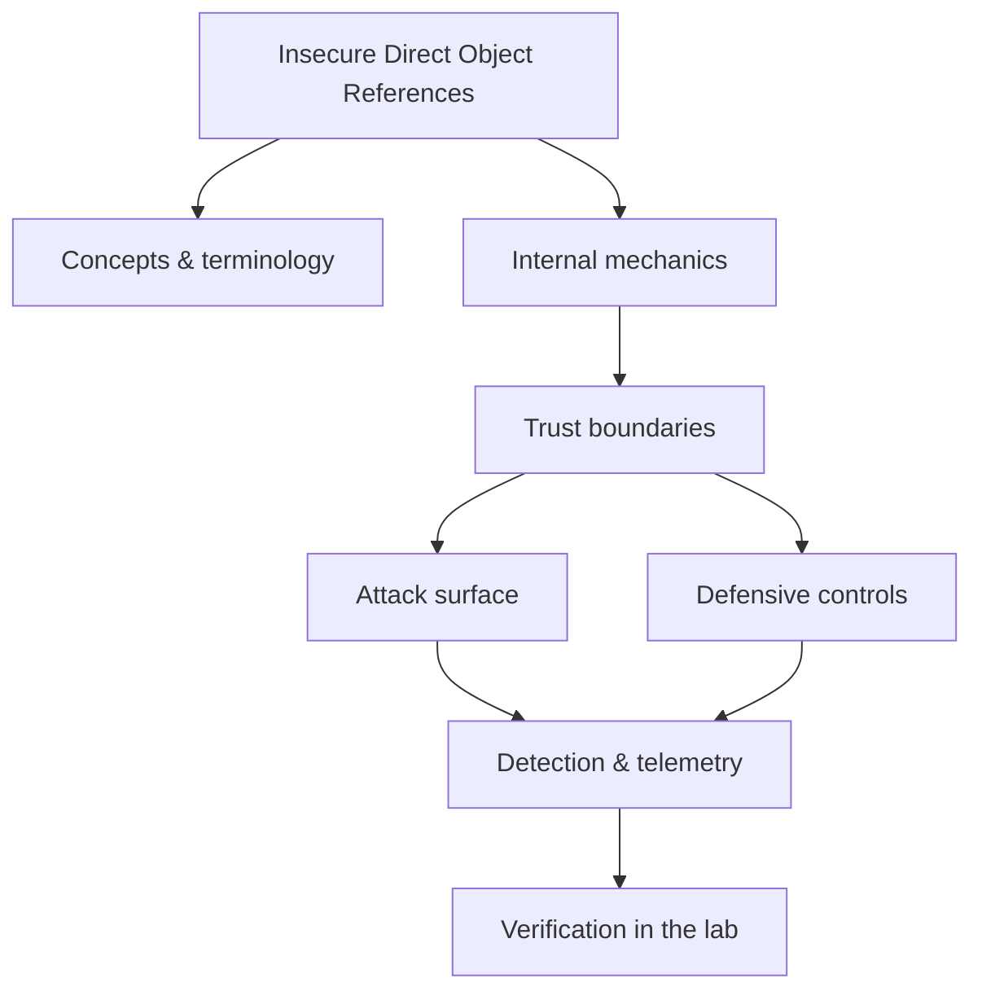

<!-- SPDX-License-Identifier: GPL-3.0-or-later | Copyright (C) 2026 Nithees Narendra S -->
[Home](../../README.md) › [Vulnerabilities](README.md) › **Insecure Direct Object References**

# Insecure Direct Object References

Object-level authorization, identifier enumeration, tenant isolation and systematic testing.

<div class="meta-row"><span class="badge b-beginner">Beginner</span><span class="badge">⌨ ~36 min hands-on</span><span class="badge">📖 ~12 min read</span><button id="lesson-complete" class="lesson-check"><span class="lbl">Mark complete</span></button></div>

**▶ Here to build, not read? Jump to the [Hands-On Practice](#hands-on-practice).**

**Prerequisites:** [Web Application Architecture](../03-web-security/web-architecture.md) · [HTTP for Security Testing](../03-web-security/http-protocol.md)

## Overview

Object-level authorization, identifier enumeration, tenant isolation and systematic testing. In one line: insecure direct object references decides where trust is placed, and misplaced trust is where the security problem lives. That's the theory you need — the understanding comes from doing it, so the walkthrough below is the heart of this chapter.

### How it works

Mechanically, insecure direct object references comes down to three things: what data is trusted, where it crosses a boundary, and what happens on the other side. The diagram traces that path; you'll walk it for real, step by step, in the practice below.



<div class="card"><div class="card-title">🔑 Key terms</div>

- **Trust boundary** — where data or control passes between components of different privilege or trust.
- **Attack surface** — the set of points an attacker can interact with.
- **Primary control** — the single measure that most reduces this technique's impact.
- **Telemetry** — the log or signal a defender uses to detect the technique.

</div>

## Hands-On Practice

> [!TIP] This is the main event. Bring up the lab, then work the walkthrough — every command has a **▸ Run** button (needs the lab runner) and a **📋 Copy** button. ~36 min, Kali attacker, fully local.

**Mission.** Access another user's objects by changing an identifier, then enforce object-level authorization.

```cf-lab
{"title": "Vulnerabilities", "section": "04-vulnerabilities", "targets": [["bWAPP / DVWA / Juice Shop", "the web bug targets (see the Web Security part environment)"], ["pwn-box", "Ubuntu build/debug container for buffer/heap/format-string labs"]], "compose": "# vuln-lab/docker-compose.yml  —  Vulnerabilities part environment\nservices:\n  bwapp:\n    image: raesene/bwapp\n    ports: [\"8081:80\"]\n    networks: [labnet]\n  dvwa:\n    image: vulnerables/web-dvwa\n    ports: [\"8082:80\"]\n    networks: [labnet]\n  pwn-box:\n    image: ubuntu:22.04\n    container_name: pwn-box\n    cap_add: [\"SYS_PTRACE\"]          # allow gdb inside the container\n    security_opt: [\"seccomp=unconfined\"]\n    command: sleep infinity\n    networks: [labnet]\n\nnetworks:\n  labnet:\n    driver: bridge"}
```

**Target for this lesson:** Juice Shop http://localhost:8083 (basket / order history) or bWAPP IDOR. Full setup: [Vulnerabilities lab environment](README.md#lab-environment).

### Guided walkthrough

<div class="stepper">

```cf-step
{"n": 1, "goal": "Find an object reference", "cmd": "# log in, open your basket; note the id in the request: GET /rest/basket/1", "output": "Your basket is id 1.", "why": "The id is user-controllable and maps directly to a database row.", "runnable": false}
```
```cf-step
{"n": 2, "goal": "Change the reference", "cmd": "curl -s http://localhost:8083/rest/basket/2 -H \"Authorization: Bearer $TOKEN\"", "output": "You receive basket 2 — another user's items.", "why": "The server checked authentication (valid token) but not *ownership* — classic IDOR.", "runnable": true}
```
```cf-step
{"n": 3, "goal": "Enumerate", "cmd": "for i in $(seq 1 20); do curl -s .../rest/basket/$i ...; done", "output": "Multiple baskets returned across users.", "why": "Sequential ids make bulk access trivial — the impact scales.", "runnable": true}
```
```cf-step
{"n": 4, "goal": "Fix: object-level checks", "cmd": "# WHERE basket.id = :id AND basket.user_id = :current_user", "output": "Requests for baskets you don't own now return 403/404.", "why": "Authorization must be checked per object, not just 'is the user logged in'.", "runnable": false}
```

</div>

### Live terminal

```cf-terminal
{"title": "kali@idor — start the lab runner for a live shell"}
```

### Try it yourself

> [!NOTE] Try each for real. Open the hint only when stuck, the solution only to check.

**Challenge 1.** Find an IDOR that leaks data via a non-numeric identifier (UUID/filename).

<details><summary>Hint</summary>

UUIDs aren't guessable but may leak via other endpoints/responses.

</details>
<details><summary>Solution</summary>

Harvest ids from listing endpoints or referrers, then replay — 'unguessable' ≠ 'authorized'.

</details>

**Challenge 2.** Escalate an IDOR from read to write (change someone else's object).

<details><summary>Hint</summary>

Try the same id swap on PUT/PATCH/DELETE.

</details>
<details><summary>Solution</summary>

If write endpoints share the missing ownership check, you can modify others' data — often higher impact.

</details>

**Challenge 3.** Explain why rate-limiting alone doesn't fix IDOR.

<details><summary>Hint</summary>

Rate limiting slows enumeration; it doesn't add authorization.

</details>
<details><summary>Solution</summary>

A single unauthorized read is still a breach; the fix is per-object authz, not throttling.

</details>

### Quick quiz

```cf-quiz
{"q": "An endpoint checks the user is logged in, then returns object by id. What's missing?", "options": ["Rate limiting", "Encryption", "Per-object (ownership) authorization", "Input validation"], "answer": 2, "explain": "IDOR is broken object-level authorization: the server must verify the object belongs to (or is permitted for) the current user, not just that they're authenticated."}
```

### Detect & defend (blue-team view)

- Alert on one account requesting many distinct object ids in a short window.
- Log authorization decisions; a burst of 200s across sequential ids from one session is an IDOR signal.

### Skills check

You can move on when you can, without notes:

- [ ] Identify and exploit object-level authorization gaps for read and write.
- [ ] Reason about guessable vs unguessable identifiers.
- [ ] Implement and verify per-object authorization.

## Check Yourself

_Quick self-test — answers hidden. If you can't answer without notes, redo the relevant walkthrough step._

**Q1. In one sentence, what security problem does Insecure Direct Object References address or create?**

<details><summary>Show answer</summary>

Insecure Direct Object References matters because its behaviour determines where trust is placed; misplacing that trust is the root of the associated bug class.

</details>

**Q2. Name one trust boundary involved in Insecure Direct Object References and what crosses it.**

<details><summary>Show answer</summary>

Any point where attacker-influenced data meets privileged processing — e.g. user input reaching an interpreter, or a token reaching a verifier.

</details>

**Q3. Give one attack against Insecure Direct Object References and the single control that most reduces its impact.**

<details><summary>Show answer</summary>

State the attack precisely, then the *primary* control (validation, encoding, isolation, authentication, or least privilege) — not a laundry list.

</details>

**Interview angles**

- Walk me through how Insecure Direct Object References works, then tell me where you would attack it.
- How would you detect Insecure Direct Object References being abused in an environment you defend?
- What is the difference between mitigating and eliminating the risk associated with Insecure Direct Object References?

## Pitfalls & Best Practice

**Common mistakes**

- Treating insecure direct object references as a checkbox instead of understanding the mechanism — defences copied without comprehension fail silently.
- Trusting client-side or default controls to enforce a server-side security property.
- Testing only the happy path and never the abuse cases or malformed input.
- Fixing the symptom (one payload) instead of the class (the missing control).

**Do this instead**

- Push security decisions to a single, well-tested enforcement point rather than scattering checks.
- Fail closed: when in doubt, deny and log, so misconfiguration reduces access rather than expanding it.
- Instrument the trust boundaries so the same event is visible to offence (as a target) and defence (as a signal).
- Validate your understanding of insecure direct object references empirically in the lab before trusting it in production.
- Prefer safe, high-level APIs and secure defaults over hand-rolled primitives.

## Reference

### MITRE ATT&CK Mapping

_No single ATT&CK technique maps cleanly to this concept. Once you apply it offensively or defensively, map the specific behaviour using the [ATT&CK](../14-threat-intelligence/mitre-attack.md) chapter._

### OWASP Mapping

- [A01:2021 Broken Access Control](https://owasp.org/Top10/A01_2021-Broken_Access_Control/)

### CWE Mapping

| CWE | Weakness |
| --- | --- |
| [CWE-639](https://cwe.mitre.org/data/definitions/639.html) | Authorization Bypass Through User-Controlled Key |
| [CWE-284](https://cwe.mitre.org/data/definitions/284.html) | Improper Access Control |

### CAPEC Mapping

- No single attack pattern; see the [CAPEC](../14-threat-intelligence/capec.md) chapter to map behaviour to patterns.

### CVE References

- No canonical CVE for a concept page. Search the [NVD](https://nvd.nist.gov/) for concrete instances when studying real cases.

### NIST References

- [NIST CSRC Publications](https://csrc.nist.gov/publications) — search for the control family or guide relevant to this topic.

### RFC References

- No governing RFC for this topic. Where a protocol is involved, its RFC is linked from the relevant networking chapter.

### Research Papers

- *Reflections on Trusting Trust* — Ken Thompson, 1984
- *Smashing the Stack for Fun and Profit* — Aleph One, Phrack 49, 1996
- *The Protection of Information in Computer Systems* — Saltzer & Schroeder, 1975

### Books

- *The Web Application Hacker's Handbook, 2nd ed.* — Stuttard & Pinto
- *Real-World Bug Hunting* — Peter Yaworski
- *The Tangled Web* — Michal Zalewski
- *Web Security for Developers* — Malcolm McDonald

### Official Documentation

- [MITRE ATT&CK](https://attack.mitre.org/)
- [OWASP](https://owasp.org/)
- [NIST CSRC Publications](https://csrc.nist.gov/publications)

### Related Chapters

- [Vulnerability Taxonomy](vulnerability-taxonomy.md)
- [SQL Injection](sql-injection.md)
- [Blind SQL Injection](blind-sql-injection.md)
- [NoSQL Injection](nosql-injection.md)
- [Cross-Site Scripting](xss.md)
- [Stored XSS](stored-xss.md)

---

_Part of the **Vulnerabilities** section of [Cybersecurity-Mastery](../../README.md). 🟢 Beginner · ~36 min hands-on · Last updated 2026-08-13._
