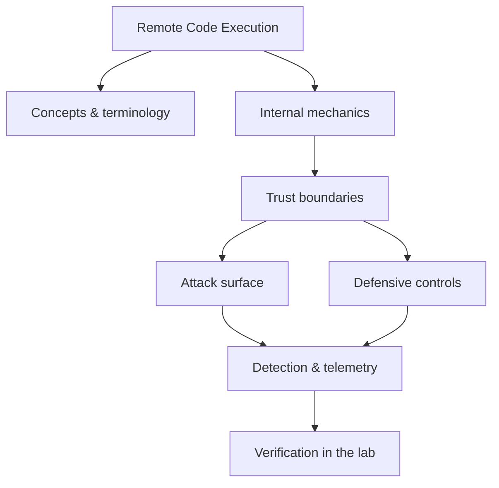

<!-- SPDX-License-Identifier: GPL-3.0-or-later | Copyright (C) 2026 Nithees Narendra S -->
[Home](../../README.md) › [Vulnerabilities](README.md) › **Remote Code Execution**

# Remote Code Execution

How arbitrary code execution is reached, chained and stabilised, plus containment strategies.

<div class="meta-row"><span class="badge b-advanced">Advanced</span><span class="badge">⌨ ~72 min hands-on</span><span class="badge">📖 ~24 min read</span><button id="lesson-complete" class="lesson-check"><span class="lbl">Mark complete</span></button></div>

**▶ Here to build, not read? Jump to the [Hands-On Practice](#hands-on-practice).**

**Prerequisites:** [Web Application Architecture](../03-web-security/web-architecture.md) · [HTTP for Security Testing](../03-web-security/http-protocol.md)

## Overview

Remote Code Execution is the most severe outcome in application security: an attacker runs
code of their choosing on your server. It is rarely a vulnerability class of its own so much as the
*destination* of many others — command injection, insecure deserialization, template injection, file upload,
memory corruption, and dependency flaws all chain toward it. Because RCE grants a foothold from which the
attacker can pivot, persist and exfiltrate, it is the outcome every other control exists to prevent.

Reasoning about RCE means reasoning about **where attacker-controlled data can influence what the server
executes** — a shell command, a deserialized object graph, a template, a loaded class, an uploaded script, or
native memory. The mitigations differ by path, but the strategic defences are constant: never pass untrusted
data to an evaluator, run services with least privilege, and isolate them so that code execution buys the
attacker as little as possible.

### How it works

RCE is reached along distinct paths, each with its own mechanics:

- **Command injection** — user input reaches a shell (`os.system`, backticks); metacharacters run extra
  commands. Fix: never call a shell; pass argument arrays to `execve`-style APIs.
- **Insecure deserialization** — untrusted bytes are turned into objects, triggering gadget chains. Fix:
  don't deserialize untrusted data into rich objects; use schema-validated formats.
- **Template injection (SSTI)** — input is evaluated by a template engine, escaping the sandbox to reach
  Python/Java internals. Fix: never build templates from user input.
- **Unsafe eval / dynamic loading** — input reaches `eval`, `exec`, or a class loader (Log4Shell's JNDI).
- **File upload / LFI chains** — an attacker writes or includes executable content.
- **Memory corruption** — an overflow yields native code execution.

In every case, the boundary crossed is *code versus data*, and the fix is to keep untrusted input strictly as
data.



<div class="card"><div class="card-title">🔑 Key terms</div>

- **Foothold** — The initial code-execution access an attacker gains on a target.
- **Gadget chain** — A sequence of existing code invoked via deserialization to reach execution.
- **Shellcode / payload** — The code an attacker runs once execution is achieved.
- **Sandbox escape** — Breaking out of a restricted execution context (template/interpreter/container) to the host.
- **Least privilege** — Running the service with the minimum rights, so RCE yields little.
- **Egress control** — Restricting outbound connections so a foothold cannot easily reach C2.

</div>

> [!EXAMPLE] **In the wild.** **Equifax (2017).** An unpatched Apache Struts2 RCE (CVE-2017-5638) — a flaw in parsing the
`Content-Type` header via OGNL — gave attackers a foothold that led to the theft of ~147 million people's
data. Root causes to extract: a known, patchable RCE left exposed for months, flat internal access from the
foothold, and unencrypted credentials that widened the breach. Defence in depth would have broken the chain at
several points.

## Hands-On Practice

> [!TIP] This is the main event. Bring up the lab, then work the walkthrough — every command has a **▸ Run** button (needs the lab runner) and a **📋 Copy** button. ~72 min, Kali attacker, fully local.

```cf-lab
{"title": "Vulnerabilities", "section": "04-vulnerabilities", "targets": [["bWAPP / DVWA / Juice Shop", "the web bug targets (see the Web Security part environment)"], ["pwn-box", "Ubuntu build/debug container for buffer/heap/format-string labs"]], "compose": "# vuln-lab/docker-compose.yml  —  Vulnerabilities part environment\nservices:\n  bwapp:\n    image: raesene/bwapp\n    ports: [\"8081:80\"]\n    networks: [labnet]\n  dvwa:\n    image: vulnerables/web-dvwa\n    ports: [\"8082:80\"]\n    networks: [labnet]\n  pwn-box:\n    image: ubuntu:22.04\n    container_name: pwn-box\n    cap_add: [\"SYS_PTRACE\"]          # allow gdb inside the container\n    security_opt: [\"seccomp=unconfined\"]\n    command: sleep infinity\n    networks: [labnet]\n\nnetworks:\n  labnet:\n    driver: bridge"}
```

Uses the [Vulnerabilities lab environment](README.md#lab-environment).

### Guided walkthrough

<div class="stepper">

```cf-step
{"n": 1, "goal": "Provision & baseline", "cmd": "# bring up the part environment, then confirm you can reach `bWAPP / DVWA / Juice Shop` from Kali", "output": "Target reachable; you have a clean starting point.", "why": "Always capture 'normal' before you change anything — it's your reference.", "runnable": false}
```
```cf-step
{"n": 2, "goal": "Reproduce the technique", "cmd": "# perform the core remote code execution technique step by step against bWAPP / DVWA / Juice Shop", "output": "You observe the expected effect and can repeat it reliably.", "why": "Owning the mechanism by hand beats running a tool you don't understand.", "runnable": false}
```
```cf-step
{"n": 3, "goal": "Observe what happened", "cmd": "# inspect logs / responses / process or network activity", "output": "You can point to exactly where and why it worked.", "why": "The evidence here is what a defender would alert on.", "runnable": false}
```
```cf-step
{"n": 4, "goal": "Apply the primary control", "cmd": "# implement the single most important fix for this technique", "output": "Repeating the technique now fails.", "why": "Fix the class, not the one payload — then prove it's closed.", "runnable": false}
```

</div>

### Live terminal

```cf-terminal
{"title": "kali@rce — start the lab runner for a live shell"}
```

### Try it yourself

> [!NOTE] Try each for real. Open the hint only when stuck, the solution only to check.

**Challenge 1.** Extend the walkthrough with one variation of the remote code execution technique and predict the result before running it.

<details><summary>Hint</summary>

Change one variable (payload, target, or control) at a time.

</details>
<details><summary>Solution</summary>

Answers vary — the goal is a correct prediction confirmed by observation.

</details>

**Challenge 2.** Find and apply a second defensive control for remote code execution and show it also blocks the technique.

<details><summary>Hint</summary>

Think in layers: prevention, detection, and least privilege.

</details>
<details><summary>Solution</summary>

Any independent control that breaks the chain counts — name why it works.

</details>

**Challenge 3.** Write a one-paragraph report of your remote code execution test mapped to CWE/ATT&CK and the fix.

<details><summary>Hint</summary>

Structure: finding → impact → evidence → remediation.

</details>
<details><summary>Solution</summary>

A defender should be able to act on your report without asking you anything.

</details>

### Detect & defend (blue-team view)

- Re-run the technique while watching your telemetry — attack and detection are two views of one event.
- Turn what you observed into a detection rule (Sigma/YARA) and confirm it fires without flooding.

### Skills check

You can move on when you can, without notes:

- [ ] Reproduce the core remote code execution technique on demand against the lab.
- [ ] Explain the root cause and the single most effective control.
- [ ] Describe the telemetry a defender would use to catch it.

### Going deeper — Containment: assume RCE will happen

Prevention reduces likelihood; containment reduces impact.
Design so that a single RCE does not equal total compromise:

- **Least privilege** — run app processes as a non-root user with no unnecessary capabilities; drop Linux
  capabilities and use seccomp.
- **Isolation** — containerise with a read-only root filesystem, no host mounts, and a minimal image; treat a
  container as a blast-radius boundary, not a security boundary you can ignore.
- **Egress filtering** — block outbound connections by default so a foothold cannot fetch a second stage or
  reach C2.
- **Secrets hygiene** — keep credentials out of the app environment where a foothold would read them; scope
  cloud roles tightly.
- **Detection** — alert on unexpected child processes of web servers (`www-data` spawning `sh`/`curl`), new
  outbound connections, and file writes to web roots.


## Check Yourself

_Quick self-test — answers hidden. If you can't answer without notes, redo the relevant walkthrough step._

**Q1. In one sentence, what security problem does Remote Code Execution address or create?**

<details><summary>Show answer</summary>

Remote Code Execution matters because its behaviour determines where trust is placed; misplacing that trust is the root of the associated bug class.

</details>

**Q2. Name one trust boundary involved in Remote Code Execution and what crosses it.**

<details><summary>Show answer</summary>

Any point where attacker-influenced data meets privileged processing — e.g. user input reaching an interpreter, or a token reaching a verifier.

</details>

**Q3. Give one attack against Remote Code Execution and the single control that most reduces its impact.**

<details><summary>Show answer</summary>

State the attack precisely, then the *primary* control (validation, encoding, isolation, authentication, or least privilege) — not a laundry list.

</details>

**Interview angles**

- Walk me through how Remote Code Execution works, then tell me where you would attack it.
- How would you detect Remote Code Execution being abused in an environment you defend?
- What is the difference between mitigating and eliminating the risk associated with Remote Code Execution?

## Pitfalls & Best Practice

**Common mistakes**

- Passing untrusted input to a shell instead of using argument arrays and avoiding a shell entirely.
- Deserializing untrusted data into rich objects (Java/PHP/Python native serialization).
- Running web services as root or with broad capabilities, so RCE means host compromise.
- No egress filtering, letting a foothold pull a second stage and reach C2 freely.
- Treating a container as a hard boundary while mounting the Docker socket or host paths into it.

**Do this instead**

- Never pass untrusted data to an evaluator (shell, deserializer, template, class loader, eval).
- Run services as non-root, least-privilege, with seccomp/AppArmor and a read-only rootfs.
- Enforce default-deny egress so footholds cannot fetch stages or exfiltrate.
- Keep dependencies patched and inventoried (SBOM) — many RCEs are third-party.
- Alert on web-server processes spawning shells or making unexpected outbound connections.

## Reference

### MITRE ATT&CK Mapping

| Technique | ID |
| --- | --- |
| ATT&CK technique | [T1190](https://attack.mitre.org/techniques/T1190/) |
| ATT&CK technique | [T1059](https://attack.mitre.org/techniques/T1059/) |

### OWASP Mapping

- See [OWASP Top 10](../03-web-security/owasp-top-10.md) for the relevant category when this applies to web systems.

### CWE Mapping

| CWE | Weakness |
| --- | --- |
| [CWE-94](https://cwe.mitre.org/data/definitions/94.html) | Code Injection |
| [CWE-78](https://cwe.mitre.org/data/definitions/78.html) | OS Command Injection |

### CAPEC Mapping

| CAPEC | Attack pattern |
| --- | --- |
| [CAPEC-248](https://capec.mitre.org/data/definitions/248.html) | Command Injection |

### CVE References

- [CVE-2021-44228](https://nvd.nist.gov/vuln/detail/CVE-2021-44228)
- [CVE-2017-5638](https://nvd.nist.gov/vuln/detail/CVE-2017-5638)

### NIST References

- [NIST CSRC Publications](https://csrc.nist.gov/publications) — search for the control family or guide relevant to this topic.

### RFC References

- No governing RFC for this topic. Where a protocol is involved, its RFC is linked from the relevant networking chapter.

### Research Papers

- *Reflections on Trusting Trust* — Ken Thompson, 1984
- *Smashing the Stack for Fun and Profit* — Aleph One, Phrack 49, 1996
- *The Protection of Information in Computer Systems* — Saltzer & Schroeder, 1975

### Books

- *The Web Application Hacker's Handbook, 2nd ed.* — Stuttard & Pinto
- *Real-World Bug Hunting* — Peter Yaworski
- *The Tangled Web* — Michal Zalewski
- *Web Security for Developers* — Malcolm McDonald

### Official Documentation

- [MITRE ATT&CK](https://attack.mitre.org/)
- [OWASP](https://owasp.org/)
- [NIST CSRC Publications](https://csrc.nist.gov/publications)

### Related Chapters

- [Vulnerability Taxonomy](vulnerability-taxonomy.md)
- [SQL Injection](sql-injection.md)
- [Blind SQL Injection](blind-sql-injection.md)
- [NoSQL Injection](nosql-injection.md)
- [Cross-Site Scripting](xss.md)
- [Stored XSS](stored-xss.md)

---

_Part of the **Vulnerabilities** section of [Cybersecurity-Mastery](../../README.md). 🟠 Advanced · ~72 min hands-on · Last updated 2026-08-13._
