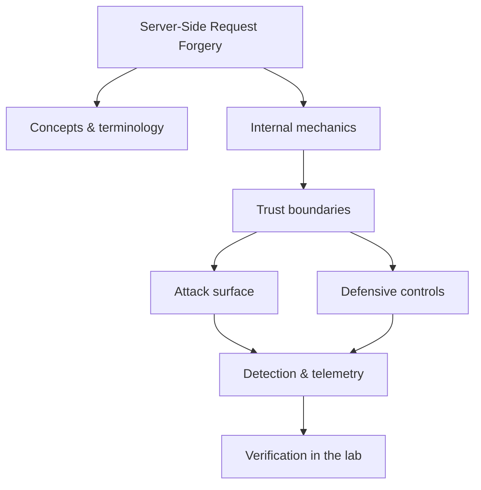

<!-- SPDX-License-Identifier: GPL-3.0-or-later | Copyright (C) 2026 Nithees Narendra S -->
[Home](../../README.md) › [Vulnerabilities](README.md) › **Server-Side Request Forgery**

# Server-Side Request Forgery

URL parsing, cloud metadata theft, blind SSRF, DNS rebinding and egress-control defences.

<div class="meta-row"><span class="badge b-advanced">Advanced</span><span class="badge">⌨ ~72 min hands-on</span><span class="badge">📖 ~24 min read</span><button id="lesson-complete" class="lesson-check"><span class="lbl">Mark complete</span></button></div>

**▶ Here to build, not read? Jump to the [Hands-On Practice](#hands-on-practice).**

**Prerequisites:** [HTTP for Security Testing](../03-web-security/http-protocol.md) · [DNS](../01-networking/dns.md) · [Cloud Platform Security](../05-platforms/cloud-platform-security.md)

## Overview

Server-Side Request Forgery abuses a server's willingness to make outbound requests to
URLs it derives from user input. The application is a trusted client sitting inside a trusted network; if an
attacker can choose where it connects, they borrow that position to reach things they cannot reach directly —
internal services, cloud metadata endpoints, admin interfaces bound to localhost, or other tenants. The
server becomes a confused deputy.

SSRF matters far more in cloud environments than the name suggests, because cloud instances expose a metadata
service at a fixed link-local address (`169.254.169.254`) that hands out temporary credentials to anything on
the instance that asks. An SSRF that can reach that endpoint frequently converts into full cloud account
compromise. The defence is not "validate the URL string" — URL parsers disagree in exploitable ways — but
"control where the server is allowed to connect", enforced after DNS resolution.

### How it works

A vulnerable endpoint typically looks benign: "fetch this URL and show me the result" —
a link preview, a webhook tester, a PDF renderer, an image proxy. The flaw is that the destination is
attacker-controlled. Exploitation explores where the server can be pointed:

- **Cloud metadata** — `http://169.254.169.254/latest/meta-data/iam/security-credentials/` on AWS (pre-IMDSv2),
  or the GCP/Azure equivalents, to steal credentials.
- **Internal services** — `http://10.0.0.5:6379/` or `http://localhost:8080/admin` that have no external route.
- **Blind SSRF** — no response is returned, but a callback (DNS/HTTP to attacker infrastructure) confirms the
  request fired, and can still be weaponised.
- **Filter bypass** — parser confusion (`http://127.0.0.1@evil`), alternate encodings, redirects, DNS
  rebinding (a name that resolves to a safe IP on validation and a target IP on use).

The bytes crossing the boundary are a *destination*, and the server's network position is the asset.



<div class="card"><div class="card-title">🔑 Key terms</div>

- **Metadata service (IMDS)** — A cloud endpoint at 169.254.169.254 serving instance data and temporary credentials.
- **IMDSv2** — Session-token-protected metadata access that defeats naive SSRF-to-metadata.
- **Blind SSRF** — SSRF where the response is not returned; confirmed via an out-of-band callback.
- **DNS rebinding** — Bypassing validation by resolving a hostname to a safe IP at check time and a target IP at use time.
- **SSRF-to-RCE** — Chaining SSRF into code execution via internal services (Redis, unauthenticated admin APIs).
- **Egress filtering** — Network controls restricting which destinations a server may connect to.

</div>

> [!EXAMPLE] **In the wild.** **Capital One (2019).** SSRF against a misconfigured ModSecurity WAF reached the EC2 metadata
service and retrieved the credentials of an over-privileged IAM role, which could list and read ~700 S3 buckets.
~100M US and ~6M Canadian records were exposed. Root causes worth extracting: SSRF reachability to IMDS, an
over-permissioned role, and no egress control — three independent failures, each of which alone would have
broken the chain.

## Hands-On Practice

> [!TIP] This is the main event. Bring up the lab, then work the walkthrough — every command has a **▸ Run** button (needs the lab runner) and a **📋 Copy** button. ~72 min, Kali attacker, fully local.

```cf-lab
{"title": "Vulnerabilities", "section": "04-vulnerabilities", "targets": [["bWAPP / DVWA / Juice Shop", "the web bug targets (see the Web Security part environment)"], ["pwn-box", "Ubuntu build/debug container for buffer/heap/format-string labs"]], "compose": "# vuln-lab/docker-compose.yml  —  Vulnerabilities part environment\nservices:\n  bwapp:\n    image: raesene/bwapp\n    ports: [\"8081:80\"]\n    networks: [labnet]\n  dvwa:\n    image: vulnerables/web-dvwa\n    ports: [\"8082:80\"]\n    networks: [labnet]\n  pwn-box:\n    image: ubuntu:22.04\n    container_name: pwn-box\n    cap_add: [\"SYS_PTRACE\"]          # allow gdb inside the container\n    security_opt: [\"seccomp=unconfined\"]\n    command: sleep infinity\n    networks: [labnet]\n\nnetworks:\n  labnet:\n    driver: bridge"}
```

Uses the [Vulnerabilities lab environment](README.md#lab-environment).

### Guided walkthrough

<div class="stepper">

```cf-step
{"n": 1, "goal": "Provision & baseline", "cmd": "# bring up the part environment, then confirm you can reach `bWAPP / DVWA / Juice Shop` from Kali", "output": "Target reachable; you have a clean starting point.", "why": "Always capture 'normal' before you change anything — it's your reference.", "runnable": false}
```
```cf-step
{"n": 2, "goal": "Reproduce the technique", "cmd": "# perform the core server-side request forgery technique step by step against bWAPP / DVWA / Juice Shop", "output": "You observe the expected effect and can repeat it reliably.", "why": "Owning the mechanism by hand beats running a tool you don't understand.", "runnable": false}
```
```cf-step
{"n": 3, "goal": "Observe what happened", "cmd": "# inspect logs / responses / process or network activity", "output": "You can point to exactly where and why it worked.", "why": "The evidence here is what a defender would alert on.", "runnable": false}
```
```cf-step
{"n": 4, "goal": "Apply the primary control", "cmd": "# implement the single most important fix for this technique", "output": "Repeating the technique now fails.", "why": "Fix the class, not the one payload — then prove it's closed.", "runnable": false}
```

</div>

### Live terminal

```cf-terminal
{"title": "kali@ssrf — start the lab runner for a live shell"}
```

### Try it yourself

> [!NOTE] Try each for real. Open the hint only when stuck, the solution only to check.

**Challenge 1.** Extend the walkthrough with one variation of the server-side request forgery technique and predict the result before running it.

<details><summary>Hint</summary>

Change one variable (payload, target, or control) at a time.

</details>
<details><summary>Solution</summary>

Answers vary — the goal is a correct prediction confirmed by observation.

</details>

**Challenge 2.** Find and apply a second defensive control for server-side request forgery and show it also blocks the technique.

<details><summary>Hint</summary>

Think in layers: prevention, detection, and least privilege.

</details>
<details><summary>Solution</summary>

Any independent control that breaks the chain counts — name why it works.

</details>

**Challenge 3.** Write a one-paragraph report of your server-side request forgery test mapped to CWE/ATT&CK and the fix.

<details><summary>Hint</summary>

Structure: finding → impact → evidence → remediation.

</details>
<details><summary>Solution</summary>

A defender should be able to act on your report without asking you anything.

</details>

### Detect & defend (blue-team view)

- Re-run the technique while watching your telemetry — attack and detection are two views of one event.
- Turn what you observed into a detection rule (Sigma/YARA) and confirm it fires without flooding.

### Skills check

You can move on when you can, without notes:

- [ ] Reproduce the core server-side request forgery technique on demand against the lab.
- [ ] Explain the root cause and the single most effective control.
- [ ] Describe the telemetry a defender would use to catch it.

### Going deeper — Why URL validation fails, and what to do instead

Attackers exploit the gap between the parser
that *validates* the URL and the client that *fetches* it. Classic bypasses:

```
http://127.0.0.1            http://0177.0.0.1 (octal)     http://2130706433 (decimal)
http://[::1]                http://127.0.0.1.nip.io       http://evil.com#@169.254.169.254/
http://localhost@target/    http://target%2f@safe/        302 redirect to an internal URL
```

Robust defence stops trying to bless the string and instead controls the connection:

1. **Resolve the hostname yourself**, then **validate the resulting IP** against a deny-list of private,
   loopback, link-local and cloud-metadata ranges — and re-validate after any redirect.
2. **Pin the connection to the validated IP** so DNS rebinding cannot swap it between check and use.
3. **Disable redirects** or re-run validation on each hop.
4. **Enforce egress filtering** at the network so a compromised fetcher simply cannot route to sensitive ranges.
5. **Require IMDSv2** and set the metadata hop limit to 1 so a proxied request cannot reach it.


## Check Yourself

_Quick self-test — answers hidden. If you can't answer without notes, redo the relevant walkthrough step._

**Q1. In one sentence, what security problem does Server-Side Request Forgery address or create?**

<details><summary>Show answer</summary>

Server-Side Request Forgery matters because its behaviour determines where trust is placed; misplacing that trust is the root of the associated bug class.

</details>

**Q2. Name one trust boundary involved in Server-Side Request Forgery and what crosses it.**

<details><summary>Show answer</summary>

Any point where attacker-influenced data meets privileged processing — e.g. user input reaching an interpreter, or a token reaching a verifier.

</details>

**Q3. Give one attack against Server-Side Request Forgery and the single control that most reduces its impact.**

<details><summary>Show answer</summary>

State the attack precisely, then the *primary* control (validation, encoding, isolation, authentication, or least privilege) — not a laundry list.

</details>

**Interview angles**

- Walk me through how Server-Side Request Forgery works, then tell me where you would attack it.
- How would you detect Server-Side Request Forgery being abused in an environment you defend?
- What is the difference between mitigating and eliminating the risk associated with Server-Side Request Forgery?

## Pitfalls & Best Practice

**Common mistakes**

- Validating the URL string instead of the resolved IP and the actual connection.
- Validating before a redirect but not after — the redirect target is never checked.
- Allowing the fetcher to reach the metadata service (no IMDSv2, no hop-limit, no egress filter).
- Treating blind SSRF as low-risk because 'nothing comes back'.
- Relying on a single allow/deny list without pinning DNS, leaving rebinding open.

**Do this instead**

- Resolve, validate the IP against private/link-local/metadata ranges, and pin the connection to it.
- Disable or re-validate redirects; treat each hop as a fresh request.
- Enforce network egress filtering so sensitive ranges are unreachable regardless of app bugs.
- Require IMDSv2 and set the metadata hop limit to 1 on cloud instances.
- Prefer allow-lists of exact destinations for server-side fetchers where the use case permits.

## Reference

### MITRE ATT&CK Mapping

| Technique | ID |
| --- | --- |
| ATT&CK technique | [T1190](https://attack.mitre.org/techniques/T1190/) |
| ATT&CK technique | [T1552.005](https://attack.mitre.org/techniques/T1552/005/) |

### OWASP Mapping

- [A10:2021 SSRF](https://owasp.org/Top10/A10_2021-Server-Side_Request_Forgery_%28SSRF%29/)

### CWE Mapping

| CWE | Weakness |
| --- | --- |
| [CWE-918](https://cwe.mitre.org/data/definitions/918.html) | Server-Side Request Forgery |

### CAPEC Mapping

| CAPEC | Attack pattern |
| --- | --- |
| [CAPEC-664](https://capec.mitre.org/data/definitions/664.html) | Server Side Request Forgery |

### CVE References

- [CVE-2019-8451](https://nvd.nist.gov/vuln/detail/CVE-2019-8451)
- [CVE-2021-26855](https://nvd.nist.gov/vuln/detail/CVE-2021-26855)

### NIST References

- [NIST CSRC Publications](https://csrc.nist.gov/publications) — search for the control family or guide relevant to this topic.

### RFC References

- No governing RFC for this topic. Where a protocol is involved, its RFC is linked from the relevant networking chapter.

### Research Papers

- *Reflections on Trusting Trust* — Ken Thompson, 1984
- *Smashing the Stack for Fun and Profit* — Aleph One, Phrack 49, 1996
- *The Protection of Information in Computer Systems* — Saltzer & Schroeder, 1975

### Books

- *The Web Application Hacker's Handbook, 2nd ed.* — Stuttard & Pinto
- *Real-World Bug Hunting* — Peter Yaworski
- *The Tangled Web* — Michal Zalewski
- *Web Security for Developers* — Malcolm McDonald

### Official Documentation

- [MITRE ATT&CK](https://attack.mitre.org/)
- [OWASP](https://owasp.org/)
- [NIST CSRC Publications](https://csrc.nist.gov/publications)

### Related Chapters

- [HTTP Request Smuggling](../03-web-security/request-smuggling.md)
- [Cloud Platform Security](../05-platforms/cloud-platform-security.md)
- [Remote Code Execution](rce.md)
- [Vulnerability Taxonomy](vulnerability-taxonomy.md)
- [SQL Injection](sql-injection.md)
- [Blind SQL Injection](blind-sql-injection.md)

---

_Part of the **Vulnerabilities** section of [Cybersecurity-Mastery](../../README.md). 🟠 Advanced · ~72 min hands-on · Last updated 2026-08-13._
