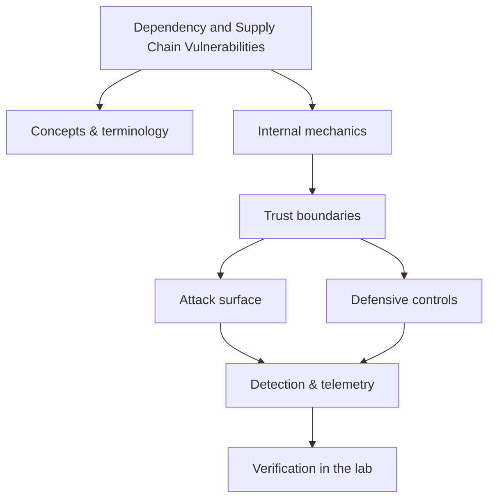

<!-- SPDX-License-Identifier: GPL-3.0-or-later | Copyright (C) 2026 Nithees Narendra S -->
[Home](../../README.md) › [Vulnerabilities](README.md) › **Dependency and Supply Chain Vulnerabilities**

# Dependency and Supply Chain Vulnerabilities

Typosquatting, dependency confusion, build compromise and reproducible-build defences.

<div class="meta-row"><span class="badge b-advanced">Advanced</span><span class="badge">⌨ ~48 min hands-on</span><span class="badge">📖 ~16 min read</span><button id="lesson-complete" class="lesson-check"><span class="lbl">Mark complete</span></button></div>

**▶ Here to build, not read? Jump to the [Hands-On Practice](#hands-on-practice).**

**Prerequisites:** [Web Application Architecture](../03-web-security/web-architecture.md) · [HTTP for Security Testing](../03-web-security/http-protocol.md)

## Overview

Typosquatting, dependency confusion, build compromise and reproducible-build defences. In one line: dependency and supply chain vulnerabilities decides where trust is placed, and misplaced trust is where the security problem lives. That's the theory you need — the understanding comes from doing it, so the walkthrough below is the heart of this chapter.

### How it works

Mechanically, dependency and supply chain vulnerabilities comes down to three things: what data is trusted, where it crosses a boundary, and what happens on the other side. The diagram traces that path; you'll walk it for real, step by step, in the practice below.



<div class="card"><div class="card-title">🔑 Key terms</div>

- **Trust boundary** — where data or control passes between components of different privilege or trust.
- **Attack surface** — the set of points an attacker can interact with.
- **Primary control** — the single measure that most reduces this technique's impact.
- **Telemetry** — the log or signal a defender uses to detect the technique.

</div>

## Hands-On Practice

> [!TIP] This is the main event. Bring up the lab, then work the walkthrough — every command has a **▸ Run** button (needs the lab runner) and a **📋 Copy** button. ~48 min, Kali attacker, fully local.

```cf-lab
{"title": "Vulnerabilities", "section": "04-vulnerabilities", "targets": [["bWAPP / DVWA / Juice Shop", "the web bug targets (see the Web Security part environment)"], ["pwn-box", "Ubuntu build/debug container for buffer/heap/format-string labs"]], "compose": "# vuln-lab/docker-compose.yml  —  Vulnerabilities part environment\nservices:\n  bwapp:\n    image: raesene/bwapp\n    ports: [\"8081:80\"]\n    networks: [labnet]\n  dvwa:\n    image: vulnerables/web-dvwa\n    ports: [\"8082:80\"]\n    networks: [labnet]\n  pwn-box:\n    image: ubuntu:22.04\n    container_name: pwn-box\n    cap_add: [\"SYS_PTRACE\"]          # allow gdb inside the container\n    security_opt: [\"seccomp=unconfined\"]\n    command: sleep infinity\n    networks: [labnet]\n\nnetworks:\n  labnet:\n    driver: bridge"}
```

Uses the [Vulnerabilities lab environment](README.md#lab-environment).

### Guided walkthrough

<div class="stepper">

```cf-step
{"n": 1, "goal": "Provision & baseline", "cmd": "# bring up the part environment, then confirm you can reach `bWAPP / DVWA / Juice Shop` from Kali", "output": "Target reachable; you have a clean starting point.", "why": "Always capture 'normal' before you change anything — it's your reference.", "runnable": false}
```
```cf-step
{"n": 2, "goal": "Reproduce the technique", "cmd": "# perform the core dependency and supply chain vulnerabilities technique step by step against bWAPP / DVWA / Juice Shop", "output": "You observe the expected effect and can repeat it reliably.", "why": "Owning the mechanism by hand beats running a tool you don't understand.", "runnable": false}
```
```cf-step
{"n": 3, "goal": "Observe what happened", "cmd": "# inspect logs / responses / process or network activity", "output": "You can point to exactly where and why it worked.", "why": "The evidence here is what a defender would alert on.", "runnable": false}
```
```cf-step
{"n": 4, "goal": "Apply the primary control", "cmd": "# implement the single most important fix for this technique", "output": "Repeating the technique now fails.", "why": "Fix the class, not the one payload — then prove it's closed.", "runnable": false}
```

</div>

### Live terminal

```cf-terminal
{"title": "kali@supply-chain-vulnerabilities — start the lab runner for a live shell"}
```

### Try it yourself

> [!NOTE] Try each for real. Open the hint only when stuck, the solution only to check.

**Challenge 1.** Extend the walkthrough with one variation of the dependency and supply chain vulnerabilities technique and predict the result before running it.

<details><summary>Hint</summary>

Change one variable (payload, target, or control) at a time.

</details>
<details><summary>Solution</summary>

Answers vary — the goal is a correct prediction confirmed by observation.

</details>

**Challenge 2.** Find and apply a second defensive control for dependency and supply chain vulnerabilities and show it also blocks the technique.

<details><summary>Hint</summary>

Think in layers: prevention, detection, and least privilege.

</details>
<details><summary>Solution</summary>

Any independent control that breaks the chain counts — name why it works.

</details>

**Challenge 3.** Write a one-paragraph report of your dependency and supply chain vulnerabilities test mapped to CWE/ATT&CK and the fix.

<details><summary>Hint</summary>

Structure: finding → impact → evidence → remediation.

</details>
<details><summary>Solution</summary>

A defender should be able to act on your report without asking you anything.

</details>

### Detect & defend (blue-team view)

- Re-run the technique while watching your telemetry — attack and detection are two views of one event.
- Turn what you observed into a detection rule (Sigma/YARA) and confirm it fires without flooding.

### Skills check

You can move on when you can, without notes:

- [ ] Reproduce the core dependency and supply chain vulnerabilities technique on demand against the lab.
- [ ] Explain the root cause and the single most effective control.
- [ ] Describe the telemetry a defender would use to catch it.

## Check Yourself

_Quick self-test — answers hidden. If you can't answer without notes, redo the relevant walkthrough step._

**Q1. In one sentence, what security problem does Dependency and Supply Chain Vulnerabilities address or create?**

<details><summary>Show answer</summary>

Dependency and Supply Chain Vulnerabilities matters because its behaviour determines where trust is placed; misplacing that trust is the root of the associated bug class.

</details>

**Q2. Name one trust boundary involved in Dependency and Supply Chain Vulnerabilities and what crosses it.**

<details><summary>Show answer</summary>

Any point where attacker-influenced data meets privileged processing — e.g. user input reaching an interpreter, or a token reaching a verifier.

</details>

**Q3. Give one attack against Dependency and Supply Chain Vulnerabilities and the single control that most reduces its impact.**

<details><summary>Show answer</summary>

State the attack precisely, then the *primary* control (validation, encoding, isolation, authentication, or least privilege) — not a laundry list.

</details>

**Interview angles**

- Walk me through how Dependency and Supply Chain Vulnerabilities works, then tell me where you would attack it.
- How would you detect Dependency and Supply Chain Vulnerabilities being abused in an environment you defend?
- What is the difference between mitigating and eliminating the risk associated with Dependency and Supply Chain Vulnerabilities?

## Pitfalls & Best Practice

**Common mistakes**

- Treating dependency and supply chain vulnerabilities as a checkbox instead of understanding the mechanism — defences copied without comprehension fail silently.
- Trusting client-side or default controls to enforce a server-side security property.
- Testing only the happy path and never the abuse cases or malformed input.
- Fixing the symptom (one payload) instead of the class (the missing control).

**Do this instead**

- Push security decisions to a single, well-tested enforcement point rather than scattering checks.
- Fail closed: when in doubt, deny and log, so misconfiguration reduces access rather than expanding it.
- Instrument the trust boundaries so the same event is visible to offence (as a target) and defence (as a signal).
- Validate your understanding of dependency and supply chain vulnerabilities empirically in the lab before trusting it in production.
- Prefer safe, high-level APIs and secure defaults over hand-rolled primitives.

## Reference

### MITRE ATT&CK Mapping

| Technique | ID |
| --- | --- |
| ATT&CK technique | [T1195](https://attack.mitre.org/techniques/T1195/) |
| ATT&CK technique | [T1195.001](https://attack.mitre.org/techniques/T1195/001/) |
| ATT&CK technique | [T1195.002](https://attack.mitre.org/techniques/T1195/002/) |

### OWASP Mapping

- See [OWASP Top 10](../03-web-security/owasp-top-10.md) for the relevant category when this applies to web systems.

### CWE Mapping

| CWE | Weakness |
| --- | --- |
| [CWE-1357](https://cwe.mitre.org/data/definitions/1357.html) | Reliance on Insufficiently Trustworthy Component |
| [CWE-829](https://cwe.mitre.org/data/definitions/829.html) | Inclusion of Functionality from Untrusted Control Sphere |

### CAPEC Mapping

- No single attack pattern; see the [CAPEC](../14-threat-intelligence/capec.md) chapter to map behaviour to patterns.

### CVE References

- [CVE-2020-10148](https://nvd.nist.gov/vuln/detail/CVE-2020-10148)

### NIST References

- [NIST CSRC Publications](https://csrc.nist.gov/publications) — search for the control family or guide relevant to this topic.

### RFC References

- No governing RFC for this topic. Where a protocol is involved, its RFC is linked from the relevant networking chapter.

### Research Papers

- *Reflections on Trusting Trust* — Ken Thompson, 1984
- *Smashing the Stack for Fun and Profit* — Aleph One, Phrack 49, 1996
- *The Protection of Information in Computer Systems* — Saltzer & Schroeder, 1975

### Books

- *Threat Modeling: Designing for Security* — Adam Shostack
- *Building Secure and Reliable Systems* — Google SRE
- *Alice and Bob Learn Application Security* — Tanya Janca

### Official Documentation

- [MITRE ATT&CK](https://attack.mitre.org/)
- [OWASP](https://owasp.org/)
- [NIST CSRC Publications](https://csrc.nist.gov/publications)

### Related Chapters

- [Vulnerability Taxonomy](vulnerability-taxonomy.md)
- [SQL Injection](sql-injection.md)
- [Blind SQL Injection](blind-sql-injection.md)
- [NoSQL Injection](nosql-injection.md)
- [Cross-Site Scripting](xss.md)
- [Stored XSS](stored-xss.md)

---

_Part of the **Vulnerabilities** section of [Cybersecurity-Mastery](../../README.md). 🟠 Advanced · ~48 min hands-on · Last updated 2026-08-13._
