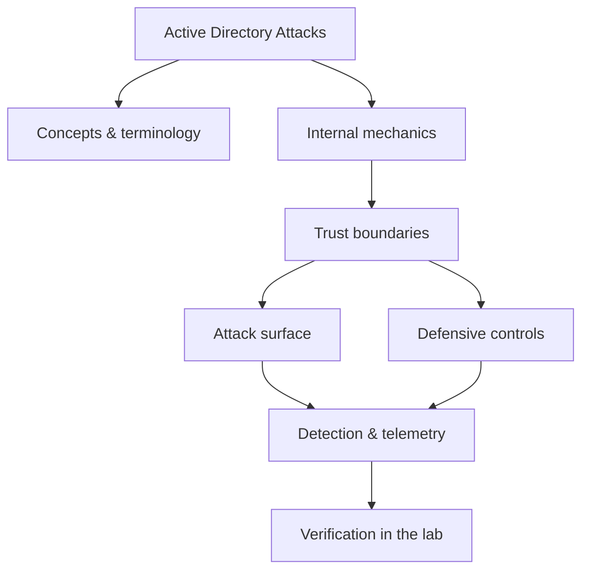

<!-- SPDX-License-Identifier: GPL-3.0-or-later | Copyright (C) 2026 Nithees Narendra S -->
[Home](../../README.md) › [Offensive Security](README.md) › **Active Directory Attacks**

# Active Directory Attacks

Kerberoasting, delegation abuse, ACL attacks, DCSync and full domain-compromise chains.

<div class="meta-row"><span class="badge b-expert">Expert</span><span class="badge">⌨ ~108 min hands-on</span><span class="badge">📖 ~36 min read</span><button id="lesson-complete" class="lesson-check"><span class="lbl">Mark complete</span></button></div>

**▶ Here to build, not read? Jump to the [Hands-On Practice](#hands-on-practice).**

**Prerequisites:** [Active Directory](../12-identity/active-directory.md) · [Kerberos](../01-networking/kerberos.md) · [NTLM](../12-identity/ntlm.md) · [Enumeration](enumeration.md)

## Overview

Active Directory is the identity backbone of most enterprises, and attacking it is less
about single exploits than about **abusing legitimate features and misconfigurations to escalate and move**.
AD is a graph: users, computers, groups and their permissions (ACLs) form edges, and an attacker's job is to
find a path from a low-privileged foothold to a high-value target such as Domain Admin. The defender's job is
to see and cut those paths. This graph framing — popularised by BloodHound — is the single most important
mental model in the domain.

Because AD authentication runs on Kerberos and NTLM, most AD attacks are really credential and ticket attacks:
harvest a credential or ticket, use it somewhere it grants more power, repeat. The techniques (Kerberoasting,
ACL abuse, delegation, DCSync) are individually simple; the skill is chaining them along a path the graph
reveals, quietly enough to evade detection.

### How it works

A typical domain-compromise chain:

1. **Foothold** — a phished user or a cracked password gives an unprivileged domain account.
2. **Enumerate** — collect the graph (BloodHound/SharpHound): sessions, group memberships, ACLs, delegation,
   SPNs.
3. **Escalate via a path** — e.g. a group the user can control has `GenericAll` over a privileged user;
   Kerberoast a weak service account; abuse an ACL to add yourself to a privileged group.
4. **Credential access** — dump credentials from memory (LSASS) or the domain (DCSync pulls hashes by
   impersonating a domain controller's replication).
5. **Domain dominance** — with the `krbtgt` hash (from DCSync) forge Golden Tickets for persistence.

Every edge is a *trust relationship* AD was designed to have; the attack is using it in an unintended
direction.



<div class="card"><div class="card-title">🔑 Key terms</div>

- **BloodHound / SharpHound** — The collector and graph tool that reveals attack paths across AD.
- **ACL abuse** — Exploiting object permissions (GenericAll, WriteDACL, GenericWrite) to seize control of principals.
- **DCSync (T1003.006)** — Impersonating a DC's replication to pull password hashes, including krbtgt.
- **Pass-the-Hash / Pass-the-Ticket** — Authenticating with a stolen NTLM hash or Kerberos ticket instead of a password.
- **Tiered admin model** — Separating admin credentials by asset tier so a workstation compromise cannot reach DCs.
- **gMSA** — Group Managed Service Account with a long, auto-rotated password — mitigates Kerberoasting.

</div>

> [!EXAMPLE] **In the wild.** **Ransomware domain takeover (recurring pattern).** DFIR reporting consistently shows intrusions
reaching Domain Admin within hours via BloodHound-guided ACL abuse, Kerberoasting and DCSync, then deploying
ransomware through GPO or PsExec. The defensive takeaways are structural — tiering, least privilege, credential
protection — not a single patch. Reproduce the full path in a lab forest and measure how each control changes
the attacker's shortest path.

## Hands-On Practice

> [!TIP] This is the main event. Bring up the lab, then work the walkthrough — every command has a **▸ Run** button (needs the lab runner) and a **📋 Copy** button. ~108 min, Kali attacker, fully local.

**Mission.** Walk from an unprivileged foothold to Domain Admin via Kerberoasting and an ACL/DCSync path.

```cf-lab
{"title": "Offensive Security", "section": "06-offensive-security", "targets": [["metasploitable", "boot-to-root Linux target (recon → exploit → loot)"], ["dvwa / juice-shop", "web foothold targets"], ["AD forest (optional)", "GOAD or a Windows Server eval VM for AD chapters — see notes"]], "compose": "# offsec-lab/docker-compose.yml  —  Offensive part environment\nservices:\n  target-linux:\n    image: tleemcjr/metasploitable2\n    networks: [labnet]\n    command: /bin/sh -c \"/etc/rc.local; tail -f /dev/null\"\n  target-web:\n    image: vulnerables/web-dvwa\n    ports: [\"8082:80\"]\n    networks: [labnet]\n\nnetworks:\n  labnet:\n    driver: bridge\n    internal: true"}
```

**Target for this lesson:** Samba AD-DC (basics) or GOAD (full forest). Tooling: netexec, bloodhound, impacket, hashcat.. Full setup: [Offensive Security lab environment](README.md#lab-environment).

### Guided walkthrough

<div class="stepper">

```cf-step
{"n": 1, "goal": "Enumerate the domain", "cmd": "netexec smb 172.20.0.10 -u bob -p 'Passw0rd' --users --groups", "output": "Domain LAB.LOCAL, users list, group memberships.", "why": "Even a low-priv account can read most of the directory — the graph starts here.", "runnable": true}
```
```cf-step
{"n": 2, "goal": "Collect the attack graph", "cmd": "bloodhound-python -u bob -p 'Passw0rd' -d lab.local -c All -ns 172.20.0.10", "output": "JSON files ready to import into BloodHound.", "why": "BloodHound turns AD permissions into shortest-path-to-DA queries.", "runnable": true}
```
```cf-step
{"n": 3, "goal": "Kerberoast a service account", "cmd": "impacket-GetUserSPNs -request -dc-ip 172.20.0.10 lab.local/bob:Passw0rd", "output": "A $krb5tgs$ hash for the 'sqlsvc' account.", "why": "Service tickets are encrypted with the account's password key — crackable offline.", "runnable": true}
```
```cf-step
{"n": 4, "goal": "Crack it", "cmd": "hashcat -m 13100 sqlsvc.hash rockyou.txt", "output": "sqlsvc:Summer2024!", "why": "Weak service-account passwords are the most common AD foothold-to-privilege step.", "runnable": true}
```
```cf-step
{"n": 5, "goal": "Escalate + DCSync", "cmd": "# BloodHound path: sqlsvc has GenericAll on an admin → reset pw → DCSync\nimpacket-secretsdump -just-dc lab.local/admin@172.20.0.10", "output": "krbtgt:502:aad3b...:<hash>  (domain hashes dumped)", "why": "The krbtgt hash is the master key — full domain compromise and Golden-Ticket persistence.", "runnable": false}
```

</div>

### Live terminal

```cf-terminal
{"title": "kali@active-directory-attacks — start the lab runner for a live shell"}
```

### Try it yourself

> [!NOTE] Try each for real. Open the hint only when stuck, the solution only to check.

**Challenge 1.** AS-REP roast an account with pre-auth disabled and crack it — no credentials needed.

<details><summary>Hint</summary>

`impacket-GetNPUsers` finds them.

</details>
<details><summary>Solution</summary>

`impacket-GetNPUsers lab.local/ -usersfile users.txt -dc-ip 172.20.0.10`, then `hashcat -m 18200`.

</details>

**Challenge 2.** Use the cracked service account to move laterally with pass-the-hash.

<details><summary>Hint</summary>

netexec accepts NTLM hashes with -H.

</details>
<details><summary>Solution</summary>

`netexec smb <targets> -u sqlsvc -H <nthash>` then `impacket-psexec -hashes :<nthash> ...`

</details>

**Challenge 3.** Forge a Golden Ticket with the krbtgt hash and access a service as a fake admin.

<details><summary>Hint</summary>

impacket-ticketer builds it.

</details>
<details><summary>Solution</summary>

`impacket-ticketer -nthash <krbtgt> -domain-sid <sid> -domain lab.local fakeadmin` then use the ccache.

</details>

### Quick quiz

```cf-quiz
{"q": "What makes Kerberoasting possible?", "options": ["Weak TLS", "Service tickets are encrypted with the service account's password key", "Open SMB shares", "Null sessions"], "answer": 1, "explain": "Any domain user can request a service ticket; it's encrypted with the service account's password-derived key, so a weak password cracks offline."}
```
```cf-quiz
{"q": "DCSync abuses which legitimate feature?", "options": ["Group Policy", "Directory replication (as if a domain controller)", "DNS zone transfer", "LDAP paging"], "answer": 1, "explain": "DCSync impersonates a DC's replication (DsGetNCChanges) to pull password hashes, including krbtgt — full domain compromise."}
```

### Detect & defend (blue-team view)

- Event 4769 with RC4 (0x17) and many SPNs from one account = Kerberoasting.
- Replication (DsGetNCChanges / Event 4662) from a non-DC principal = DCSync.
- Anomalous ticket lifetimes / tickets for non-existent accounts = Golden Ticket.

### Skills check

You can move on when you can, without notes:

- [ ] Enumerate AD and find an attack path with BloodHound.
- [ ] Kerberoast/AS-REP roast and crack service credentials.
- [ ] Chain ACL abuse → DCSync → domain dominance, and name each detection.

### Going deeper — The graph mindset with BloodHound

AD compromise is shortest-path search on a permissions graph.

```bash
# Collect (from a domain-joined or credentialed context)
bloodhound-python -u user -p 'Password1' -d domain.local -c All -ns DC_IP
# or SharpHound.exe -c All
```

Load the data and ask BloodHound for "Shortest paths to Domain Admins". Each edge is an actionable technique:
`MemberOf`, `GenericAll`, `WriteDacl`, `ForceChangePassword`, `AddMember`, `AllowedToDelegate`. The defender
runs the *same* tool to find and cut those edges before an attacker walks them.


### Going deeper — A worked escalation and its detections

A common path and the telemetry it leaves:

1. **Kerberoast** a service account (Event **4769**, RC4) → crack offline.
2. **ACL abuse**: that account has `GenericAll` on a helpdesk group → add yourself (Event **4728**).
3. The helpdesk group can `ForceChangePassword` on an admin (Event **4724**) → reset it.
4. **DCSync** with the admin (replication from a non-DC → Event **4662** / directory replication) → pull
   `krbtgt`.
5. **Golden Ticket** for persistence.

Defences: least privilege on ACLs, tiered admin, LSASS protection (Credential Guard), and alerting on 4769
roasting patterns, 4728/4724 in sensitive groups, and replication from non-DCs.


## Check Yourself

_Quick self-test — answers hidden. If you can't answer without notes, redo the relevant walkthrough step._

**Q1. In one sentence, what security problem does Active Directory Attacks address or create?**

<details><summary>Show answer</summary>

Active Directory Attacks matters because its behaviour determines where trust is placed; misplacing that trust is the root of the associated bug class.

</details>

**Q2. Name one trust boundary involved in Active Directory Attacks and what crosses it.**

<details><summary>Show answer</summary>

Any point where attacker-influenced data meets privileged processing — e.g. user input reaching an interpreter, or a token reaching a verifier.

</details>

**Q3. Give one attack against Active Directory Attacks and the single control that most reduces its impact.**

<details><summary>Show answer</summary>

State the attack precisely, then the *primary* control (validation, encoding, isolation, authentication, or least privilege) — not a laundry list.

</details>

**Interview angles**

- Walk me through how Active Directory Attacks works, then tell me where you would attack it.
- How would you detect Active Directory Attacks being abused in an environment you defend?
- What is the difference between mitigating and eliminating the risk associated with Active Directory Attacks?

## Pitfalls & Best Practice

**Common mistakes**

- Flat admin model — the same admin logs into workstations and domain controllers, so any host compromise reaches DA.
- Over-permissive ACLs (GenericAll/WriteDACL granted broadly) creating hidden escalation edges.
- Weak service-account passwords and unnecessary SPNs feeding Kerberoasting.
- No LSASS protection, so a single admin session yields credentials for lateral movement.
- Detecting only malware, not the legitimate-feature-abuse (4769/4728/4662) that defines AD attacks.

**Do this instead**

- Adopt a tiered admin model and separate, non-overlapping admin credentials per tier.
- Run BloodHound defensively and remediate the shortest paths to privileged groups.
- Protect credentials in memory (Credential Guard) and restrict local admin (LAPS).
- Use gMSAs, AES-only Kerberos, and remove unneeded SPNs and delegation.
- Alert on Kerberoasting, sensitive-group changes, and replication from non-domain-controllers.

## Reference

### MITRE ATT&CK Mapping

| Technique | ID |
| --- | --- |
| ATT&CK technique | [T1558.003](https://attack.mitre.org/techniques/T1558/003/) |
| ATT&CK technique | [T1207](https://attack.mitre.org/techniques/T1207/) |
| ATT&CK technique | [T1484](https://attack.mitre.org/techniques/T1484/) |
| ATT&CK technique | [T1550.002](https://attack.mitre.org/techniques/T1550/002/) |
| ATT&CK technique | [T1003.006](https://attack.mitre.org/techniques/T1003/006/) |

### OWASP Mapping

- See [OWASP Top 10](../03-web-security/owasp-top-10.md) for the relevant category when this applies to web systems.

### CWE Mapping

- No direct weakness ID; when this concept fails in code it usually surfaces as one of the [CWE Top 25](../04-vulnerabilities/cwe-top-25.md) entries.

### CAPEC Mapping

- No single attack pattern; see the [CAPEC](../14-threat-intelligence/capec.md) chapter to map behaviour to patterns.

### CVE References

- [CVE-2021-42287](https://nvd.nist.gov/vuln/detail/CVE-2021-42287)
- [CVE-2020-1472](https://nvd.nist.gov/vuln/detail/CVE-2020-1472)

### NIST References

- [NIST CSRC Publications](https://csrc.nist.gov/publications) — search for the control family or guide relevant to this topic.

### RFC References

- No governing RFC for this topic. Where a protocol is involved, its RFC is linked from the relevant networking chapter.

### Research Papers

- *Reflections on Trusting Trust* — Ken Thompson, 1984
- *Smashing the Stack for Fun and Profit* — Aleph One, Phrack 49, 1996
- *The Protection of Information in Computer Systems* — Saltzer & Schroeder, 1975

### Books

- *Active Directory, 5th ed.* — Desmond, Richards, Allen & Lowe-Norris
- *Pentesting Active Directory & Windows-based Infrastructure* — Isakov

### Official Documentation

- [MITRE ATT&CK](https://attack.mitre.org/)
- [OWASP](https://owasp.org/)
- [NIST CSRC Publications](https://csrc.nist.gov/publications)

### Related Chapters

- [Kerberos](../01-networking/kerberos.md)
- [NTLM](../12-identity/ntlm.md)
- [Lateral Movement](lateral-movement.md)
- [Credential Access](credential-access.md)
- [Active Directory](../12-identity/active-directory.md)
- [Offensive Security Methodology](offensive-methodology.md)

---

_Part of the **Offensive Security** section of [Cybersecurity-Mastery](../../README.md). 🔴 Expert · ~108 min hands-on · Last updated 2026-08-13._
