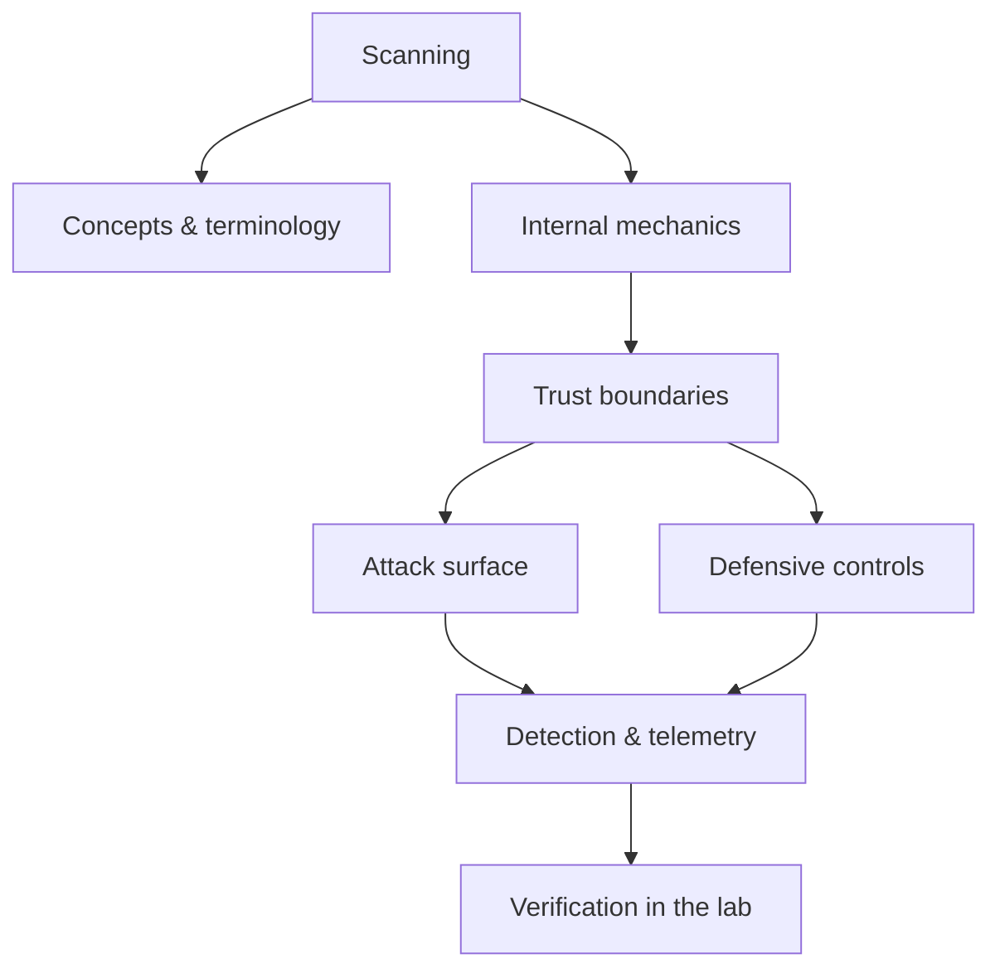

<!-- SPDX-License-Identifier: GPL-3.0-or-later | Copyright (C) 2026 Nithees Narendra S -->
[Home](../../README.md) › [Offensive Security](README.md) › **Scanning**

# Scanning

Host discovery, port and service scanning, versioning and safe scan tuning.

<div class="meta-row"><span class="badge b-beginner">Beginner</span><span class="badge">⌨ ~60 min hands-on</span><span class="badge">📖 ~20 min read</span><button id="lesson-complete" class="lesson-check"><span class="lbl">Mark complete</span></button></div>

**▶ Here to build, not read? Jump to the [Hands-On Practice](#hands-on-practice).**

**Prerequisites:** [Offensive Security Methodology](offensive-methodology.md) · [Reconnaissance](recon.md)

## Overview

Host discovery, port and service scanning, versioning and safe scan tuning. In one line: scanning decides where trust is placed, and misplaced trust is where the security problem lives. That's the theory you need — the understanding comes from doing it, so the walkthrough below is the heart of this chapter.

### How it works

Mechanically, scanning comes down to three things: what data is trusted, where it crosses a boundary, and what happens on the other side. The diagram traces that path; you'll walk it for real, step by step, in the practice below.



<div class="card"><div class="card-title">🔑 Key terms</div>

- **Trust boundary** — where data or control passes between components of different privilege or trust.
- **Attack surface** — the set of points an attacker can interact with.
- **Primary control** — the single measure that most reduces this technique's impact.
- **Telemetry** — the log or signal a defender uses to detect the technique.

</div>

## Hands-On Practice

> [!TIP] This is the main event. Bring up the lab, then work the walkthrough — every command has a **▸ Run** button (needs the lab runner) and a **📋 Copy** button. ~60 min, Kali attacker, fully local.

**Mission.** Go from 'a subnet exists' to a full service/vuln picture with escalating Nmap technique.

```cf-lab
{"title": "Offensive Security", "section": "06-offensive-security", "targets": [["metasploitable", "boot-to-root Linux target (recon → exploit → loot)"], ["dvwa / juice-shop", "web foothold targets"], ["AD forest (optional)", "GOAD or a Windows Server eval VM for AD chapters — see notes"]], "compose": "# offsec-lab/docker-compose.yml  —  Offensive part environment\nservices:\n  target-linux:\n    image: tleemcjr/metasploitable2\n    networks: [labnet]\n    command: /bin/sh -c \"/etc/rc.local; tail -f /dev/null\"\n  target-web:\n    image: vulnerables/web-dvwa\n    ports: [\"8082:80\"]\n    networks: [labnet]\n\nnetworks:\n  labnet:\n    driver: bridge\n    internal: true"}
```

**Target for this lesson:** `net-target` (Metasploitable 2) on labnet. Full setup: [Offensive Security lab environment](README.md#lab-environment).

### Guided walkthrough

<div class="stepper">

```cf-step
{"n": 1, "goal": "Discover live hosts", "cmd": "nmap -sn 172.18.0.0/24", "output": "Host is up (0.00040s latency). 172.18.0.2", "why": "Ping sweep finds targets without touching ports — cheap and quiet.", "runnable": true}
```
```cf-step
{"n": 2, "goal": "Find open ports", "cmd": "nmap -p- --min-rate 2000 172.18.0.2", "output": "21,22,23,25,80,139,445,3306,5432... open", "why": "A full TCP scan reveals the whole listening surface, not just the common ports.", "runnable": true}
```
```cf-step
{"n": 3, "goal": "Fingerprint services", "cmd": "nmap -sV -sC 172.18.0.2", "output": "vsftpd 2.3.4, OpenSSH 4.7p1, Apache 2.2.8, MySQL 5.0.51a...", "why": "Versions map to known CVEs; default scripts add quick wins.", "runnable": true}
```
```cf-step
{"n": 4, "goal": "Targeted vuln scripts", "cmd": "nmap --script vuln -p 21,80,139 172.18.0.2", "output": "ftp-vsftpd-backdoor: VULNERABLE (CVE-2011-2523)", "why": "NSE flags exploitable services so you know where to focus.", "runnable": true}
```
```cf-step
{"n": 5, "goal": "Save everything", "cmd": "nmap -A -oA scan 172.18.0.2", "output": "scan.nmap / .xml / .gnmap written.", "why": "Machine-readable output feeds the rest of your workflow and your report.", "runnable": true}
```

</div>

### Live terminal

```cf-terminal
{"title": "kali@scanning — start the lab runner for a live shell"}
```

### Try it yourself

> [!NOTE] Try each for real. Open the hint only when stuck, the solution only to check.

**Challenge 1.** Scan the same host as quietly as possible and compare what an IDS would see.

<details><summary>Hint</summary>

Slower timing, fewer ports, no version probes.

</details>
<details><summary>Solution</summary>

`-T2 -sS --top-ports 20` produces far fewer packets than `-A -T4 -p-`; capture both in Wireshark to compare.

</details>

**Challenge 2.** Identify one service you could exploit and cite its CVE — don't exploit yet.

<details><summary>Hint</summary>

vsftpd 2.3.4 and UnrealIRCd both have famous backdoors here.

</details>
<details><summary>Solution</summary>

vsftpd 2.3.4 → CVE-2011-2523 backdoor; note it for the Exploitation chapter.

</details>

**Challenge 3.** Write an nmap command that only checks whether SMB signing is enforced.

<details><summary>Hint</summary>

There's an NSE script for exactly this.

</details>
<details><summary>Solution</summary>

`nmap --script smb2-security-mode -p445 <ip>`

</details>

### Quick quiz

```cf-quiz
{"q": "In a packet capture, how does a TCP SYN scan appear?", "options": ["Full 3-way handshakes", "Many SYNs with no completed handshake", "UDP floods", "ICMP echo only"], "answer": 1, "explain": "A SYN scan sends SYN and never completes the handshake (RST after SYN-ACK) — the half-open pattern an IDS keys on."}
```

### Detect & defend (blue-team view)

- In a Wireshark capture, a SYN scan appears as many SYNs with no completed handshakes — the IDS signature.
- Suricata/Snort ship port-scan rules; run one and watch your scan light it up.

### Skills check

You can move on when you can, without notes:

- [ ] Discover hosts, enumerate ports, and fingerprint services with Nmap.
- [ ] Tune scans for speed vs stealth and predict the telemetry.
- [ ] Turn scan output into a prioritised list of exploitable services.

## Check Yourself

_Quick self-test — answers hidden. If you can't answer without notes, redo the relevant walkthrough step._

**Q1. In one sentence, what security problem does Scanning address or create?**

<details><summary>Show answer</summary>

Scanning matters because its behaviour determines where trust is placed; misplacing that trust is the root of the associated bug class.

</details>

**Q2. Name one trust boundary involved in Scanning and what crosses it.**

<details><summary>Show answer</summary>

Any point where attacker-influenced data meets privileged processing — e.g. user input reaching an interpreter, or a token reaching a verifier.

</details>

**Q3. Give one attack against Scanning and the single control that most reduces its impact.**

<details><summary>Show answer</summary>

State the attack precisely, then the *primary* control (validation, encoding, isolation, authentication, or least privilege) — not a laundry list.

</details>

**Interview angles**

- Walk me through how Scanning works, then tell me where you would attack it.
- How would you detect Scanning being abused in an environment you defend?
- What is the difference between mitigating and eliminating the risk associated with Scanning?

## Pitfalls & Best Practice

**Common mistakes**

- Treating scanning as a checkbox instead of understanding the mechanism — defences copied without comprehension fail silently.
- Trusting client-side or default controls to enforce a server-side security property.
- Testing only the happy path and never the abuse cases or malformed input.
- Fixing the symptom (one payload) instead of the class (the missing control).

**Do this instead**

- Push security decisions to a single, well-tested enforcement point rather than scattering checks.
- Fail closed: when in doubt, deny and log, so misconfiguration reduces access rather than expanding it.
- Instrument the trust boundaries so the same event is visible to offence (as a target) and defence (as a signal).
- Validate your understanding of scanning empirically in the lab before trusting it in production.
- Prefer safe, high-level APIs and secure defaults over hand-rolled primitives.

## Reference

### MITRE ATT&CK Mapping

| Technique | ID |
| --- | --- |
| ATT&CK technique | [T1046](https://attack.mitre.org/techniques/T1046/) |
| ATT&CK technique | [T1595.001](https://attack.mitre.org/techniques/T1595/001/) |
| ATT&CK technique | [T1595.002](https://attack.mitre.org/techniques/T1595/002/) |

### OWASP Mapping

- See [OWASP Top 10](../03-web-security/owasp-top-10.md) for the relevant category when this applies to web systems.

### CWE Mapping

- No direct weakness ID; when this concept fails in code it usually surfaces as one of the [CWE Top 25](../04-vulnerabilities/cwe-top-25.md) entries.

### CAPEC Mapping

- No single attack pattern; see the [CAPEC](../14-threat-intelligence/capec.md) chapter to map behaviour to patterns.

### CVE References

- No canonical CVE for a concept page. Search the [NVD](https://nvd.nist.gov/) for concrete instances when studying real cases.

### NIST References

- [NIST CSRC Publications](https://csrc.nist.gov/publications) — search for the control family or guide relevant to this topic.

### RFC References

- No governing RFC for this topic. Where a protocol is involved, its RFC is linked from the relevant networking chapter.

### Research Papers

- *Reflections on Trusting Trust* — Ken Thompson, 1984
- *Smashing the Stack for Fun and Profit* — Aleph One, Phrack 49, 1996
- *The Protection of Information in Computer Systems* — Saltzer & Schroeder, 1975

### Books

- *The Hacker Playbook 3* — Peter Kim
- *Penetration Testing* — Georgia Weidman
- *Red Team Field Manual (RTFM)* — Ben Clark
- *Advanced Penetration Testing* — Wil Allsopp

### Official Documentation

- [MITRE ATT&CK](https://attack.mitre.org/)
- [OWASP](https://owasp.org/)
- [NIST CSRC Publications](https://csrc.nist.gov/publications)

### Related Chapters

- [Offensive Security Methodology](offensive-methodology.md)
- [Reconnaissance](recon.md)
- [OSINT](osint.md)
- [Enumeration](enumeration.md)
- [Vulnerability Assessment](vulnerability-assessment.md)
- [Exploitation](exploitation.md)

---

_Part of the **Offensive Security** section of [Cybersecurity-Mastery](../../README.md). 🟢 Beginner · ~60 min hands-on · Last updated 2026-08-13._
