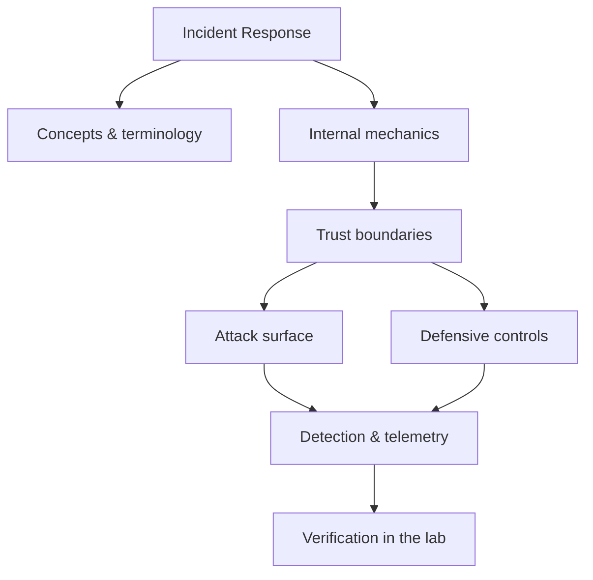

<!-- SPDX-License-Identifier: GPL-3.0-or-later | Copyright (C) 2026 Nithees Narendra S -->
[Home](../../README.md) › [Defensive Security](README.md) › **Incident Response**

# Incident Response

PICERL lifecycle, containment strategy, evidence handling and post-incident review.

<div class="meta-row"><span class="badge b-advanced">Advanced</span><span class="badge">⌨ ~84 min hands-on</span><span class="badge">📖 ~28 min read</span><button id="lesson-complete" class="lesson-check"><span class="lbl">Mark complete</span></button></div>

**▶ Here to build, not read? Jump to the [Hands-On Practice](#hands-on-practice).**

**Prerequisites:** [DFIR Fundamentals](../13-digital-forensics/dfir-fundamentals.md) · [Log Analysis](log-analysis.md)

## Overview

Incident response is the disciplined process of preparing for, detecting, containing,
eradicating and recovering from security incidents — and, crucially, learning from them. Its purpose is to
limit damage and restore normal operation while preserving the evidence needed to understand what happened.
Good IR is mostly preparation: the quality of your response is decided by the runbooks, access, logging and
practice you put in place *before* the incident, not by heroics during it.

The defining tension in IR is **containment speed versus evidence preservation versus business continuity**.
Pull the plug too fast and you destroy volatile evidence and tip off the adversary; move too slowly and the
attacker spreads. Structured frameworks (NIST SP 800-61's Preparation → Detection & Analysis → Containment,
Eradication & Recovery → Post-Incident Activity, and the SANS PICERL variant) exist to make those trade-offs
deliberately rather than in a panic.

### How it works

The lifecycle, in practice:

1. **Preparation** — runbooks, roles (incident commander, scribe, comms), tooling, logging coverage, and
   rehearsed tabletops. This phase decides the outcome.
2. **Detection & Analysis** — triage an alert, establish scope ("how many hosts, what data, which accounts"),
   and build a timeline. Order of volatility guides evidence collection: memory before disk before logs.
3. **Containment** — short-term (isolate a host) and long-term (block C2, reset credentials) while preserving
   evidence. Contain in a way that does not tip a sophisticated adversary prematurely.
4. **Eradication & Recovery** — remove persistence, patch the entry vector, rebuild from known-good, and
   restore service with heightened monitoring.
5. **Post-Incident Activity** — a blameless review that turns the incident into detections, hardening and
   updated runbooks.

The through-line is evidence: every action is logged so the timeline — and any later legal process — holds
up.



<div class="card"><div class="card-title">🔑 Key terms</div>

- **Incident commander** — The single person coordinating the response and making containment decisions.
- **Order of volatility** — The sequence to collect evidence by how quickly it disappears (RAM → disk → logs).
- **Chain of custody** — Documented handling of evidence that preserves its integrity and admissibility.
- **Containment** — Limiting an incident's spread; short-term (isolate) vs long-term (remediate the vector).
- **Eradication** — Removing the attacker's presence, tools and persistence entirely.
- **Dwell time** — How long an attacker was present before detection — a key metric to minimise.

</div>

> [!EXAMPLE] **In the wild.** **Maersk / NotPetya (2017).** A destructive wormable attack encrypted ~49,000 laptops and
thousands of servers within hours, halting global operations. Recovery famously depended on a single surviving
domain controller (offline by chance during the outage). The IR lessons: segmentation limits blast radius,
tested offline backups are existential, and rehearsed crisis command turns catastrophe into mere disaster.

## Hands-On Practice

> [!TIP] This is the main event. Bring up the lab, then work the walkthrough — every command has a **▸ Run** button (needs the lab runner) and a **📋 Copy** button. ~84 min, Kali attacker, fully local.

```cf-lab
{"title": "Defensive Security", "section": "07-defensive-security", "targets": [["Wazuh dashboard", "https://localhost:5601 (or :443) — SIEM/XDR UI, rules, alerts"], ["victim host + agent", "generates the telemetry you hunt over"]], "compose": "# blue-lab/docker-compose.yml  —  Defensive part environment\n# Wazuh ships an official single-node compose. Pull it and bring it up:\n#   git clone https://github.com/wazuh/wazuh-docker -b v4.x\n#   cd wazuh-docker/single-node && docker compose up -d\n# Then add a target that generates events:\nservices:\n  victim:\n    image: ubuntu:22.04\n    container_name: blue-victim\n    command: sleep infinity\n    networks: [labnet]\n  # (install the Wazuh agent in 'victim', or run Sysmon on a Windows VM,\n  #  then run Atomic Red Team tests to generate detections.)\n\nnetworks:\n  labnet:\n    driver: bridge"}
```

Uses the [Defensive Security lab environment](README.md#lab-environment).

### Guided walkthrough

<div class="stepper">

```cf-step
{"n": 1, "goal": "Provision & baseline", "cmd": "# bring up the part environment, then confirm you can reach `Wazuh dashboard` from Kali", "output": "Target reachable; you have a clean starting point.", "why": "Always capture 'normal' before you change anything — it's your reference.", "runnable": false}
```
```cf-step
{"n": 2, "goal": "Reproduce the technique", "cmd": "# perform the core incident response technique step by step against Wazuh dashboard", "output": "You observe the expected effect and can repeat it reliably.", "why": "Owning the mechanism by hand beats running a tool you don't understand.", "runnable": false}
```
```cf-step
{"n": 3, "goal": "Observe what happened", "cmd": "# inspect logs / responses / process or network activity", "output": "You can point to exactly where and why it worked.", "why": "The evidence here is what a defender would alert on.", "runnable": false}
```
```cf-step
{"n": 4, "goal": "Apply the primary control", "cmd": "# implement the single most important fix for this technique", "output": "Repeating the technique now fails.", "why": "Fix the class, not the one payload — then prove it's closed.", "runnable": false}
```

</div>

### Live terminal

```cf-terminal
{"title": "kali@incident-response — start the lab runner for a live shell"}
```

### Try it yourself

> [!NOTE] Try each for real. Open the hint only when stuck, the solution only to check.

**Challenge 1.** Extend the walkthrough with one variation of the incident response technique and predict the result before running it.

<details><summary>Hint</summary>

Change one variable (payload, target, or control) at a time.

</details>
<details><summary>Solution</summary>

Answers vary — the goal is a correct prediction confirmed by observation.

</details>

**Challenge 2.** Find and apply a second defensive control for incident response and show it also blocks the technique.

<details><summary>Hint</summary>

Think in layers: prevention, detection, and least privilege.

</details>
<details><summary>Solution</summary>

Any independent control that breaks the chain counts — name why it works.

</details>

**Challenge 3.** Write a one-paragraph report of your incident response test mapped to CWE/ATT&CK and the fix.

<details><summary>Hint</summary>

Structure: finding → impact → evidence → remediation.

</details>
<details><summary>Solution</summary>

A defender should be able to act on your report without asking you anything.

</details>

### Detect & defend (blue-team view)

- Re-run the technique while watching your telemetry — attack and detection are two views of one event.
- Turn what you observed into a detection rule (Sigma/YARA) and confirm it fires without flooding.

### Skills check

You can move on when you can, without notes:

- [ ] Reproduce the core incident response technique on demand against the lab.
- [ ] Explain the root cause and the single most effective control.
- [ ] Describe the telemetry a defender would use to catch it.

### Going deeper — Running the first hour

The opening moves of a real incident, in order:

1. **Declare and staff.** Name an incident commander and a scribe; open a dedicated, out-of-band comms channel
   (assume email/chat may be monitored by the adversary).
2. **Triage and scope.** What fired the alert? Which hosts, accounts and data are implicated? Do not fixate on
   patient zero before understanding spread.
3. **Preserve volatile evidence** before containing: capture memory and volatile artefacts from key hosts.
4. **Contain deliberately.** Isolate affected hosts (network quarantine, not power-off, to keep RAM), disable
   compromised accounts, and block known C2.
5. **Communicate.** Keep leadership and (as required) legal/regulatory stakeholders informed on a defined
   cadence.

Decisions made here are hard to reverse — which is exactly why they should be rehearsed in tabletops
beforehand.


## Check Yourself

_Quick self-test — answers hidden. If you can't answer without notes, redo the relevant walkthrough step._

**Q1. In one sentence, what security problem does Incident Response address or create?**

<details><summary>Show answer</summary>

Incident Response matters because its behaviour determines where trust is placed; misplacing that trust is the root of the associated bug class.

</details>

**Q2. Name one trust boundary involved in Incident Response and what crosses it.**

<details><summary>Show answer</summary>

Any point where attacker-influenced data meets privileged processing — e.g. user input reaching an interpreter, or a token reaching a verifier.

</details>

**Q3. Give one attack against Incident Response and the single control that most reduces its impact.**

<details><summary>Show answer</summary>

State the attack precisely, then the *primary* control (validation, encoding, isolation, authentication, or least privilege) — not a laundry list.

</details>

**Interview angles**

- Walk me through how Incident Response works, then tell me where you would attack it.
- How would you detect Incident Response being abused in an environment you defend?
- What is the difference between mitigating and eliminating the risk associated with Incident Response?

## Pitfalls & Best Practice

**Common mistakes**

- Powering off a host and destroying volatile memory evidence before capturing it.
- No incident commander, so decisions stall and actions conflict.
- Communicating over channels the adversary may control, tipping them off.
- Eradicating patient zero while missing persistence and secondary footholds, causing reinfection.
- Skipping the blameless post-mortem, so the same gap is exploited again.

**Do this instead**

- Invest in preparation: runbooks, roles, logging coverage, and regular tabletops.
- Follow order of volatility; preserve evidence before you contain.
- Use out-of-band communications during an active intrusion.
- Contain to stop spread without prematurely alerting a sophisticated adversary.
- Close every incident with a blameless review that yields new detections and hardening.

## Reference

### MITRE ATT&CK Mapping

_No single ATT&CK technique maps cleanly to this concept. Once you apply it offensively or defensively, map the specific behaviour using the [ATT&CK](../14-threat-intelligence/mitre-attack.md) chapter._

### OWASP Mapping

- See [OWASP Top 10](../03-web-security/owasp-top-10.md) for the relevant category when this applies to web systems.

### CWE Mapping

- No direct weakness ID; when this concept fails in code it usually surfaces as one of the [CWE Top 25](../04-vulnerabilities/cwe-top-25.md) entries.

### CAPEC Mapping

- No single attack pattern; see the [CAPEC](../14-threat-intelligence/capec.md) chapter to map behaviour to patterns.

### CVE References

- No canonical CVE for a concept page. Search the [NVD](https://nvd.nist.gov/) for concrete instances when studying real cases.

### NIST References

- **NIST SP 800-61 Rev.2** — Computer Security Incident Handling Guide

### RFC References

- No governing RFC for this topic. Where a protocol is involved, its RFC is linked from the relevant networking chapter.

### Research Papers

- *Reflections on Trusting Trust* — Ken Thompson, 1984
- *Smashing the Stack for Fun and Profit* — Aleph One, Phrack 49, 1996
- *The Protection of Information in Computer Systems* — Saltzer & Schroeder, 1975

### Books

- *Blue Team Handbook* — Don Murdoch
- *The Practice of Network Security Monitoring* — Richard Bejtlich
- *Intelligence-Driven Incident Response* — Roberts & Brown

### Official Documentation

- [MITRE ATT&CK](https://attack.mitre.org/)
- [OWASP](https://owasp.org/)
- [NIST CSRC Publications](https://csrc.nist.gov/publications)

### Related Chapters

- [Defensive Security Methodology](defensive-methodology.md)
- [Security Operations Center](soc.md)
- [SIEM](siem.md)
- [Intrusion Detection Systems](ids.md)
- [Intrusion Prevention Systems](ips.md)
- [Endpoint Detection and Response](edr.md)

---

_Part of the **Defensive Security** section of [Cybersecurity-Mastery](../../README.md). 🟠 Advanced · ~84 min hands-on · Last updated 2026-08-13._
