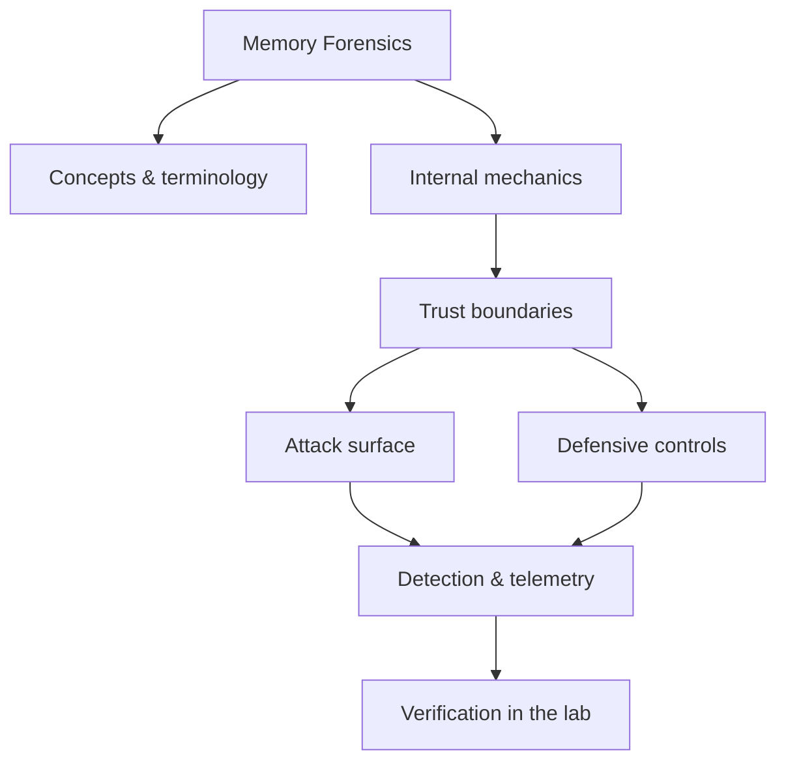

<!-- SPDX-License-Identifier: GPL-3.0-or-later | Copyright (C) 2026 Nithees Narendra S -->
[Home](../../README.md) › [Defensive Security](README.md) › **Memory Forensics**

# Memory Forensics

Acquisition, Volatility 3 workflows, process/handle analysis and malware in RAM.

<div class="meta-row"><span class="badge b-advanced">Advanced</span><span class="badge">⌨ ~72 min hands-on</span><span class="badge">📖 ~24 min read</span><button id="lesson-complete" class="lesson-check"><span class="lbl">Mark complete</span></button></div>

**▶ Here to build, not read? Jump to the [Hands-On Practice](#hands-on-practice).**

**Prerequisites:** [Operating Systems](../00-foundations/operating-systems.md) · [DFIR Fundamentals](../13-digital-forensics/dfir-fundamentals.md)

## Overview

Acquisition, Volatility 3 workflows, process/handle analysis and malware in RAM. In one line: memory forensics decides where trust is placed, and misplaced trust is where the security problem lives. That's the theory you need — the understanding comes from doing it, so the walkthrough below is the heart of this chapter.

### How it works

Mechanically, memory forensics comes down to three things: what data is trusted, where it crosses a boundary, and what happens on the other side. The diagram traces that path; you'll walk it for real, step by step, in the practice below.



<div class="card"><div class="card-title">🔑 Key terms</div>

- **Trust boundary** — where data or control passes between components of different privilege or trust.
- **Attack surface** — the set of points an attacker can interact with.
- **Primary control** — the single measure that most reduces this technique's impact.
- **Telemetry** — the log or signal a defender uses to detect the technique.

</div>

## Hands-On Practice

> [!TIP] This is the main event. Bring up the lab, then work the walkthrough — every command has a **▸ Run** button (needs the lab runner) and a **📋 Copy** button. ~72 min, Kali attacker, fully local.

**Mission.** Reconstruct an intrusion from a memory image with Volatility 3.

```cf-lab
{"title": "Defensive Security", "section": "07-defensive-security", "targets": [["Wazuh dashboard", "https://localhost:5601 (or :443) — SIEM/XDR UI, rules, alerts"], ["victim host + agent", "generates the telemetry you hunt over"]], "compose": "# blue-lab/docker-compose.yml  —  Defensive part environment\n# Wazuh ships an official single-node compose. Pull it and bring it up:\n#   git clone https://github.com/wazuh/wazuh-docker -b v4.x\n#   cd wazuh-docker/single-node && docker compose up -d\n# Then add a target that generates events:\nservices:\n  victim:\n    image: ubuntu:22.04\n    container_name: blue-victim\n    command: sleep infinity\n    networks: [labnet]\n  # (install the Wazuh agent in 'victim', or run Sysmon on a Windows VM,\n  #  then run Atomic Red Team tests to generate detections.)\n\nnetworks:\n  labnet:\n    driver: bridge"}
```

**Target for this lesson:** `dfir-box` with a lab RAM image under /evidence (e.g. a CyberDefenders image). Full setup: [Defensive Security lab environment](README.md#lab-environment).

### Guided walkthrough

<div class="stepper">

```cf-step
{"n": 1, "goal": "List processes", "cmd": "vol -f /evidence/mem.raw windows.pslist", "output": "A tree including a suspicious powershell.exe under winword.exe.", "why": "Office spawning PowerShell is a classic macro-to-payload pattern.", "runnable": true}
```
```cf-step
{"n": 2, "goal": "Hunt hidden/terminated processes", "cmd": "vol -f /evidence/mem.raw windows.psscan", "output": "A process missing from pslist but present in psscan.", "why": "psscan finds processes hidden from the active list — an evasion signal.", "runnable": true}
```
```cf-step
{"n": 3, "goal": "Find network connections", "cmd": "vol -f /evidence/mem.raw windows.netscan", "output": "An outbound TCP connection to 185.x.x.x:443 from the suspicious PID.", "why": "Ties the host to a likely C2 endpoint.", "runnable": true}
```
```cf-step
{"n": 4, "goal": "Detect injected code", "cmd": "vol -f /evidence/mem.raw windows.malfind", "output": "RWX private memory with MZ/shellcode in the suspicious process.", "why": "malfind flags injected/unbacked executable memory — likely the implant.", "runnable": true}
```
```cf-step
{"n": 5, "goal": "Extract and triage", "cmd": "vol -f /evidence/mem.raw windows.dumpfiles --pid <pid>", "output": "The malicious module written to disk for static analysis.", "why": "Now you can YARA-scan and reverse the artefact you recovered.", "runnable": true}
```

</div>

### Live terminal

```cf-terminal
{"title": "kali@memory-forensics — start the lab runner for a live shell"}
```

### Try it yourself

> [!NOTE] Try each for real. Open the hint only when stuck, the solution only to check.

**Challenge 1.** Recover the command line the attacker ran.

<details><summary>Hint</summary>

There's a plugin for process command lines.

</details>
<details><summary>Solution</summary>

`windows.cmdline` reveals the full command, often the encoded PowerShell payload.

</details>

**Challenge 2.** Find persistence established by the intrusion.

<details><summary>Hint</summary>

Registry run keys live in memory too.

</details>
<details><summary>Solution</summary>

`windows.registry.printkey` on the Run keys, or `windows.getsids`/services plugins.

</details>

**Challenge 3.** Build a short timeline of the attacker's actions from the memory artefacts.

<details><summary>Hint</summary>

Correlate process start times, network connections and files.

</details>
<details><summary>Solution</summary>

Combine pslist times + netscan + cmdline into a narrative; export with `timeliner`.

</details>

### Quick quiz

```cf-quiz
{"q": "Which Volatility 3 plugin flags injected/unbacked executable memory?", "options": ["windows.pslist", "windows.malfind", "windows.netscan", "windows.filescan"], "answer": 1, "explain": "malfind finds RWX/private memory regions containing code (e.g. injected shellcode) — a strong implant signal."}
```

### Detect & defend (blue-team view)

- The live equivalents: EDR flags Office→PowerShell, injected RWX memory, and beaconing.
- Turn each memory finding into a detection (Sigma for the process lineage, network rule for the C2).

### Skills check

You can move on when you can, without notes:

- [ ] Triage a memory image with Volatility 3.
- [ ] Identify injected code, hidden processes and C2.
- [ ] Recover artefacts and reconstruct an attack timeline.

## Check Yourself

_Quick self-test — answers hidden. If you can't answer without notes, redo the relevant walkthrough step._

**Q1. In one sentence, what security problem does Memory Forensics address or create?**

<details><summary>Show answer</summary>

Memory Forensics matters because its behaviour determines where trust is placed; misplacing that trust is the root of the associated bug class.

</details>

**Q2. Name one trust boundary involved in Memory Forensics and what crosses it.**

<details><summary>Show answer</summary>

Any point where attacker-influenced data meets privileged processing — e.g. user input reaching an interpreter, or a token reaching a verifier.

</details>

**Q3. Give one attack against Memory Forensics and the single control that most reduces its impact.**

<details><summary>Show answer</summary>

State the attack precisely, then the *primary* control (validation, encoding, isolation, authentication, or least privilege) — not a laundry list.

</details>

**Interview angles**

- Walk me through how Memory Forensics works, then tell me where you would attack it.
- How would you detect Memory Forensics being abused in an environment you defend?
- What is the difference between mitigating and eliminating the risk associated with Memory Forensics?

## Pitfalls & Best Practice

**Common mistakes**

- Treating memory forensics as a checkbox instead of understanding the mechanism — defences copied without comprehension fail silently.
- Trusting client-side or default controls to enforce a server-side security property.
- Testing only the happy path and never the abuse cases or malformed input.
- Fixing the symptom (one payload) instead of the class (the missing control).

**Do this instead**

- Push security decisions to a single, well-tested enforcement point rather than scattering checks.
- Fail closed: when in doubt, deny and log, so misconfiguration reduces access rather than expanding it.
- Instrument the trust boundaries so the same event is visible to offence (as a target) and defence (as a signal).
- Validate your understanding of memory forensics empirically in the lab before trusting it in production.
- Prefer safe, high-level APIs and secure defaults over hand-rolled primitives.

## Reference

### MITRE ATT&CK Mapping

_No single ATT&CK technique maps cleanly to this concept. Once you apply it offensively or defensively, map the specific behaviour using the [ATT&CK](../14-threat-intelligence/mitre-attack.md) chapter._

### OWASP Mapping

- See [OWASP Top 10](../03-web-security/owasp-top-10.md) for the relevant category when this applies to web systems.

### CWE Mapping

- No direct weakness ID; when this concept fails in code it usually surfaces as one of the [CWE Top 25](../04-vulnerabilities/cwe-top-25.md) entries.

### CAPEC Mapping

- No single attack pattern; see the [CAPEC](../14-threat-intelligence/capec.md) chapter to map behaviour to patterns.

### CVE References

- No canonical CVE for a concept page. Search the [NVD](https://nvd.nist.gov/) for concrete instances when studying real cases.

### NIST References

- [NIST CSRC Publications](https://csrc.nist.gov/publications) — search for the control family or guide relevant to this topic.

### RFC References

- No governing RFC for this topic. Where a protocol is involved, its RFC is linked from the relevant networking chapter.

### Research Papers

- *Reflections on Trusting Trust* — Ken Thompson, 1984
- *Smashing the Stack for Fun and Profit* — Aleph One, Phrack 49, 1996
- *The Protection of Information in Computer Systems* — Saltzer & Schroeder, 1975

### Books

- *File System Forensic Analysis* — Brian Carrier
- *The Art of Memory Forensics* — Ligh, Case, Levy & Walters
- *Windows Forensic Analysis* — Harlan Carvey

### Official Documentation

- [Volatility 3](https://volatility3.readthedocs.io/)

### Related Chapters

- [Defensive Security Methodology](defensive-methodology.md)
- [Security Operations Center](soc.md)
- [SIEM](siem.md)
- [Intrusion Detection Systems](ids.md)
- [Intrusion Prevention Systems](ips.md)
- [Endpoint Detection and Response](edr.md)

---

_Part of the **Defensive Security** section of [Cybersecurity-Mastery](../../README.md). 🟠 Advanced · ~72 min hands-on · Last updated 2026-08-13._
