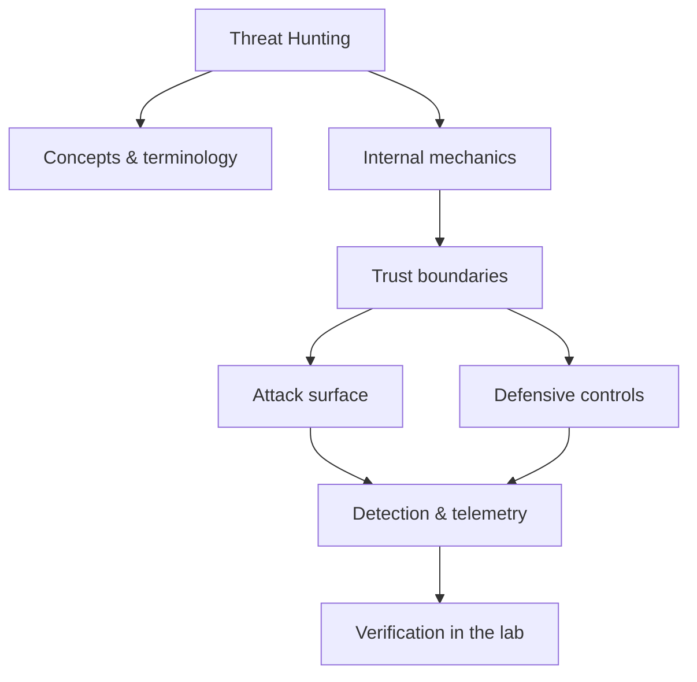

<!-- SPDX-License-Identifier: GPL-3.0-or-later | Copyright (C) 2026 Nithees Narendra S -->
[Home](../../README.md) › [Defensive Security](README.md) › **Threat Hunting**

# Threat Hunting

Hypothesis-driven hunts, the pyramid of pain, MITRE-aligned queries and hunt reporting.

<div class="meta-row"><span class="badge b-advanced">Advanced</span><span class="badge">⌨ ~72 min hands-on</span><span class="badge">📖 ~24 min read</span><button id="lesson-complete" class="lesson-check"><span class="lbl">Mark complete</span></button></div>

**▶ Here to build, not read? Jump to the [Hands-On Practice](#hands-on-practice).**

**Prerequisites:** [MITRE ATT&CK](../14-threat-intelligence/mitre-attack.md) · [SIEM](siem.md) · [Log Analysis](log-analysis.md)

## Overview

Threat hunting is the proactive, hypothesis-driven search for adversaries who have evaded
automated detection. It starts from the assumption that prevention and alerting are imperfect and that a
determined attacker may already be present, then goes looking for them in telemetry rather than waiting for an
alert. Hunting is human-led and creative where alerting is machine-led and repetitive; its outputs are not just
findings but new, durable detections that turn each successful hunt into permanent coverage.

The discipline is anchored by two ideas. David Bianco's **Pyramid of Pain** ranks indicators by how much it
hurts an adversary to change them — hashes and IPs are trivial to rotate, but tactics, techniques and
procedures (TTPs) are costly — so effective hunting targets behaviour high on the pyramid. And **MITRE ATT&CK**
supplies the behavioural vocabulary and a map of what to hunt for, technique by technique.

### How it works

A hunt runs as a loop:

1. **Hypothesis** — a specific, testable statement, ideally tied to an ATT&CK technique and your environment:
   e.g. "an adversary is using WMI for lateral movement (T1047), visible as `wmiprvse.exe` spawning shells on
   servers."
2. **Data** — identify the telemetry that would show it (process creation with parent/child, network flows,
   authentication logs) and confirm you actually collect it.
3. **Hunt** — query, pivot and filter, distinguishing malicious from the (large) benign baseline. This is where
   knowing 'normal' matters most.
4. **Findings** — confirm or refute; if confirmed, hand to incident response.
5. **Operationalise** — turn what you learned into a detection (a Sigma rule), so the hunt need not be repeated
   manually.

The whole loop turns tacit adversary knowledge into codified, repeatable coverage.



<div class="card"><div class="card-title">🔑 Key terms</div>

- **Hypothesis-driven hunt** — A hunt starting from a specific, testable statement about adversary behaviour.
- **Pyramid of Pain** — A ranking of indicators by how costly they are for an adversary to change.
- **TTP** — Tactics, Techniques and Procedures — behaviour high on the pyramid, the best hunting target.
- **Baseline / 'normal'** — Knowledge of expected activity, without which anomalies cannot be spotted.
- **Dwell time** — How long an adversary is present before detection — hunting aims to shrink it.
- **Operationalising** — Converting a hunt finding into a durable automated detection.

</div>

> [!EXAMPLE] **In the wild.** **Long-dwell intrusions.** Post-incident reports of major breaches repeatedly show adversaries
present for months, using legitimate tools (living-off-the-land) that signature detection missed but a
behaviour-focused hunt (unusual parent/child processes, anomalous service-ticket requests, new persistence)
would have surfaced. Pick one public report, extract the TTPs, and design the hunts that would have caught it.

## Hands-On Practice

> [!TIP] This is the main event. Bring up the lab, then work the walkthrough — every command has a **▸ Run** button (needs the lab runner) and a **📋 Copy** button. ~72 min, Kali attacker, fully local.

**Mission.** Run one full hypothesis-driven hunt loop and turn the result into a standing detection.

```cf-lab
{"title": "Defensive Security", "section": "07-defensive-security", "targets": [["Wazuh dashboard", "https://localhost:5601 (or :443) — SIEM/XDR UI, rules, alerts"], ["victim host + agent", "generates the telemetry you hunt over"]], "compose": "# blue-lab/docker-compose.yml  —  Defensive part environment\n# Wazuh ships an official single-node compose. Pull it and bring it up:\n#   git clone https://github.com/wazuh/wazuh-docker -b v4.x\n#   cd wazuh-docker/single-node && docker compose up -d\n# Then add a target that generates events:\nservices:\n  victim:\n    image: ubuntu:22.04\n    container_name: blue-victim\n    command: sleep infinity\n    networks: [labnet]\n  # (install the Wazuh agent in 'victim', or run Sysmon on a Windows VM,\n  #  then run Atomic Red Team tests to generate detections.)\n\nnetworks:\n  labnet:\n    driver: bridge"}
```

**Target for this lesson:** the Wazuh/ELK stack with telemetry from the victim host. Full setup: [Defensive Security lab environment](README.md#lab-environment).

### Guided walkthrough

<div class="stepper">

```cf-step
{"n": 1, "goal": "Form a hypothesis", "cmd": "# 'An adversary is Kerberoasting: many 4769 with RC4 from one account.'", "output": "A specific, testable statement tied to ATT&CK T1558.003.", "why": "A good hunt starts narrow and falsifiable, not 'look for bad stuff'.", "runnable": false}
```
```cf-step
{"n": 2, "goal": "Confirm you have the data", "cmd": "# check that Windows 4769 events are being ingested", "output": "4769 events present with TicketEncryptionType field.", "why": "You can only hunt what you collect — verify the data source first.", "runnable": false}
```
```cf-step
{"n": 3, "goal": "Query for the pattern", "cmd": "index=win EventCode=4769 TicketEncryptionType=0x17\n| stats dc(ServiceName) as svcs by Account\n| where svcs > 10", "output": "One account requested tickets for 14 distinct SPNs with RC4.", "why": "That fan-out with RC4 is the Kerberoasting fingerprint.", "runnable": true}
```
```cf-step
{"n": 4, "goal": "Triage", "cmd": "# pivot on that account's other activity and logon source", "output": "The account is a workstation user, not a scanner — suspicious.", "why": "Separate benign (vuln scanners, apps) from real attacker behaviour by context.", "runnable": false}
```
```cf-step
{"n": 5, "goal": "Operationalise", "cmd": "# write a Sigma rule for the pattern and deploy it", "output": "A standing detection now fires automatically on recurrence.", "why": "Every confirmed hunt should become a detection so the work compounds.", "runnable": false}
```

</div>

### Live terminal

```cf-terminal
{"title": "kali@threat-hunting — start the lab runner for a live shell"}
```

### Try it yourself

> [!NOTE] Try each for real. Open the hint only when stuck, the solution only to check.

**Challenge 1.** Generate the telemetry yourself with Atomic Red Team, then hunt it.

<details><summary>Hint</summary>

Atomic has tests mapped to ATT&CK technique IDs.

</details>
<details><summary>Solution</summary>

`Invoke-AtomicTest T1558.003` on the lab host, then run your query and confirm it fires.

</details>

**Challenge 2.** Write a hunt for lateral movement via WMI (T1047) and name the data source.

<details><summary>Hint</summary>

Process creation with a wmiprvse.exe parent.

</details>
<details><summary>Solution</summary>

Sysmon Event 1 where ParentImage ends with wmiprvse.exe spawning shells/LOLBins.

</details>

**Challenge 3.** Explain why hunting for the attacker's C2 IP is weaker than hunting the behaviour.

<details><summary>Hint</summary>

Think Pyramid of Pain.

</details>
<details><summary>Solution</summary>

IPs rotate trivially (bottom of the pyramid); the TTP (roasting/WMI) is costly for the adversary to change.

</details>

### Quick quiz

```cf-quiz
{"q": "Per the Pyramid of Pain, which is most costly for an adversary to change?", "options": ["File hash", "IP address", "Domain name", "TTP (technique/behaviour)"], "answer": 3, "explain": "Hashes/IPs/domains rotate trivially; changing tactics and techniques is expensive — so hunt behaviour, not atomic indicators."}
```

### Detect & defend (blue-team view)

- This chapter *is* the blue side — each hunt output becomes a Sigma detection.
- Track hunt→detection conversion and dwell-time reduction as program metrics.

### Skills check

You can move on when you can, without notes:

- [ ] Frame and run a hypothesis-driven hunt tied to ATT&CK.
- [ ] Validate hunts with Atomic Red Team.
- [ ] Convert findings into durable detections.

### Going deeper — Running a hunt, concretely

Hunt for Kerberoasting (T1558.003) as a worked example:

1. **Hypothesis:** an adversary is requesting many service tickets with RC4 to crack offline.
2. **Data:** Windows Security Event **4769** (service ticket requests), including ticket encryption type and
   requesting account.
3. **Hunt (pseudo-query):**
   ```
   EventID=4769 AND TicketEncryptionType=0x17            // RC4
   | stats count by Account, count(distinct ServiceName)
   | where distinct_services > 10                        // one account, many SPNs
   ```
4. **Triage:** is this a vulnerability scanner, a misconfigured app, or an attacker? Pivot on the account's
   other activity.
5. **Operationalise:** publish a Sigma rule for the pattern so future occurrences alert automatically.

Validate your hunts and detections with **Atomic Red Team** — execute the technique safely and confirm your
hunt would have found it.


## Check Yourself

_Quick self-test — answers hidden. If you can't answer without notes, redo the relevant walkthrough step._

**Q1. In one sentence, what security problem does Threat Hunting address or create?**

<details><summary>Show answer</summary>

Threat Hunting matters because its behaviour determines where trust is placed; misplacing that trust is the root of the associated bug class.

</details>

**Q2. Name one trust boundary involved in Threat Hunting and what crosses it.**

<details><summary>Show answer</summary>

Any point where attacker-influenced data meets privileged processing — e.g. user input reaching an interpreter, or a token reaching a verifier.

</details>

**Q3. Give one attack against Threat Hunting and the single control that most reduces its impact.**

<details><summary>Show answer</summary>

State the attack precisely, then the *primary* control (validation, encoding, isolation, authentication, or least privilege) — not a laundry list.

</details>

**Interview angles**

- Walk me through how Threat Hunting works, then tell me where you would attack it.
- How would you detect Threat Hunting being abused in an environment you defend?
- What is the difference between mitigating and eliminating the risk associated with Threat Hunting?

## Pitfalls & Best Practice

**Common mistakes**

- Hunting for hashes/IPs (bottom of the pyramid) that adversaries rotate trivially.
- Starting without a hypothesis, producing aimless dashboard-staring.
- Hunting for a technique whose required telemetry you do not actually collect.
- Not baselining 'normal', so every result looks anomalous and nothing is actionable.
- Finding something and not operationalising it into a detection, so the work does not compound.

**Do this instead**

- Frame every hunt as a specific, testable hypothesis tied to an ATT&CK technique.
- Target TTPs high on the Pyramid of Pain, not easily-changed atomic indicators.
- Confirm you collect the needed data source before committing to a hunt.
- Invest in understanding your environment's baseline; it is the hunter's core asset.
- Turn every confirmed hunt into a Sigma detection and validate with Atomic Red Team.

## Reference

### MITRE ATT&CK Mapping

_No single ATT&CK technique maps cleanly to this concept. Once you apply it offensively or defensively, map the specific behaviour using the [ATT&CK](../14-threat-intelligence/mitre-attack.md) chapter._

### OWASP Mapping

- See [OWASP Top 10](../03-web-security/owasp-top-10.md) for the relevant category when this applies to web systems.

### CWE Mapping

- No direct weakness ID; when this concept fails in code it usually surfaces as one of the [CWE Top 25](../04-vulnerabilities/cwe-top-25.md) entries.

### CAPEC Mapping

- No single attack pattern; see the [CAPEC](../14-threat-intelligence/capec.md) chapter to map behaviour to patterns.

### CVE References

- No canonical CVE for a concept page. Search the [NVD](https://nvd.nist.gov/) for concrete instances when studying real cases.

### NIST References

- [NIST CSRC Publications](https://csrc.nist.gov/publications) — search for the control family or guide relevant to this topic.

### RFC References

- No governing RFC for this topic. Where a protocol is involved, its RFC is linked from the relevant networking chapter.

### Research Papers

- *The Pyramid of Pain* — David Bianco, 2013

### Books

- *Blue Team Handbook* — Don Murdoch
- *The Practice of Network Security Monitoring* — Richard Bejtlich
- *Intelligence-Driven Incident Response* — Roberts & Brown

### Official Documentation

- [The ThreatHunting Project](https://www.threathunting.net/)
- [MITRE ATT&CK](https://attack.mitre.org/)

### Related Chapters

- [Defensive Security Methodology](defensive-methodology.md)
- [Security Operations Center](soc.md)
- [SIEM](siem.md)
- [Intrusion Detection Systems](ids.md)
- [Intrusion Prevention Systems](ips.md)
- [Endpoint Detection and Response](edr.md)

---

_Part of the **Defensive Security** section of [Cybersecurity-Mastery](../../README.md). 🟠 Advanced · ~72 min hands-on · Last updated 2026-08-13._
