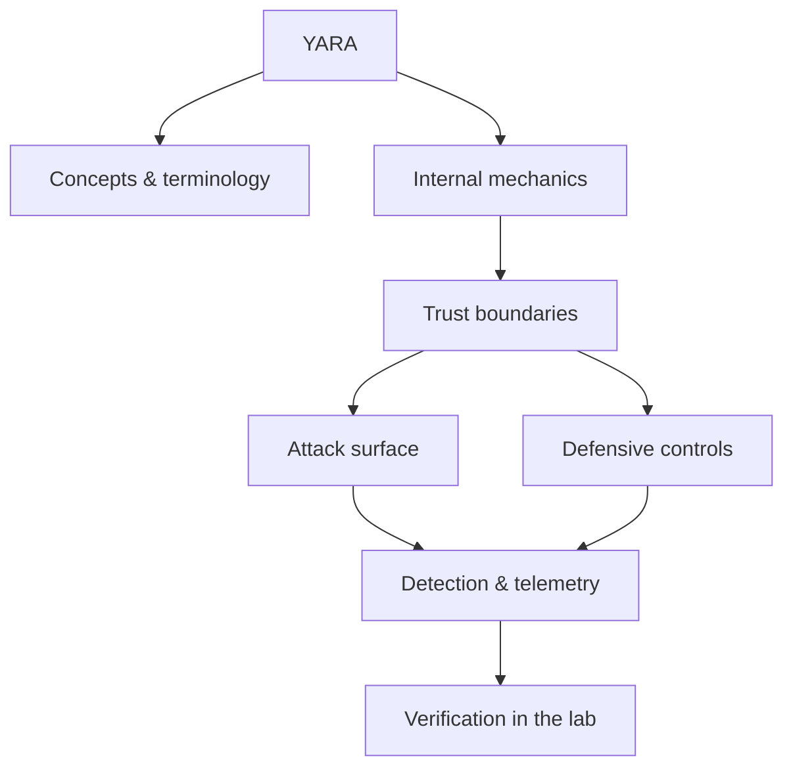

<!-- SPDX-License-Identifier: GPL-3.0-or-later | Copyright (C) 2026 Nithees Narendra S -->
[Home](../../README.md) › [Defensive Security](README.md) › **YARA**

# YARA

Rule syntax, strings and conditions, performance, and building a maintainable ruleset.

<div class="meta-row"><span class="badge b-intermediate">Intermediate</span><span class="badge">⌨ ~48 min hands-on</span><span class="badge">📖 ~16 min read</span><button id="lesson-complete" class="lesson-check"><span class="lbl">Mark complete</span></button></div>

**▶ Here to build, not read? Jump to the [Hands-On Practice](#hands-on-practice).**

**Prerequisites:** [Defensive Security Methodology](defensive-methodology.md)

## Overview

Rule syntax, strings and conditions, performance, and building a maintainable ruleset. In one line: YARA decides where trust is placed, and misplaced trust is where the security problem lives. That's the theory you need — the understanding comes from doing it, so the walkthrough below is the heart of this chapter.

### How it works

Mechanically, YARA comes down to three things: what data is trusted, where it crosses a boundary, and what happens on the other side. The diagram traces that path; you'll walk it for real, step by step, in the practice below.



<div class="card"><div class="card-title">🔑 Key terms</div>

- **Trust boundary** — where data or control passes between components of different privilege or trust.
- **Attack surface** — the set of points an attacker can interact with.
- **Primary control** — the single measure that most reduces this technique's impact.
- **Telemetry** — the log or signal a defender uses to detect the technique.

</div>

## Hands-On Practice

> [!TIP] This is the main event. Bring up the lab, then work the walkthrough — every command has a **▸ Run** button (needs the lab runner) and a **📋 Copy** button. ~48 min, Kali attacker, fully local.

**Mission.** Write a precise YARA rule that catches a family without false-positiving on clean files.

```cf-lab
{"title": "Defensive Security", "section": "07-defensive-security", "targets": [["Wazuh dashboard", "https://localhost:5601 (or :443) — SIEM/XDR UI, rules, alerts"], ["victim host + agent", "generates the telemetry you hunt over"]], "compose": "# blue-lab/docker-compose.yml  —  Defensive part environment\n# Wazuh ships an official single-node compose. Pull it and bring it up:\n#   git clone https://github.com/wazuh/wazuh-docker -b v4.x\n#   cd wazuh-docker/single-node && docker compose up -d\n# Then add a target that generates events:\nservices:\n  victim:\n    image: ubuntu:22.04\n    container_name: blue-victim\n    command: sleep infinity\n    networks: [labnet]\n  # (install the Wazuh agent in 'victim', or run Sysmon on a Windows VM,\n  #  then run Atomic Red Team tests to generate detections.)\n\nnetworks:\n  labnet:\n    driver: bridge"}
```

**Target for this lesson:** the isolated `analysis-box` with a folder of benign lab samples + a clean corpus. Full setup: [Defensive Security lab environment](README.md#lab-environment).

### Guided walkthrough

<div class="stepper">

```cf-step
{"n": 1, "goal": "Find distinguishing strings", "cmd": "strings -n 8 sample1.bin | sort | uniq -c | sort -rn | head", "output": "Recurring markers: 'X-Bot/1.2', a mutex name, a config marker.", "why": "Good rules key on stable, distinctive artefacts, not incidental bytes.", "runnable": true}
```
```cf-step
{"n": 2, "goal": "Draft a rule", "cmd": "rule XBot {\n  strings:\n    $ua = \"X-Bot/1.2\"\n    $mx = \"Global\\\\xb0mtx\" wide\n  condition:\n    uint16(0)==0x5A4D and all of them\n}", "output": "A rule matching the PE magic and both markers.", "why": "Anchoring on the MZ header + specific strings keeps it fast and precise.", "runnable": true}
```
```cf-step
{"n": 3, "goal": "Test against the family", "cmd": "yara XBot.yar samples/", "output": "sample1.bin, sample2.bin match; the rest don't.", "why": "It catches the family — now prove it doesn't over-match.", "runnable": true}
```
```cf-step
{"n": 4, "goal": "Test against clean files", "cmd": "yara XBot.yar /usr/bin/", "output": "(no output)", "why": "Zero false positives on a clean corpus — the rule is deployable.", "runnable": true}
```
```cf-step
{"n": 5, "goal": "Tune for performance", "cmd": "# add a filesize guard and prefer anchored strings", "output": "condition: filesize < 2MB and uint16(0)==0x5A4D and all of them", "why": "Cheap conditions first means the scanner rejects non-candidates instantly.", "runnable": false}
```

</div>

### Live terminal

```cf-terminal
{"title": "kali@yara — start the lab runner for a live shell"}
```

### Try it yourself

> [!NOTE] Try each for real. Open the hint only when stuck, the solution only to check.

**Challenge 1.** Write a rule that matches the family even after simple string obfuscation (XOR).

<details><summary>Hint</summary>

YARA supports xor modifiers.

</details>
<details><summary>Solution</summary>

`$s = "X-Bot" xor` matches the string under any single-byte XOR key.

</details>

**Challenge 2.** Add a rule that catches packed variants by section entropy or a packer signature.

<details><summary>Hint</summary>

Use the `math` or `pe` module.

</details>
<details><summary>Solution</summary>

`import "math"` → `math.entropy(0, filesize) > 7.2` flags likely-packed samples.

</details>

**Challenge 3.** Explain how to avoid a rule that matches on the compiler runtime (false-positive trap).

<details><summary>Hint</summary>

Common library strings appear in benign files too.

</details>
<details><summary>Solution</summary>

Exclude generic runtime strings; require multiple *unique* markers, and always test on a clean corpus.

</details>

### Quick quiz

```cf-quiz
{"q": "Why test a new YARA rule against a clean corpus?", "options": ["To make it faster", "To measure and minimise false positives", "To pack the samples", "To sign the rule"], "answer": 1, "explain": "A rule that also matches benign files is unusable in production; validating against clean files proves precision."}
```

### Detect & defend (blue-team view)

- Deploy the rule in your EDR/scanner and on mail/file gateways.
- Feed matches into the SIEM as detections; track false positives and tune.

### Skills check

You can move on when you can, without notes:

- [ ] Extract durable indicators from a sample set.
- [ ] Write precise, performant YARA rules and validate against a clean corpus.
- [ ] Handle obfuscation and packing in rules.

## Check Yourself

_Quick self-test — answers hidden. If you can't answer without notes, redo the relevant walkthrough step._

**Q1. In one sentence, what security problem does YARA address or create?**

<details><summary>Show answer</summary>

YARA matters because its behaviour determines where trust is placed; misplacing that trust is the root of the associated bug class.

</details>

**Q2. Name one trust boundary involved in YARA and what crosses it.**

<details><summary>Show answer</summary>

Any point where attacker-influenced data meets privileged processing — e.g. user input reaching an interpreter, or a token reaching a verifier.

</details>

**Q3. Give one attack against YARA and the single control that most reduces its impact.**

<details><summary>Show answer</summary>

State the attack precisely, then the *primary* control (validation, encoding, isolation, authentication, or least privilege) — not a laundry list.

</details>

**Interview angles**

- Walk me through how YARA works, then tell me where you would attack it.
- How would you detect YARA being abused in an environment you defend?
- What is the difference between mitigating and eliminating the risk associated with YARA?

## Pitfalls & Best Practice

**Common mistakes**

- Treating YARA as a checkbox instead of understanding the mechanism — defences copied without comprehension fail silently.
- Trusting client-side or default controls to enforce a server-side security property.
- Testing only the happy path and never the abuse cases or malformed input.
- Fixing the symptom (one payload) instead of the class (the missing control).

**Do this instead**

- Push security decisions to a single, well-tested enforcement point rather than scattering checks.
- Fail closed: when in doubt, deny and log, so misconfiguration reduces access rather than expanding it.
- Instrument the trust boundaries so the same event is visible to offence (as a target) and defence (as a signal).
- Validate your understanding of YARA empirically in the lab before trusting it in production.
- Prefer safe, high-level APIs and secure defaults over hand-rolled primitives.

## Reference

### MITRE ATT&CK Mapping

_No single ATT&CK technique maps cleanly to this concept. Once you apply it offensively or defensively, map the specific behaviour using the [ATT&CK](../14-threat-intelligence/mitre-attack.md) chapter._

### OWASP Mapping

- See [OWASP Top 10](../03-web-security/owasp-top-10.md) for the relevant category when this applies to web systems.

### CWE Mapping

- No direct weakness ID; when this concept fails in code it usually surfaces as one of the [CWE Top 25](../04-vulnerabilities/cwe-top-25.md) entries.

### CAPEC Mapping

- No single attack pattern; see the [CAPEC](../14-threat-intelligence/capec.md) chapter to map behaviour to patterns.

### CVE References

- No canonical CVE for a concept page. Search the [NVD](https://nvd.nist.gov/) for concrete instances when studying real cases.

### NIST References

- [NIST CSRC Publications](https://csrc.nist.gov/publications) — search for the control family or guide relevant to this topic.

### RFC References

- No governing RFC for this topic. Where a protocol is involved, its RFC is linked from the relevant networking chapter.

### Research Papers

- *Reflections on Trusting Trust* — Ken Thompson, 1984
- *Smashing the Stack for Fun and Profit* — Aleph One, Phrack 49, 1996
- *The Protection of Information in Computer Systems* — Saltzer & Schroeder, 1975

### Books

- *Practical Malware Analysis* — Sikorski & Honig
- *The Art of Memory Forensics* — Ligh, Case, Levy & Walters
- *Practical Binary Analysis* — Dennis Andriesse

### Official Documentation

- [YARA Documentation](https://yara.readthedocs.io/)

### Related Chapters

- [Defensive Security Methodology](defensive-methodology.md)
- [Security Operations Center](soc.md)
- [SIEM](siem.md)
- [Intrusion Detection Systems](ids.md)
- [Intrusion Prevention Systems](ips.md)
- [Endpoint Detection and Response](edr.md)

---

_Part of the **Defensive Security** section of [Cybersecurity-Mastery](../../README.md). 🟡 Intermediate · ~48 min hands-on · Last updated 2026-08-13._
