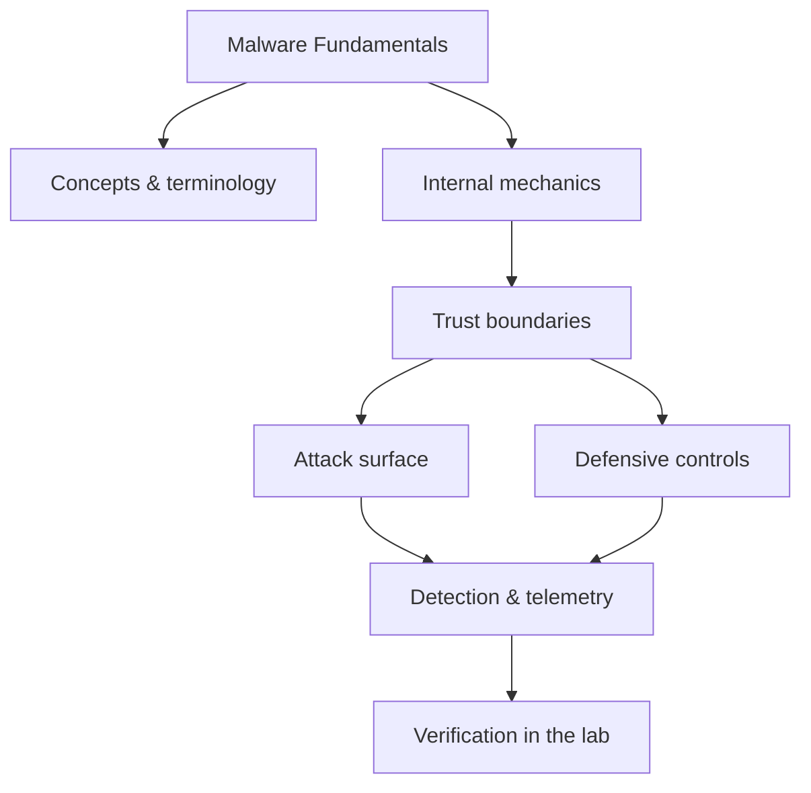

<!-- SPDX-License-Identifier: GPL-3.0-or-later | Copyright (C) 2026 Nithees Narendra S -->
[Home](../../README.md) › [Malware Analysis](README.md) › **Malware Fundamentals**

# Malware Fundamentals

Classification, the malware lifecycle, delivery, and building a safe analysis lab.

<div class="meta-row"><span class="badge b-beginner">Beginner</span><span class="badge">⌨ ~48 min hands-on</span><span class="badge">📖 ~16 min read</span><button id="lesson-complete" class="lesson-check"><span class="lbl">Mark complete</span></button></div>

**▶ Here to build, not read? Jump to the [Hands-On Practice](#hands-on-practice).**

## Overview

Malware is software written to act against the interests of the system's owner — to steal,
spy, disrupt, encrypt or control. Understanding it means looking past scary labels to a small set of questions:
how does it get in (delivery), how does it run and survive (execution and persistence), what does it do
(capability), and how does it talk to its operator (command and control)? Every family, however sophisticated,
is some combination of answers to those questions, which is why a behavioural model beats a taxonomy of names.

Analysis is done **safely, in isolation**, on inert samples in a disposable lab that cannot reach production or
the internet. The two complementary approaches are *static* analysis (examine the file without running it) and
*dynamic* analysis (run it in a controlled sandbox and observe behaviour). Neither is complete alone: static
analysis is defeated by packing and obfuscation; dynamic analysis is defeated by evasion and by only showing
the paths that execute. Skilled analysts iterate between them.

### How it works

A malware analysis lab and workflow:

- **Isolation** — a disposable VM (or CyberForge-hosted container) on an *internal* network with no route to
  the host or internet, with snapshots so you can revert after each detonation.
- **Triage (static)** — hashes, file type, strings, and imports reveal intent quickly. A packed file (high
  entropy, few imports) tells you to unpack before deeper static work.
- **Behavioural (dynamic)** — run the sample while monitoring process, file, registry and network activity;
  capture the traffic; note persistence and C2 attempts.
- **Deeper RE** — disassemble/decompile to understand specific capabilities and extract configuration/IOCs.
- **Output** — a report: classification, capabilities, IOCs, ATT&CK mapping, and detections (YARA/Sigma).

The discipline is to observe without being fooled: assume the sample checks for VMs, debuggers and analysis
tools, and that it only reveals some behaviour on the first run.



<div class="card"><div class="card-title">🔑 Key terms</div>

- **Static analysis** — Examining a sample without executing it (strings, imports, structure, disassembly).
- **Dynamic analysis** — Running a sample in a controlled sandbox and observing its behaviour.
- **Packer / crypter** — Software that compresses/encrypts a payload to hide it from static analysis.
- **IOC** — Indicator of Compromise — an artefact (hash, domain, mutex, path) used to detect the malware.
- **C2 (Command and Control)** — The channel malware uses to receive commands and exfiltrate data.
- **Persistence** — Mechanisms that keep malware running across reboots (services, run keys, scheduled tasks).

</div>

> [!EXAMPLE] **In the wild.** **Stuxnet (2010).** A worm combining four zero-days, stolen code-signing certificates, and
deep knowledge of Siemens PLCs to physically damage uranium-enrichment centrifuges while showing operators
normal readings. Its analysis (by multiple vendors) is a masterclass in how static and dynamic techniques,
combined, reconstruct capability and intent — and in why isolation and patience matter when the sample is this
sophisticated.

## Hands-On Practice

> [!TIP] This is the main event. Bring up the lab, then work the walkthrough — every command has a **▸ Run** button (needs the lab runner) and a **📋 Copy** button. ~48 min, Kali attacker, fully local.

```cf-lab
{"title": "Malware Analysis", "section": "08-malware", "targets": [["analysis-box", "isolated container/VM with static+dynamic tooling"]], "compose": "# malware-lab/docker-compose.yml  —  Malware analysis (ISOLATED)\nservices:\n  analysis-box:\n    image: remnux/remnux-distro:focal    # REMnux: malware-analysis toolkit\n    container_name: analysis-box\n    command: sleep infinity\n    networks: [airgap]\n    # NO published ports. NO internet.\n\nnetworks:\n  airgap:\n    driver: bridge\n    internal: true         # hard requirement: no route out"}
```

Uses the [Malware Analysis lab environment](README.md#lab-environment).

### Guided walkthrough

<div class="stepper">

```cf-step
{"n": 1, "goal": "Provision & baseline", "cmd": "# bring up the part environment, then confirm you can reach `analysis-box` from Kali", "output": "Target reachable; you have a clean starting point.", "why": "Always capture 'normal' before you change anything — it's your reference.", "runnable": false}
```
```cf-step
{"n": 2, "goal": "Reproduce the technique", "cmd": "# perform the core malware fundamentals technique step by step against analysis-box", "output": "You observe the expected effect and can repeat it reliably.", "why": "Owning the mechanism by hand beats running a tool you don't understand.", "runnable": false}
```
```cf-step
{"n": 3, "goal": "Observe what happened", "cmd": "# inspect logs / responses / process or network activity", "output": "You can point to exactly where and why it worked.", "why": "The evidence here is what a defender would alert on.", "runnable": false}
```
```cf-step
{"n": 4, "goal": "Apply the primary control", "cmd": "# implement the single most important fix for this technique", "output": "Repeating the technique now fails.", "why": "Fix the class, not the one payload — then prove it's closed.", "runnable": false}
```

</div>

### Live terminal

```cf-terminal
{"title": "kali@malware-fundamentals — start the lab runner for a live shell"}
```

### Try it yourself

> [!NOTE] Try each for real. Open the hint only when stuck, the solution only to check.

**Challenge 1.** Extend the walkthrough with one variation of the malware fundamentals technique and predict the result before running it.

<details><summary>Hint</summary>

Change one variable (payload, target, or control) at a time.

</details>
<details><summary>Solution</summary>

Answers vary — the goal is a correct prediction confirmed by observation.

</details>

**Challenge 2.** Find and apply a second defensive control for malware fundamentals and show it also blocks the technique.

<details><summary>Hint</summary>

Think in layers: prevention, detection, and least privilege.

</details>
<details><summary>Solution</summary>

Any independent control that breaks the chain counts — name why it works.

</details>

**Challenge 3.** Write a one-paragraph report of your malware fundamentals test mapped to CWE/ATT&CK and the fix.

<details><summary>Hint</summary>

Structure: finding → impact → evidence → remediation.

</details>
<details><summary>Solution</summary>

A defender should be able to act on your report without asking you anything.

</details>

### Detect & defend (blue-team view)

- Re-run the technique while watching your telemetry — attack and detection are two views of one event.
- Turn what you observed into a detection rule (Sigma/YARA) and confirm it fires without flooding.

### Skills check

You can move on when you can, without notes:

- [ ] Reproduce the core malware fundamentals technique on demand against the lab.
- [ ] Explain the root cause and the single most effective control.
- [ ] Describe the telemetry a defender would use to catch it.

### Going deeper — First-look triage safely

Never double-click an unknown sample. Triage first, in isolation:

```bash
sha256sum sample.bin                    # identity; check reputation offline in your notes
file sample.bin                         # type
strings -n 8 sample.bin | less          # URLs, paths, commands, mutexes
# PE specifics
pecheck / pefile: imports, sections, entropy, compile timestamp
capa sample.bin                         # capability detection from patterns
yara rules/ sample.bin                  # family classification
```

High entropy + almost no imports means packed; unpack (often by running to the OEP under a debugger, or a known
unpacker) before deeper static analysis. Only then detonate in the sandbox, revert the snapshot afterwards, and
never let the lab reach the internet unless you deliberately and safely proxy C2.


## Check Yourself

_Quick self-test — answers hidden. If you can't answer without notes, redo the relevant walkthrough step._

**Q1. In one sentence, what security problem does Malware Fundamentals address or create?**

<details><summary>Show answer</summary>

Malware Fundamentals matters because its behaviour determines where trust is placed; misplacing that trust is the root of the associated bug class.

</details>

**Q2. Name one trust boundary involved in Malware Fundamentals and what crosses it.**

<details><summary>Show answer</summary>

Any point where attacker-influenced data meets privileged processing — e.g. user input reaching an interpreter, or a token reaching a verifier.

</details>

**Q3. Give one attack against Malware Fundamentals and the single control that most reduces its impact.**

<details><summary>Show answer</summary>

State the attack precisely, then the *primary* control (validation, encoding, isolation, authentication, or least privilege) — not a laundry list.

</details>

**Interview angles**

- Walk me through how Malware Fundamentals works, then tell me where you would attack it.
- How would you detect Malware Fundamentals being abused in an environment you defend?
- What is the difference between mitigating and eliminating the risk associated with Malware Fundamentals?

## Pitfalls & Best Practice

**Common mistakes**

- Running an unknown sample outside a properly isolated, revertible lab.
- Trusting static analysis alone against a packed or obfuscated sample.
- Trusting dynamic analysis alone, missing behaviour gated behind anti-analysis checks.
- Letting the analysis environment reach the internet or the host network.
- Reporting names instead of behaviour, IOCs and detections that defenders can act on.

**Do this instead**

- Analyse only in a disposable, internal-network VM/container with snapshots.
- Triage statically before ever detonating; unpack before deep static work.
- Iterate between static and dynamic analysis; neither is complete alone.
- Assume anti-VM/anti-debug/anti-sandbox and plan to defeat it.
- Deliver behaviour, IOCs, ATT&CK mapping and YARA/Sigma detections, not just a family name.

## Reference

### MITRE ATT&CK Mapping

_No single ATT&CK technique maps cleanly to this concept. Once you apply it offensively or defensively, map the specific behaviour using the [ATT&CK](../14-threat-intelligence/mitre-attack.md) chapter._

### OWASP Mapping

- See [OWASP Top 10](../03-web-security/owasp-top-10.md) for the relevant category when this applies to web systems.

### CWE Mapping

- No direct weakness ID; when this concept fails in code it usually surfaces as one of the [CWE Top 25](../04-vulnerabilities/cwe-top-25.md) entries.

### CAPEC Mapping

- No single attack pattern; see the [CAPEC](../14-threat-intelligence/capec.md) chapter to map behaviour to patterns.

### CVE References

- No canonical CVE for a concept page. Search the [NVD](https://nvd.nist.gov/) for concrete instances when studying real cases.

### NIST References

- [NIST CSRC Publications](https://csrc.nist.gov/publications) — search for the control family or guide relevant to this topic.

### RFC References

- No governing RFC for this topic. Where a protocol is involved, its RFC is linked from the relevant networking chapter.

### Research Papers

- *Reflections on Trusting Trust* — Ken Thompson, 1984
- *Smashing the Stack for Fun and Profit* — Aleph One, Phrack 49, 1996
- *The Protection of Information in Computer Systems* — Saltzer & Schroeder, 1975

### Books

- *Practical Malware Analysis* — Sikorski & Honig
- *The Art of Memory Forensics* — Ligh, Case, Levy & Walters
- *Practical Binary Analysis* — Dennis Andriesse

### Official Documentation

- [MITRE ATT&CK](https://attack.mitre.org/)
- [OWASP](https://owasp.org/)
- [NIST CSRC Publications](https://csrc.nist.gov/publications)

### Related Chapters

- [Viruses](virus.md)
- [Worms](worm.md)
- [Trojans](trojan.md)
- [Spyware and Stalkerware](spyware.md)
- [Rootkits](rootkit.md)
- [Bootkits](bootkit.md)

---

_Part of the **Malware Analysis** section of [Cybersecurity-Mastery](../../README.md). 🟢 Beginner · ~48 min hands-on · Last updated 2026-08-13._
