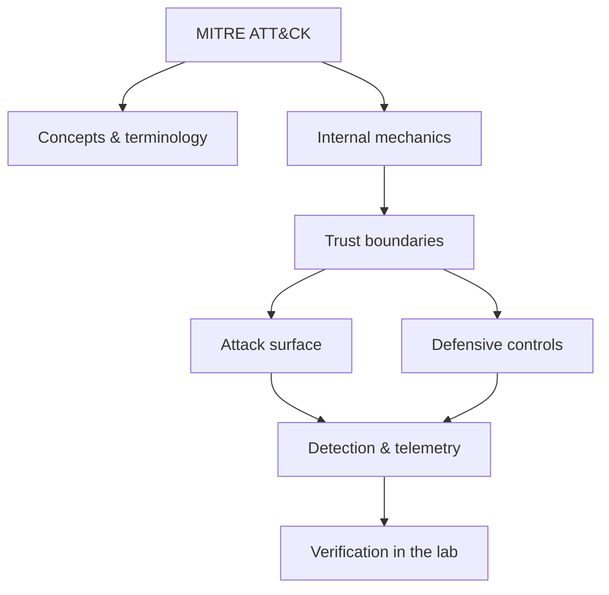

<!-- SPDX-License-Identifier: GPL-3.0-or-later | Copyright (C) 2026 Nithees Narendra S -->
[Home](../../README.md) › [Threat Intelligence and Frameworks](README.md) › **MITRE ATT&CK**

# MITRE ATT&CK

Tactics, techniques, sub-techniques, matrices, and using ATT&CK to drive detection.

<div class="meta-row"><span class="badge b-intermediate">Intermediate</span><span class="badge">⌨ ~72 min hands-on</span><span class="badge">📖 ~24 min read</span><button id="lesson-complete" class="lesson-check"><span class="lbl">Mark complete</span></button></div>

**▶ Here to build, not read? Jump to the [Hands-On Practice](#hands-on-practice).**

**Prerequisites:** [Defensive Security Methodology](../07-defensive-security/defensive-methodology.md)

## Overview

MITRE ATT&CK is a curated, evidence-based knowledge base of adversary behaviour, organised
as a matrix of **tactics** (the attacker's goals — the "why") and **techniques** (how they achieve them — the
"how"). It gives defenders, red teams and threat intelligence a shared, precise vocabulary: instead of vague
labels like "advanced attack", you can say exactly "T1558.003 Kerberoasting" and everyone knows what is meant,
how it works, how to detect it, and which groups use it. That common language is ATT&CK's real value.

ATT&CK is descriptive, not prescriptive — it catalogues what adversaries actually do, drawn from public
incident reporting. It underpins detection engineering (map your detections to techniques and find gaps),
threat intelligence (describe a group by its techniques), red/purple teaming (plan and score coverage), and
risk communication (talk about behaviours rather than tools).

### How it works

The model is layered:

- **Tactics** (columns) — the adversary's objective at a stage: Reconnaissance, Initial Access, Execution,
  Persistence, Privilege Escalation, Defense Evasion, Credential Access, Discovery, Lateral Movement,
  Collection, Command and Control, Exfiltration, Impact.
- **Techniques** (e.g. T1059 Command and Scripting Interpreter) — a general method for achieving a tactic.
- **Sub-techniques** (e.g. T1059.001 PowerShell) — a specific implementation.
- **Procedures** — the concrete, observed ways a specific group performs a technique.

Each technique page carries a description, detection guidance, data sources, mitigations, and the groups and
software known to use it. You *use* ATT&CK by mapping — a detection, a red-team action, or an intel report —
to technique IDs, which makes coverage measurable.



<div class="card"><div class="card-title">🔑 Key terms</div>

- **Tactic** — The adversary's goal at a stage (e.g. Persistence); the columns of the matrix.
- **Technique / Sub-technique** — How a goal is achieved, general and specific (T1059 / T1059.001).
- **Procedure** — A specific observed implementation of a technique by a group or tool.
- **Navigator** — A tool for building coverage/heatmap layers over the matrix.
- **Data source** — The telemetry (e.g. process creation, Kerberos ticket) needed to detect a technique.
- **D3FEND** — MITRE's complementary knowledge graph of defensive countermeasures.

</div>

> [!EXAMPLE] **In the wild.** **APT reporting and coverage mapping.** After a major advisory (e.g. a state-linked group's
technique list), mature teams import the techniques into Navigator, overlay their detection coverage, and
immediately see their blind spots. Practise this end to end: pick a public group profile, build a coverage
layer, run atomic tests for the red techniques, and write the missing detections.

## Hands-On Practice

> [!TIP] This is the main event. Bring up the lab, then work the walkthrough — every command has a **▸ Run** button (needs the lab runner) and a **📋 Copy** button. ~72 min, Kali attacker, fully local.

```cf-lab
{"title": "Threat Intelligence and Frameworks", "section": "14-threat-intelligence", "targets": [["Kali / local shell", "everything you need is a terminal and the tools named per chapter"]], "compose": "# Optional scratch box for trying commands in isolation:\nservices:\n  scratch:\n    image: kalilinux/kali-rolling        # or debian:stable-slim\n    container_name: scratch\n    command: sleep infinity\n    networks: [labnet]\nnetworks:\n  labnet: { driver: bridge, internal: true }"}
```

Uses the [Threat Intelligence and Frameworks lab environment](README.md#lab-environment).

### Guided walkthrough

<div class="stepper">

```cf-step
{"n": 1, "goal": "Provision & baseline", "cmd": "# bring up the part environment, then confirm you can reach `Kali / local shell` from Kali", "output": "Target reachable; you have a clean starting point.", "why": "Always capture 'normal' before you change anything — it's your reference.", "runnable": false}
```
```cf-step
{"n": 2, "goal": "Reproduce the technique", "cmd": "# perform the core mitre att&ck technique step by step against Kali / local shell", "output": "You observe the expected effect and can repeat it reliably.", "why": "Owning the mechanism by hand beats running a tool you don't understand.", "runnable": false}
```
```cf-step
{"n": 3, "goal": "Observe what happened", "cmd": "# inspect logs / responses / process or network activity", "output": "You can point to exactly where and why it worked.", "why": "The evidence here is what a defender would alert on.", "runnable": false}
```
```cf-step
{"n": 4, "goal": "Apply the primary control", "cmd": "# implement the single most important fix for this technique", "output": "Repeating the technique now fails.", "why": "Fix the class, not the one payload — then prove it's closed.", "runnable": false}
```

</div>

### Live terminal

```cf-terminal
{"title": "kali@mitre-attack — start the lab runner for a live shell"}
```

### Try it yourself

> [!NOTE] Try each for real. Open the hint only when stuck, the solution only to check.

**Challenge 1.** Extend the walkthrough with one variation of the mitre att&ck technique and predict the result before running it.

<details><summary>Hint</summary>

Change one variable (payload, target, or control) at a time.

</details>
<details><summary>Solution</summary>

Answers vary — the goal is a correct prediction confirmed by observation.

</details>

**Challenge 2.** Find and apply a second defensive control for mitre att&ck and show it also blocks the technique.

<details><summary>Hint</summary>

Think in layers: prevention, detection, and least privilege.

</details>
<details><summary>Solution</summary>

Any independent control that breaks the chain counts — name why it works.

</details>

**Challenge 3.** Write a one-paragraph report of your mitre att&ck test mapped to CWE/ATT&CK and the fix.

<details><summary>Hint</summary>

Structure: finding → impact → evidence → remediation.

</details>
<details><summary>Solution</summary>

A defender should be able to act on your report without asking you anything.

</details>

### Detect & defend (blue-team view)

- Re-run the technique while watching your telemetry — attack and detection are two views of one event.
- Turn what you observed into a detection rule (Sigma/YARA) and confirm it fires without flooding.

### Skills check

You can move on when you can, without notes:

- [ ] Reproduce the core mitre att&ck technique on demand against the lab.
- [ ] Explain the root cause and the single most effective control.
- [ ] Describe the telemetry a defender would use to catch it.

### Going deeper — Using ATT&CK to drive detection

ATT&CK turns "are we covered?" into a measurable question.

1. **Prioritise** techniques by what actually threatens you (use threat intel + ATT&CK's group pages).
2. **Map your detections** to technique IDs and paint a Navigator layer: green = solid detection, yellow =
   partial, red = blind.
3. **Validate** with atomic tests (Atomic Red Team) or purple-team exercises — execute the technique and
   confirm the detection fires.
4. **Close gaps** by adding the data source the technique needs (per its ATT&CK page) and a detection rule.

This detection-engineering loop, anchored to ATT&CK, is how mature SOCs measure and improve coverage rather
than guessing.


## Check Yourself

_Quick self-test — answers hidden. If you can't answer without notes, redo the relevant walkthrough step._

**Q1. In one sentence, what security problem does MITRE ATT&CK address or create?**

<details><summary>Show answer</summary>

MITRE ATT&CK matters because its behaviour determines where trust is placed; misplacing that trust is the root of the associated bug class.

</details>

**Q2. Name one trust boundary involved in MITRE ATT&CK and what crosses it.**

<details><summary>Show answer</summary>

Any point where attacker-influenced data meets privileged processing — e.g. user input reaching an interpreter, or a token reaching a verifier.

</details>

**Q3. Give one attack against MITRE ATT&CK and the single control that most reduces its impact.**

<details><summary>Show answer</summary>

State the attack precisely, then the *primary* control (validation, encoding, isolation, authentication, or least privilege) — not a laundry list.

</details>

**Interview angles**

- Walk me through how MITRE ATT&CK works, then tell me where you would attack it.
- How would you detect MITRE ATT&CK being abused in an environment you defend?
- What is the difference between mitigating and eliminating the risk associated with MITRE ATT&CK?

## Pitfalls & Best Practice

**Common mistakes**

- Treating ATT&CK as a checklist to '100% cover' rather than prioritising by real threat.
- Mapping tools to techniques loosely and claiming coverage you cannot actually detect.
- Ignoring data-source requirements — you cannot detect a technique whose telemetry you do not collect.
- Using technique IDs as jargon without validating detections against real execution.
- Forgetting ATT&CK is descriptive: absence from the matrix is not proof a behaviour is safe.

**Do this instead**

- Prioritise techniques using threat intelligence relevant to your sector, not the whole matrix.
- Maintain a Navigator layer of validated detection coverage and revisit it regularly.
- Validate coverage with Atomic Red Team / purple-team exercises, not self-assessment.
- Ensure the data sources each prioritised technique needs are actually being collected.
- Tag detections, incidents and intel with ATT&CK IDs to keep one shared vocabulary.

## Reference

### MITRE ATT&CK Mapping

_No single ATT&CK technique maps cleanly to this concept. Once you apply it offensively or defensively, map the specific behaviour using the [ATT&CK](mitre-attack.md) chapter._

### OWASP Mapping

- See [OWASP Top 10](../03-web-security/owasp-top-10.md) for the relevant category when this applies to web systems.

### CWE Mapping

- No direct weakness ID; when this concept fails in code it usually surfaces as one of the [CWE Top 25](../04-vulnerabilities/cwe-top-25.md) entries.

### CAPEC Mapping

- No single attack pattern; see the [CAPEC](capec.md) chapter to map behaviour to patterns.

### CVE References

- No canonical CVE for a concept page. Search the [NVD](https://nvd.nist.gov/) for concrete instances when studying real cases.

### NIST References

- [NIST CSRC Publications](https://csrc.nist.gov/publications) — search for the control family or guide relevant to this topic.

### RFC References

- No governing RFC for this topic. Where a protocol is involved, its RFC is linked from the relevant networking chapter.

### Research Papers

- *Reflections on Trusting Trust* — Ken Thompson, 1984
- *Smashing the Stack for Fun and Profit* — Aleph One, Phrack 49, 1996
- *The Protection of Information in Computer Systems* — Saltzer & Schroeder, 1975

### Books

- *Blue Team Handbook* — Don Murdoch
- *The Practice of Network Security Monitoring* — Richard Bejtlich
- *Intelligence-Driven Incident Response* — Roberts & Brown

### Official Documentation

- [MITRE ATT&CK](https://attack.mitre.org/)
- [ATT&CK Navigator](https://mitre-attack.github.io/attack-navigator/)

### Related Chapters

- [CAPEC](capec.md)
- [CWE](cwe.md)
- [TTP Analysis](ttp-analysis.md)
- [Detection Engineering](../07-defensive-security/detection-engineering.md)
- [Threat Hunting](../07-defensive-security/threat-hunting.md)
- [Cyber Threat Intelligence Fundamentals](cti-fundamentals.md)

---

_Part of the **Threat Intelligence and Frameworks** section of [Cybersecurity-Mastery](../../README.md). 🟡 Intermediate · ~72 min hands-on · Last updated 2026-08-13._
